# 一、项目搭建

那接下来呢，我们就进入到轻客管家这个项目的搭建。那通过前面的介绍，我们可以看到轻客管家这个项目里面包含的功能模块比较多，包括：部门管理、角色管理、用户管理、日志管理、课程管理、活动管理、线索管理、商机管理、客户管理等等。

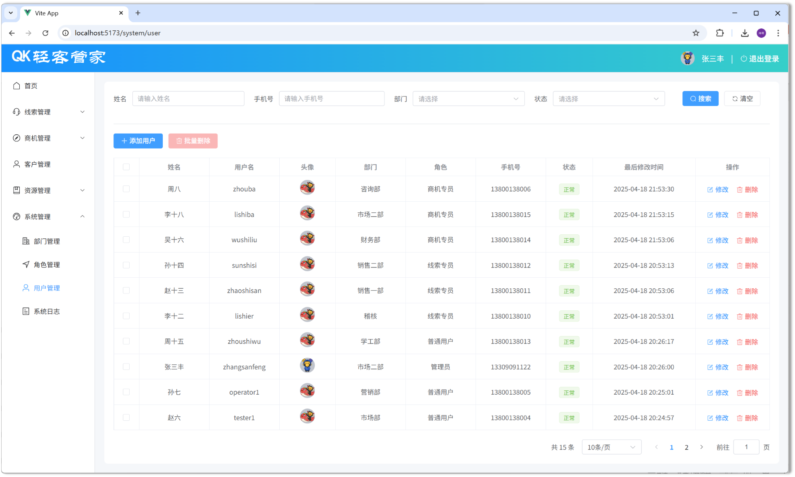

里面涉及到的功能模块很多，那功能模块多了，最终我们进行项目开发时，项目涉及到的代码量就比较大，涉及到的类、接口都会很多，最终项目的结构大约就是这个样子的。

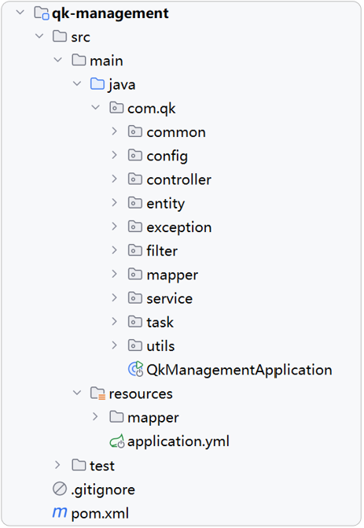

我们可以看到，所有的项目代码都放在同一个maven项目中的，包括项目中的 实体类、工具类、以及项目的业务代码。 如果说，公司里面别的项目组，要复用我们的工具类，要复用我们定义的通用组件，该怎么做呢？

其实，由于在maven项目中，要使用别人开发好的项目，就只需要引入依赖就可以了，但是大家再思考一下，如果说，让别的项目组，直接引入我们这个依赖的坐标可不可以呢？ 不可以，因为这个项目中包含了我们项目的全部代码，涵盖了项目中的核心业务代码，不安全。

> 总结起来，如果把所有的代码都写在一个项目中，主要两点问题：项目中的通用组件难以复用、不方便项目的维护和管理。
>

# 二、模块设计

分模块设计：分模块设计就是将项目按照功能/结构拆分成若干个子模块，每一个模块都是独立的。方便项目的管理维护、拓展，也方便模块键的相互调用、资源共享。

比如：

- 可以将项目中涉及到的工具类、通用组件，单独抽取到一个maven模块中，就叫 `qk-common`

- 可以将项目中涉及到的实体类，单独抽取到一个maven模块中，就叫 `qk-entity`

- 可以将项目中涉及到的核心业务代码，单独抽取到一个maven模块中，就叫 `qk-management`

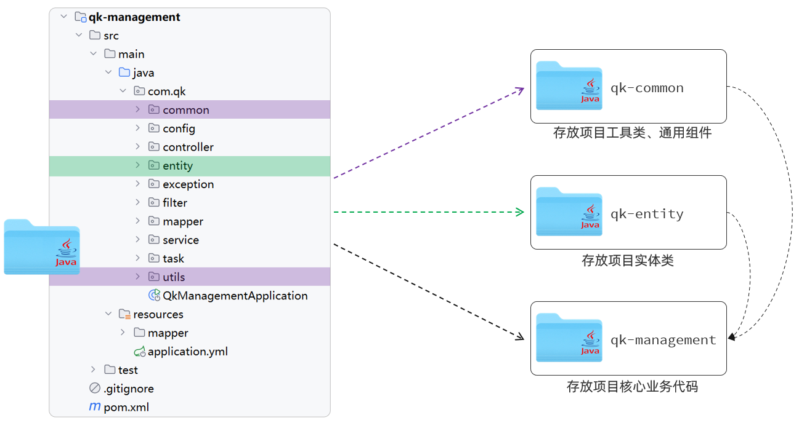

然后，在别的项目中，如果需要用到那个模块，我们就只需要在pom\.xml中引入对应的依赖坐标就可以了。 比如，在 `qk-management` 模块中需要用到工具类、实体类，而工具类存放在 `qk-common` 模块中，实体类存放在 `qk-entity` 模块中，所以此时只需要在 `qk-management` 模块的pom\.xml 中引入 `qk-common`、`qk-entity` 的依赖坐标即可。

通过上述的分析之后，我们可以看到最终一个大的项目中，会包含若干个模块，而这些个模块中可能会引入各种各样的依赖，为了对这些模块能够进行集中的管理和维护，我们通常会创建一个父工程，用来统一管理项目中的模块。然后再让其他的子模块继承这个父工程，最终的项目结构如下：

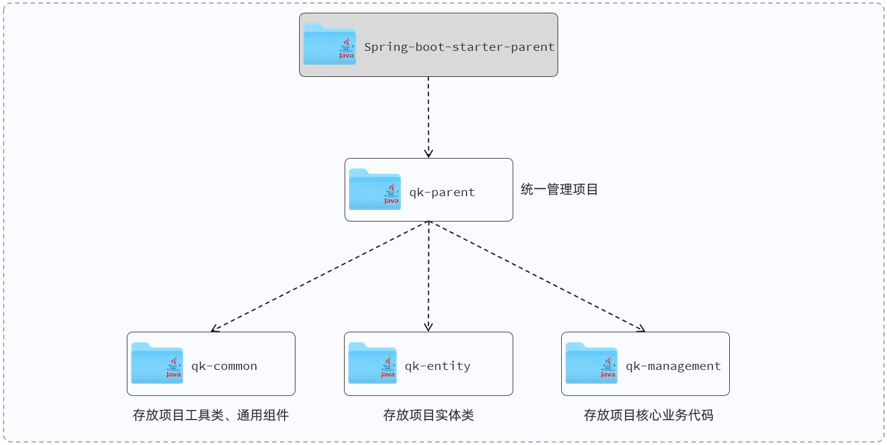

> 注意：在maven中项目与项目之间，也可以继承，而与java类似，maven项目之间也是单继承，不支持多继承。
>

# 三、模块创建

具体操作步骤如下：

1. 创建项目父工程`qk-parent`，打包方式为`pom`，设置父工程为`spring-boot-starter-parent`

2. 创建子工程`qk-common`，设置父工程为`qk-parent`

3. 创建子工程`qk-entity`，设置父工程为`qk-parent`

4. 创建子工程`qk-management`，设置父工程为`qk-parent`

5. 设置qk\-management依赖qk\-common和qk\-entity工程。

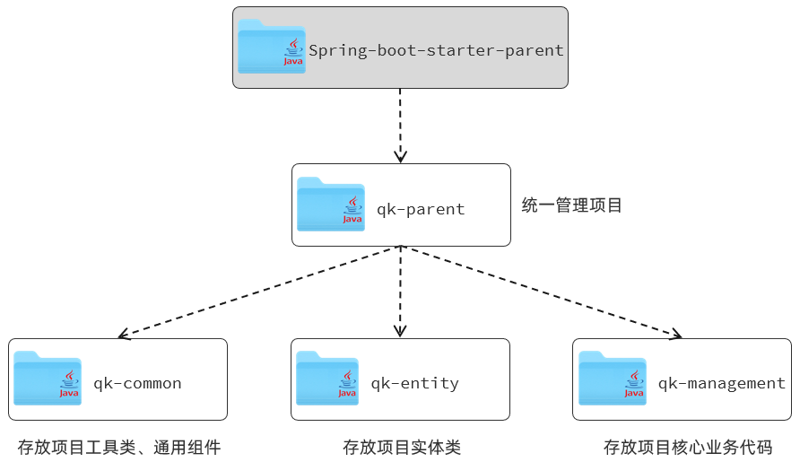

那接下来呢，我们就来实操一下：

准备工作：检查idea中maven的全局配置：

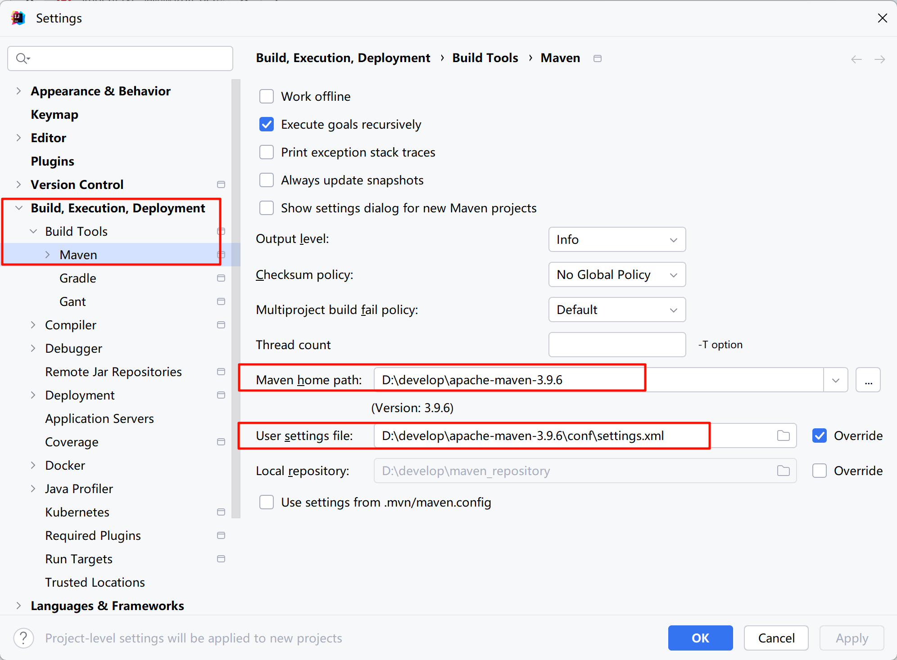

1.创建项目父工程`qk-parent`，打包方式为`pom`，设置父工程为`spring-boot-starter-parent`

打开idea，创建一个新的project，名字为 `qk-parent`。

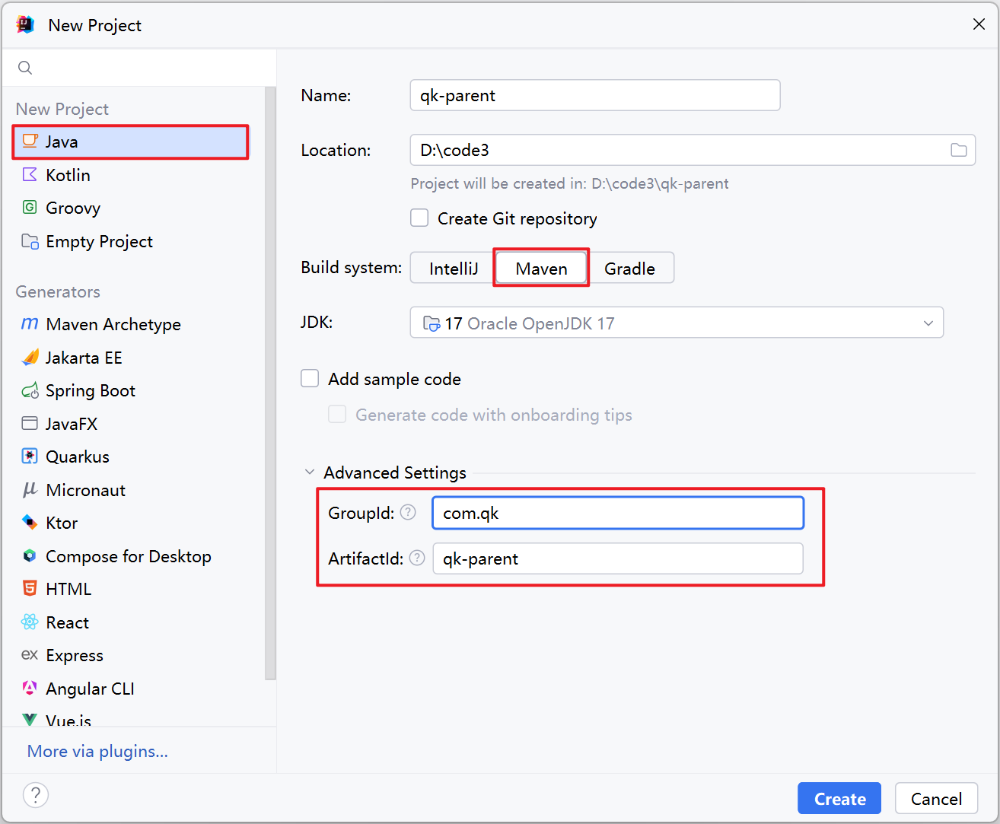

项目创建完毕后，基础的结构如下：

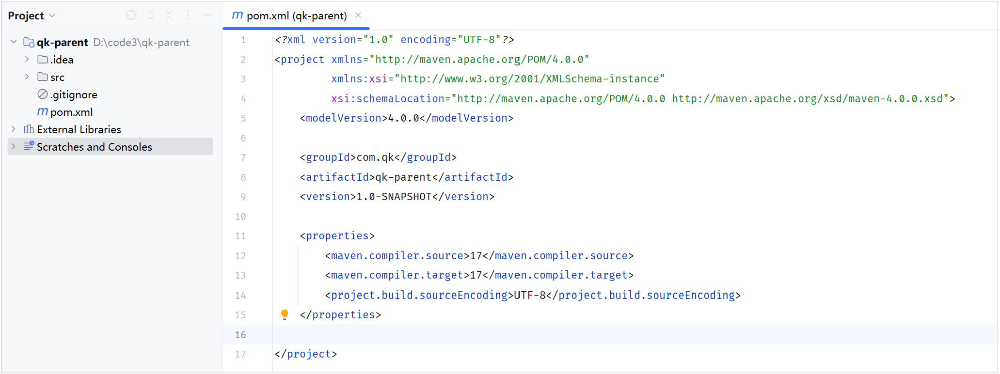

接下来，我们需要做如下调整：

- 删除掉 src 目录，因为`qk-parent` 是父工程，里面不需要写任何代码，只是管理其他的子模块。

- 设置打包方式为`pom`，标识这个项目是用来管理其他项目的，不写任何代码。【可以不用做，可以自动生成】

- 指定继承关系，让`qk-parent`继承springboot项目统一的父工程`spring-boot-starter-parent`。

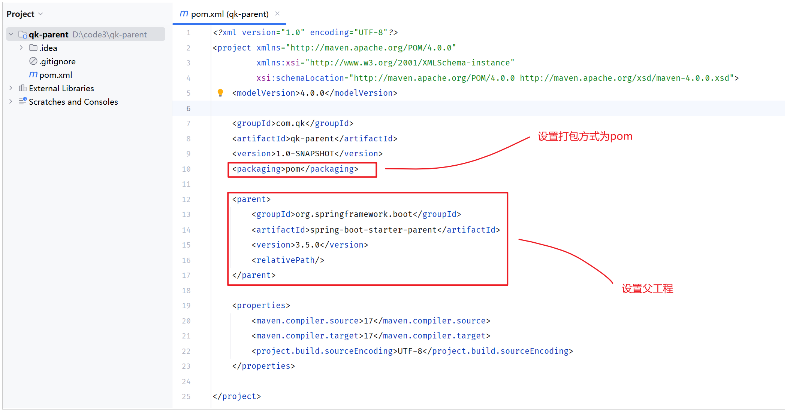

pom\.xml的代码如下：

```xml
<?xml version="1.0" encoding="UTF-8"?>
<project xmlns="http://maven.apache.org/POM/4.0.0"
         xmlns:xsi="http://www.w3.org/2001/XMLSchema-instance"
         xsi:schemaLocation="http://maven.apache.org/POM/4.0.0 http://maven.apache.org/xsd/maven-4.0.0.xsd">
    <modelVersion>4.0.0</modelVersion>

    <groupId>com.itheima.qk</groupId>
    <artifactId>qk-parent</artifactId>
    <version>1.0-SNAPSHOT</version>
    <packaging>pom</packaging>

    <!--设置父工程为spring-boot-starter-parent-->
    <parent>
        <groupId>org.springframework.boot</groupId>
        <artifactId>spring-boot-starter-parent</artifactId>
        <version>3.5.15</version>
        <relativePath/> <!-- lookup parent from repository -->
    </parent>

    <properties>
        <maven.compiler.source>17</maven.compiler.source>
        <maven.compiler.target>17</maven.compiler.target>
        <project.build.sourceEncoding>UTF-8</project.build.sourceEncoding>
    </properties>

</project>
```

2.创建子工程`qk-common`，设置父工程为`qk-parent`

由于该模块，仅仅用来管理一些通用组件、工具类，并不需要单独启动运行，所以创建一个普通的maven项目即可，不需要创建springboot项目。

由于 `qk-common` 是 `qk-parent `的子模块，所以将其放在 `qk-parent` 下面就可以了。 选中 `qk-parent` 项目，右键选择`new module`。

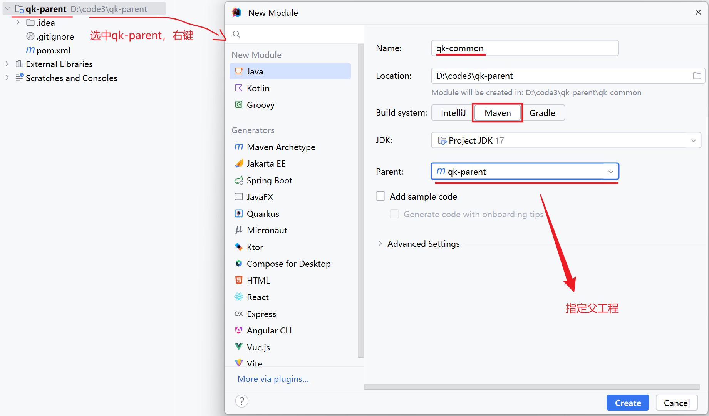

创建完毕后，我们可以看到`qk-common`已经继承了`qk-parent`这个父工程了。

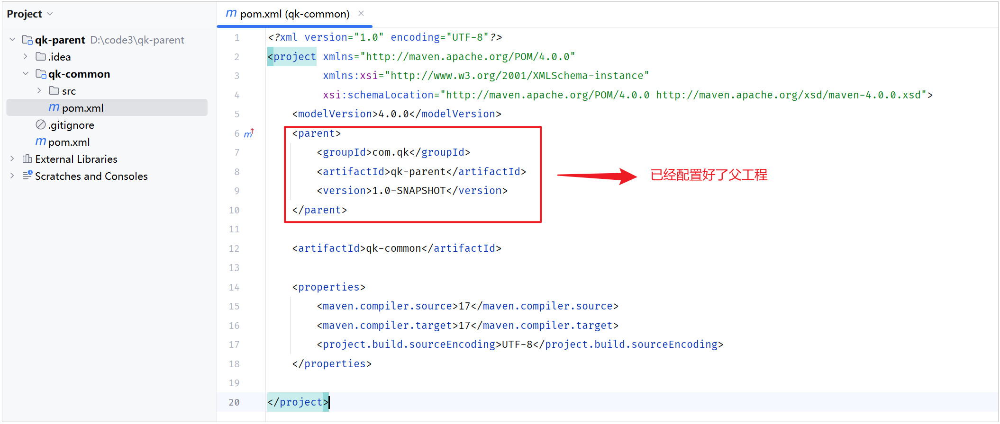

> 提示：如果在maven项目中指定了继承关系，设置了父工程，如果父工程与子工程的组织名、版本一致，子工程坐标中的`<groupId><version>` 是可以省略的，默认与父工程一致。
>

3.创建子工程`qk-entity`，设置父工程为`qk-parent`

由于该模块，仅仅用来管理一些实体类，也不需要单独启动运行，所以创建一个普通的maven项目即可，不需要创建springboot项目。

由于 `qk-entity` 是 `qk-parent `的子模块，所以将其放在 `qk-parent` 下面就可以了。 选中 `qk-parent` 项目，右键选择`new module`。

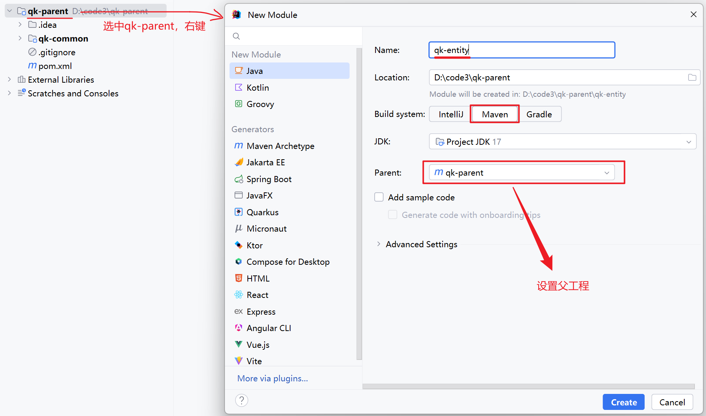

创建完毕后，我们可以看到`qk-entiy`已经继承了`qk-parent`这个父工程了。

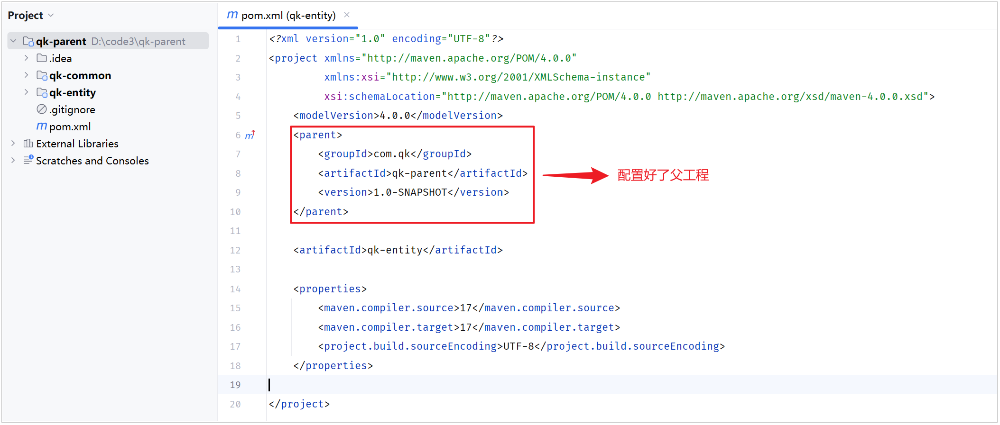

4.创建子工程`qk-management`，设置父工程为`qk-parent`

由于 qk\-management 里面存储的是轻客管家这个项目的核心代码，最终是要独立运行的。所以这里我们要创建一个SpringBoot项目。

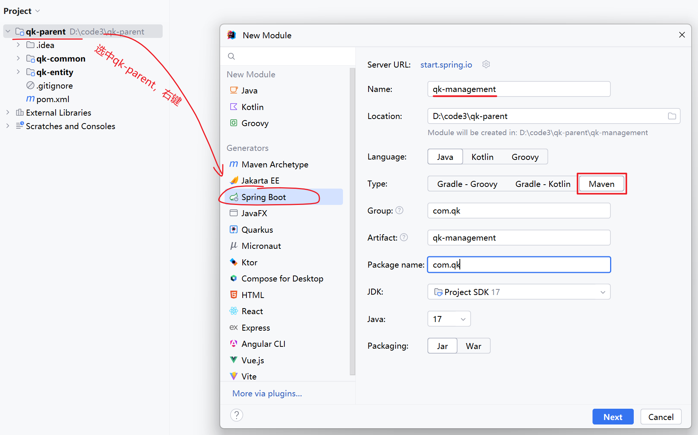

在创建springboot项目时，勾选 web开发的起步依赖，mybatis的依赖，mysql驱动的依赖。

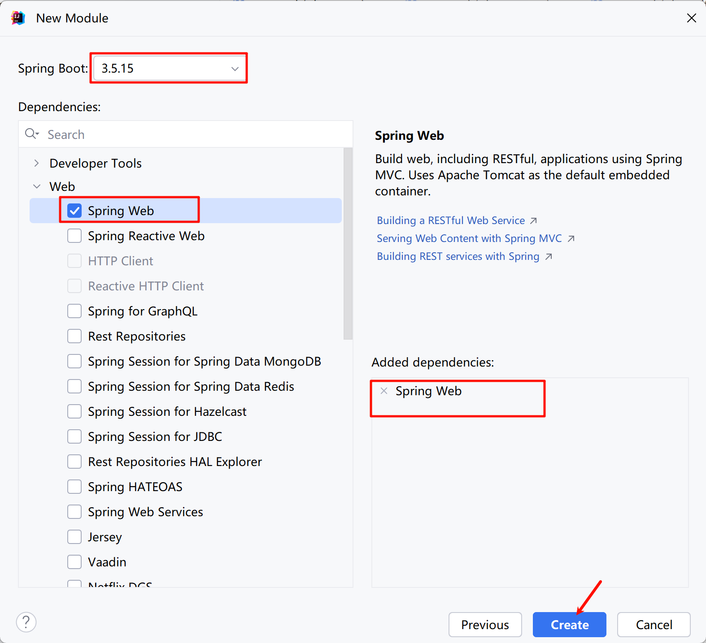

项目创建好了之后，我们可以看到这个项目默认继承了springboot的父工程spring\-boot\-starter\-parent。

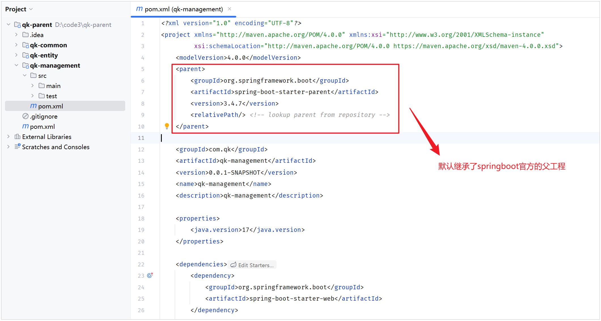

而按照我们前面的设计，qk\-management需要继承我们自己创建的qk\-parent这个父工程啊，所以需要对pom\.xml中的配置做如下调整，调整后的pom\.xml配置如下：

```xml
<?xml version="1.0" encoding="UTF-8"?>
<project xmlns="http://maven.apache.org/POM/4.0.0" xmlns:xsi="http://www.w3.org/2001/XMLSchema-instance"
         xsi:schemaLocation="http://maven.apache.org/POM/4.0.0 https://maven.apache.org/xsd/maven-4.0.0.xsd">
    <modelVersion>4.0.0</modelVersion>
    <parent>
        <groupId>com.itheima.qk</groupId>
        <artifactId>qk-parent</artifactId>
        <version>1.0-SNAPSHOT</version>
    </parent>
    
    <artifactId>qk-management</artifactId>
    <version>0.0.1-SNAPSHOT</version>
    <name>qk-management</name>
    <description>qk-management</description>

    <properties>
        <java.version>17</java.version>
    </properties>

    <dependencies>
        <dependency>
            <groupId>org.springframework.boot</groupId>
            <artifactId>spring-boot-starter-web</artifactId>
        </dependency>

        <dependency>
            <groupId>org.mybatis.spring.boot</groupId>
            <artifactId>mybatis-spring-boot-starter</artifactId>
            <version>3.0.4</version>
        </dependency>

        <dependency>
            <groupId>com.mysql</groupId>
            <artifactId>mysql-connector-j</artifactId>
            <scope>runtime</scope>
        </dependency>

        <dependency>
            <groupId>org.springframework.boot</groupId>
            <artifactId>spring-boot-starter-test</artifactId>
            <scope>test</scope>
        </dependency>

        <dependency>
            <groupId>org.mybatis.spring.boot</groupId>
            <artifactId>mybatis-spring-boot-starter-test</artifactId>
            <version>3.0.4</version>
            <scope>test</scope>
        </dependency>
        
        <dependency>
            <groupId>com.qk</groupId>
            <artifactId>qk-common</artifactId>
            <version>1.0-SNAPSHOT</version>
        </dependency>
        <dependency>
            <groupId>com.qk</groupId>
            <artifactId>qk-entity</artifactId>
            <version>1.0-SNAPSHOT</version>
        </dependency>
    </dependencies>

    <build>
        <plugins>
            <plugin>
                <groupId>org.springframework.boot</groupId>
                <artifactId>spring-boot-maven-plugin</artifactId>
            </plugin>
        </plugins>
    </build>

</project>
```

5.设置qk\-management依赖qk\-common和qk\-entity工程。

```xml
<dependencies>
    <!--引入qk-common 和 qk-entity -->
    <dependency>
        <groupId>com.itheima.qk</groupId>
        <artifactId>qk-common</artifactId>
        <version>1.0-SNAPSHOT</version>
    </dependency>
    <dependency>
        <groupId>com.itheima.qk</groupId>
        <artifactId>qk-entity</artifactId>
        <version>1.0-SNAPSHOT</version>
    </dependency>

    <!--springboot web开发起步依赖-->
    <dependency>
        <groupId>org.springframework.boot</groupId>
        <artifactId>spring-boot-starter-web</artifactId>
    </dependency>
    <!--springboot 单元测试起步依赖-->
    <dependency>
        <groupId>org.springframework.boot</groupId>
        <artifactId>spring-boot-starter-test</artifactId>
        <scope>test</scope>
    </dependency>

</dependencies>
```

# 四、依赖配置

## 1.公共依赖抽取

进行了分模块设计与开发之后，在进行依赖配置的时候，如果各个子工程中都需要引入某一项依赖，比如lombok，如果在各个子工程中分别引入，会比较麻烦，并且也不便于维护和管理。

所以，如果是各个子工程中公共的这部分依赖，我们是可以直接统一抽取到父工程，在父工程中统一进行配置的，父工程一旦引入了这部分公共的依赖之后，各个子工程都会继承下来。

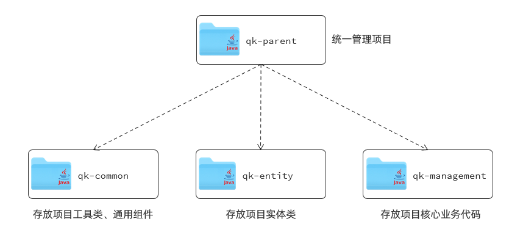

接下来，我们就可以在 `qk-parent` 这个父工程中，引入`lombok`的依赖。 父工程的pom\.xml配置如下：

```xml
<?xml version="1.0" encoding="UTF-8"?>
<project xmlns="http://maven.apache.org/POM/4.0.0"
         xmlns:xsi="http://www.w3.org/2001/XMLSchema-instance"
         xsi:schemaLocation="http://maven.apache.org/POM/4.0.0 http://maven.apache.org/xsd/maven-4.0.0.xsd">
    <modelVersion>4.0.0</modelVersion>

    <groupId>com.qk</groupId>
    <artifactId>qk-parent</artifactId>
    <version>1.0-SNAPSHOT</version>
    <packaging>pom</packaging>

    <parent>
        <groupId>org.springframework.boot</groupId>
        <artifactId>spring-boot-starter-parent</artifactId>
        <version>3.5.0</version>
        <relativePath/>
    </parent>

    <!-- 聚合 -->
    <modules>
        <module>qk-common</module>
        <module>qk-entity</module>
        <module>qk-management</module>
    </modules>
    
    <properties>
        <maven.compiler.source>17</maven.compiler.source>
        <maven.compiler.target>17</maven.compiler.target>
        <project.build.sourceEncoding>UTF-8</project.build.sourceEncoding>
    </properties>

    <dependencies>
        <dependency>
            <groupId>org.projectlombok</groupId>
            <artifactId>lombok</artifactId>
        </dependency>
    </dependencies>

</project>
```

然后我们可以打开右侧的maven面板，可以看看各个子工程中，都已经引入了lombok这个依赖。

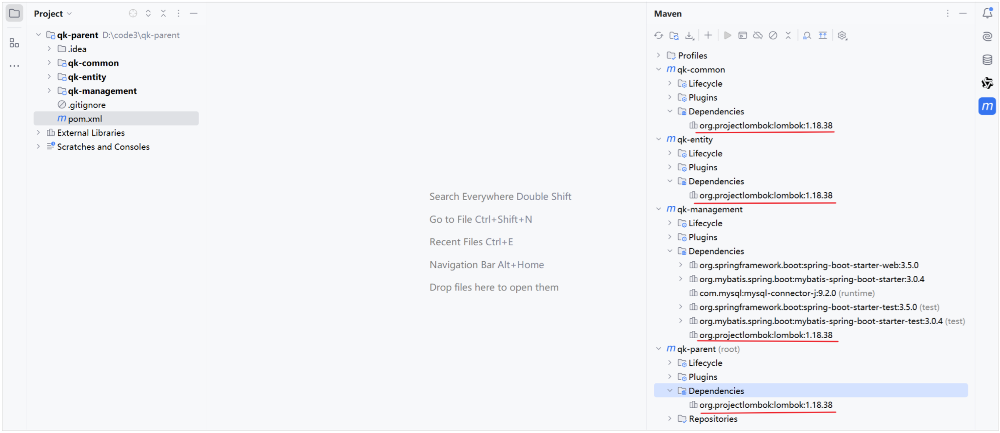

此时，大家可以思考一下，如果以后，我们要想调整lombok这些各个子工程公共的依赖的版本，是不就很方便了，只需要调整父工程中依赖的版本即可。

## 2.版本锁定

我们可以看到，我们所创建SpringBoot工程中，项目创建完毕后，在pom\.xml中已经自动帮我们配置好了依赖。

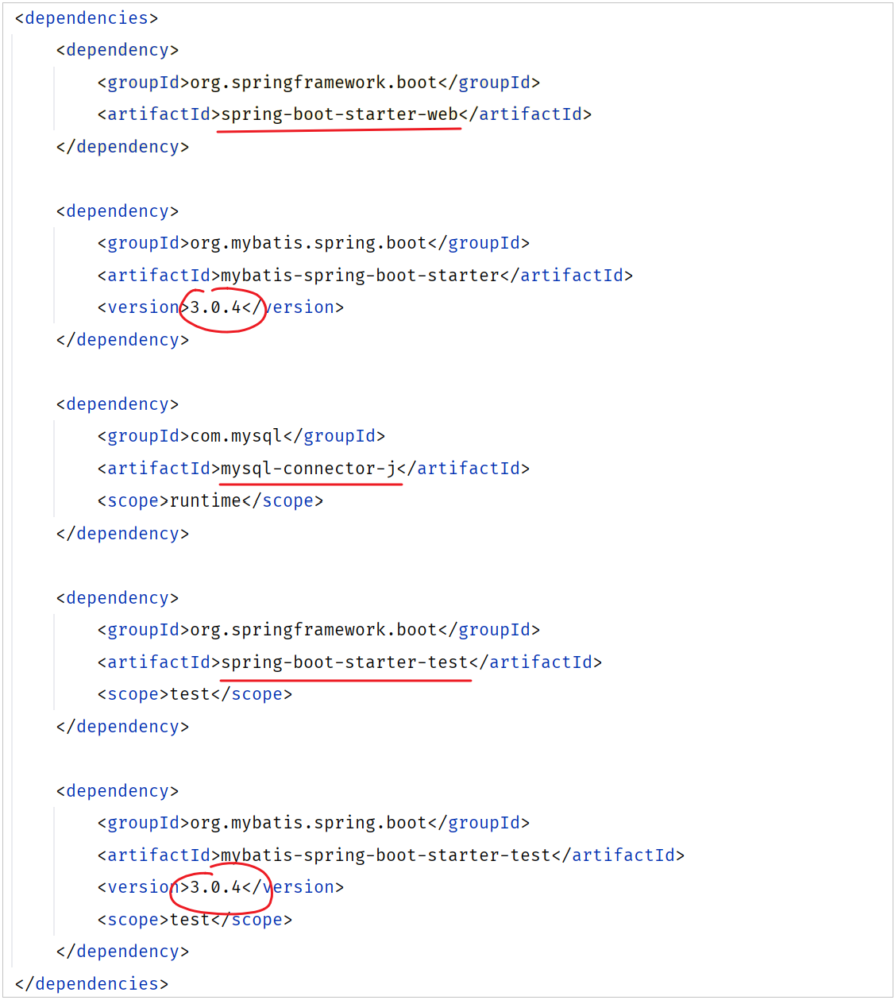

但是大家会发现，在pom\.xml引入的依赖中，有的依赖坐标执行了`<version>`版本号，有的却没有指定版本号，这是为什么呢？

因为，所有的Springboot项目都有一个父工程 spring\-boot\-starter\-parent，而在maven中，如果存在继承关系，我们是可以把所有依赖的版本统一交给父工程进行管理和维护的，而在springboot中就是这么做的，我们只需要在父工程的pom\.xml中通过 \<dependencyManagement\> 标签来统一管理哟来的版本即可。具体形式如下：

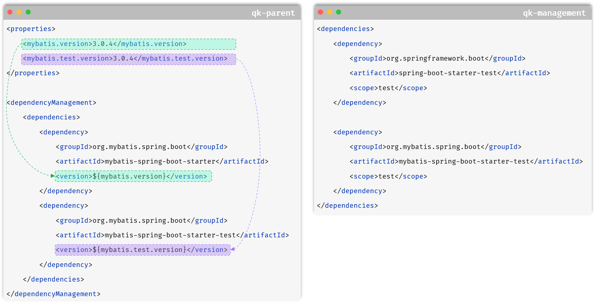

接下来，我们就来演示一下：

1.在父工程中通过\<dependencyManagement\>统一管理依赖的版本，`qk-parent` 完整 pom\.xml 配置如下

```xml
<?xml version="1.0" encoding="UTF-8"?>
<project xmlns="http://maven.apache.org/POM/4.0.0"
         xmlns:xsi="http://www.w3.org/2001/XMLSchema-instance"
         xsi:schemaLocation="http://maven.apache.org/POM/4.0.0 http://maven.apache.org/xsd/maven-4.0.0.xsd">
    <modelVersion>4.0.0</modelVersion>

    <groupId>com.qk</groupId>
    <artifactId>qk-parent</artifactId>
    <version>1.0-SNAPSHOT</version>
    <packaging>pom</packaging>

    <parent>
        <groupId>org.springframework.boot</groupId>
        <artifactId>spring-boot-starter-parent</artifactId>
        <version>3.5.0</version>
        <relativePath/>
    </parent>

    <!-- 聚合 -->
    <modules>
        <module>qk-common</module>
        <module>qk-entity</module>
        <module>qk-management</module>
    </modules>

    <properties>
        <maven.compiler.source>17</maven.compiler.source>
        <maven.compiler.target>17</maven.compiler.target>
        <project.build.sourceEncoding>UTF-8</project.build.sourceEncoding>
    </properties>

    <dependencies>
        <dependency>
            <groupId>org.projectlombok</groupId>
            <artifactId>lombok</artifactId>
            <version>1.18.38</version>
        </dependency>
    </dependencies>

    <dependencyManagement>
        <dependencies>
            <dependency>
                <groupId>org.mybatis.spring.boot</groupId>
                <artifactId>mybatis-spring-boot-starter</artifactId>
                <version>3.0.4</version>
            </dependency>

            <dependency>
                <groupId>org.mybatis.spring.boot</groupId>
                <artifactId>mybatis-spring-boot-starter-test</artifactId>
                <version>3.0.4</version>
            </dependency>
        </dependencies>
    </dependencyManagement>

</project>
```

而对于这些个 `<version>` 版本号，我们也可以将其集中维护管理起来，直接配置在 `<properties>` 中自定义一个属性。最终优化后形式如下:

```xml
<?xml version="1.0" encoding="UTF-8"?>
<project xmlns="http://maven.apache.org/POM/4.0.0"
         xmlns:xsi="http://www.w3.org/2001/XMLSchema-instance"
         xsi:schemaLocation="http://maven.apache.org/POM/4.0.0 http://maven.apache.org/xsd/maven-4.0.0.xsd">
    <modelVersion>4.0.0</modelVersion>

    <groupId>com.qk</groupId>
    <artifactId>qk-parent</artifactId>
    <version>1.0-SNAPSHOT</version>
    <packaging>pom</packaging>

    <parent>
        <groupId>org.springframework.boot</groupId>
        <artifactId>spring-boot-starter-parent</artifactId>
        <version>3.5.0</version>
        <relativePath/>
    </parent>

    <!-- 聚合 -->
    <modules>
        <module>qk-common</module>
        <module>qk-entity</module>
        <module>qk-management</module>
    </modules>

    <properties>
        <maven.compiler.source>17</maven.compiler.source>
        <maven.compiler.target>17</maven.compiler.target>
        <project.build.sourceEncoding>UTF-8</project.build.sourceEncoding>
        <!--自定义属性-->
        <mybatis.version>3.0.4</mybatis.version>
        <pagehelper.version>2.1.0</pagehelper.version>
    </properties>

    <dependencies>
        <dependency>
            <groupId>org.projectlombok</groupId>
            <artifactId>lombok</artifactId>
            <version>1.18.38</version>
        </dependency>
    </dependencies>

    <dependencyManagement>
        <dependencies>
            <dependency>
                <groupId>org.mybatis.spring.boot</groupId>
                <artifactId>mybatis-spring-boot-starter</artifactId>
                <version>${mybatis.version}</version>
            </dependency>

            <dependency>
                <groupId>com.github.pagehelper</groupId>
                <artifactId>pagehelper-spring-boot-starter</artifactId>
            </dependency>
        </dependencies>
    </dependencyManagement>

</project>
```

2.在子工程中引入依赖的时候，则无需指定`<version>`，`qk-management` 中 pom\.xml 配置如下

```xml
<?xml version="1.0" encoding="UTF-8"?>
<project xmlns="http://maven.apache.org/POM/4.0.0" xmlns:xsi="http://www.w3.org/2001/XMLSchema-instance"
         xsi:schemaLocation="http://maven.apache.org/POM/4.0.0 https://maven.apache.org/xsd/maven-4.0.0.xsd">
    <modelVersion>4.0.0</modelVersion>
    <parent>
        <groupId>com.itheima.qk</groupId>
        <artifactId>qk-parent</artifactId>
        <version>1.0-SNAPSHOT</version>
    </parent>

    <artifactId>qk-management</artifactId>
    <version>0.0.1-SNAPSHOT</version>
    <name>qk-management</name>
    <description>qk-management</description>

    <properties>
        <java.version>17</java.version>
    </properties>

    <dependencies>
        <dependency>
            <groupId>org.springframework.boot</groupId>
            <artifactId>spring-boot-starter-web</artifactId>
        </dependency>

        <dependency>
            <groupId>com.mysql</groupId>
            <artifactId>mysql-connector-j</artifactId>
            <scope>runtime</scope>
        </dependency>

        <dependency>
            <groupId>org.springframework.boot</groupId>
            <artifactId>spring-boot-starter-test</artifactId>
            <scope>test</scope>
        </dependency>

        <!--mybatis-->
        <dependency>
            <groupId>org.mybatis.spring.boot</groupId>
            <artifactId>mybatis-spring-boot-starter</artifactId>
        </dependency>
        
        <!--pagehelper-->
        <dependency>
            <groupId>com.github.pagehelper</groupId>
            <artifactId>pagehelper-spring-boot-starter</artifactId>
        </dependency>
    </dependencies>

    <build>
        <plugins>
            <plugin>
                <groupId>org.springframework.boot</groupId>
                <artifactId>spring-boot-maven-plugin</artifactId>
            </plugin>
        </plugins>
    </build>

</project>
```

虽然没有指定 \<version\> ，但是通过右侧的maven面板，我们是可以看到这些依赖的版本的，就是我们在父工程中所设置的依赖的版本。

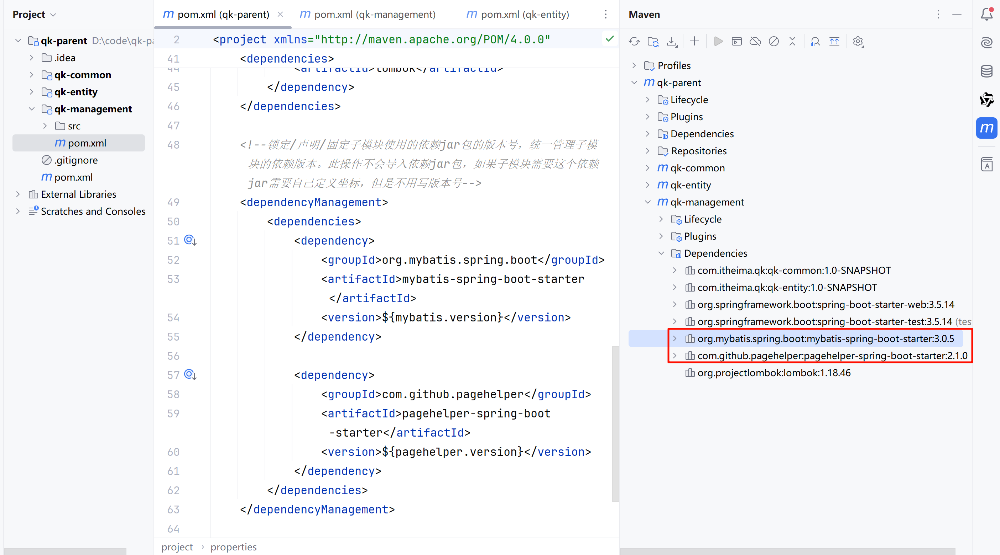

> `<dependencies>` 与 `<dependencyManagement>`的区别 ?
>
> `<dependencies>` 标签中配置的依赖坐标，是直接将依赖引入进来。
>
> `<dependencyManagement>` 标签主要是用来统一管理依赖的版本，不会直接引入依赖，在子工程中还需要通过坐标引入依赖，但是不需要再指定 `<version>`。

