# 一、部门管理-说明

好的，我们已经完成了轻客管家项目的准备工作，那接下来呢，我们就要开始来开发轻客管家项目的功能了，那今天呢，我们就先来完成轻客管家项目的第一个功能模块\-\-部门管理。

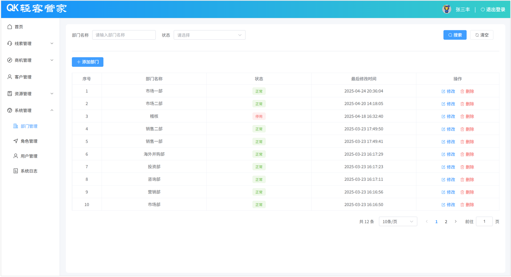

这其中，就包括部门信息的新增、查询、修改、删除等操作。在正式开发之前，我们还需要明确一下开发规范：

# 二、开发规范

## 1.开发模式


我们项目开发时，采用的是目前企业开发中最为主流的前后台分离开发方式。 

在前后端分离的开发模式中，我们会将项目拆分为前端工程、后端工程这2个工程，然后前端工程交给专业的前端人员开发，后端工程交给专业的后端人员开发。

前端页面需要数据，可以通过发送异步请求，从后台工程获取。但是，我们前后台是分开来开发的，那么前端人员怎么知道后台返回数据的格式呢？后端人员开发，怎么知道前端人员需要的数据格式呢？

所以针对这个问题，我们前后台统一制定一套规范！我们前后台开发人员都需要遵循这套规范开发，这就是我们的接口文档。

那么接口文档的内容怎么来的呢？是我们后台开发者根据产品经理提供的产品原型和需求文档所撰写出来的。

那么基于前后台分离开发的模式下，我们后台开发者开发一个功能的具体流程如何呢？如下图所示：


1. 需求分析：首先我们需要阅读需求文档，分析需求，理解需求。

2. 接口设计：查询接口文档中关于需求的接口的定义，包括地址，参数，响应数据类型等等

3. 前后台并行开发：各自按照接口文档进行开发，实现需求

4. 测试：前后台开发完了，各自按照接口文档进行测试

5. 前后段联调测试：前段工程请求后端工程，测试功能

## 2.交互规范

在项目开发中，会涉及到很多很多的接口，这些接口涉及到增、删、改、查各种各样的操作，如果这些操作，给前端响应的结果的格式没有一个统一固定的格式，想怎么返回就怎么返回，那最终这个项目将变得难以维护和管理。

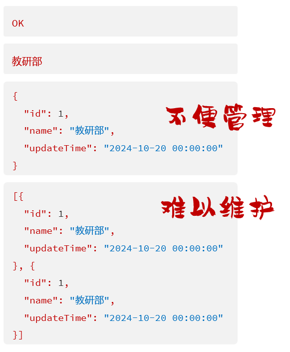

因此呢， 在前后端交互时，所有的增、删、改、查的接口，无论是请求成功，还是失败，均响应统一格式的结果。比如，如下的结果：

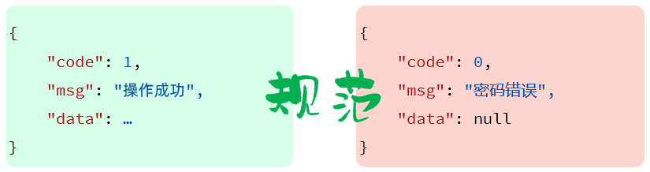

- code：表示状态码，1：成功，0：失败。

- msg：提示信息。

- data：响应的数据。


那么对于上述的这三项数据，我们可以在服务端定义一个统一响应结果的封装类 Result ，最终我们只需要将这三项数据封装到Result这个类中就可以了。 

Result属于项目开发中涉及到的通用组件，引入存放在 `qk-common` 这个模块中。创建包 `com.qk.common` , Result类代码如下:

```java
package com.itheima.qk.common.domain;

import lombok.Data;

/**
 * 后端统一返回结果
 */
@Data
public class Result {

    private Integer code; //编码：1成功，0为失败
    private String msg; //错误信息
    private Object data; //数据

    //封装增删改成功的结果
    public static Result success() {
        Result result = new Result();
        result.code = 1;
        result.msg = "success";
        return result;
    }
    //封装查询成功的结果
    public static Result success(Object data) {
        Result result = new Result();
        result.data = data;
        result.code = 1;
        result.msg = "success";
        return result;
    }
    //封装失败的结果
    public static Result error(String msg) {
        Result result = new Result();
        result.msg = msg;
        result.code = 0;
        return result;
    }

}
```

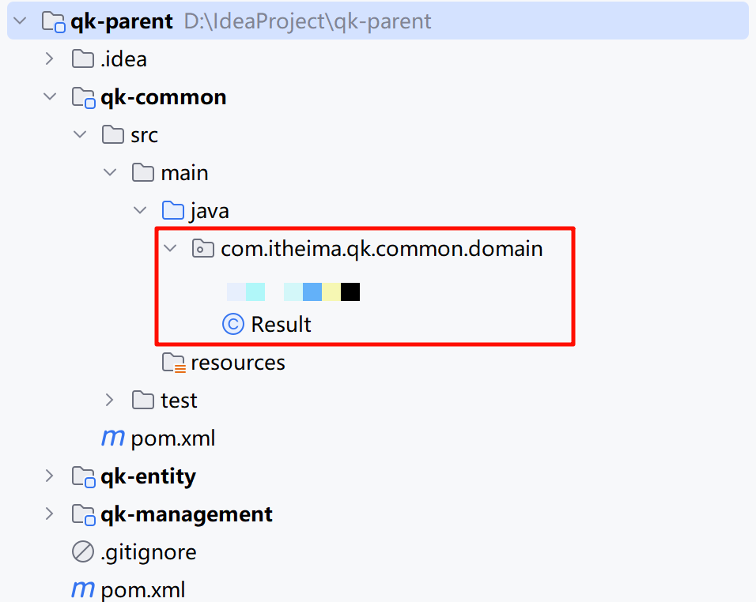

## 3.API风格

我们的案例是基于当前最为主流的前后端分离模式进行开发。

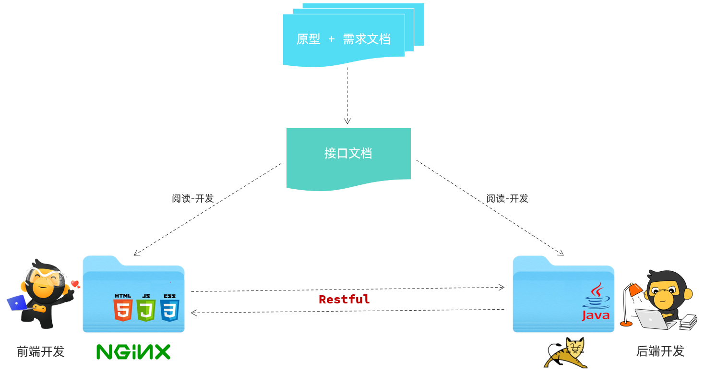

在前后端分离的开发模式中，前后端开发人员都需要根据提前定义好的接口文档，来进行前后端功能的开发。

后端开发人员：必须严格遵守提供的接口文档进行后端功能开发（保障开发的功能可以和前端对接）

而在前后端进行交互的时候，我们需要基于当前主流的REST风格的API接口进行交互。

### 3.1.Restful介绍

什么是REST风格呢?

REST（Representational State Transfer），表述性状态转换，它是一种软件架构风格。

传统URL风格如下：

- http://localhost:8080/user/getById?id=1      GET：查询id为1的用户

- http://localhost:8080/user/saveUser            POST：新增用户

- http://localhost:8080/user/updateUser         POST：修改用户

- http://localhost:8080/user/deleteUser?id=1  GET：删除id为1的用户

我们看到，原始的传统URL呢，定义比较复杂，而且将资源的访问行为对外暴露出来了。而且，对于开发人员来说，每一个开发人员都有自己的命名习惯，就拿根据id查询用户信息来说的，不同的开发人员定义的路径可能是这样的：`getById`，`selectById`，`queryById`，`loadById`\.\.\. 。 每一个人都有自己的命名习惯，如果都按照各自的习惯来，一个项目组，几十号或上百号人，那最终开发出来的项目，将会变得难以维护，没有一个统一的标准。

基于REST风格URL如下：

- http://localhost:8080/users/1       GET：查询id为1的用户

- http://localhost:8080/users          POST：新增用户

- http://localhost:8080/users          PUT：修改用户

- http://localhost:8080/users/1       DELETE：删除id为1的用户

其中总结起来，就一句话：通过URL定位要操作的资源，通过HTTP动词\(请求方式\)来描述具体的操作。

后端接口上除了定义请求路径之外，还需要定义前端访问的请求方式，否则前端可以使用任何请求方式访问，这是不符合Restful开发规范的，可以在@RequestMapping注解中添加method属性，指定前端的请求方式：

```java
@RequestMapping(value = "/users",method = RequestMethod.GET )。
```

以上写法较为麻烦，Spring给我们提供了四个简化的注解来定义请求路径和请求方式，如下所示

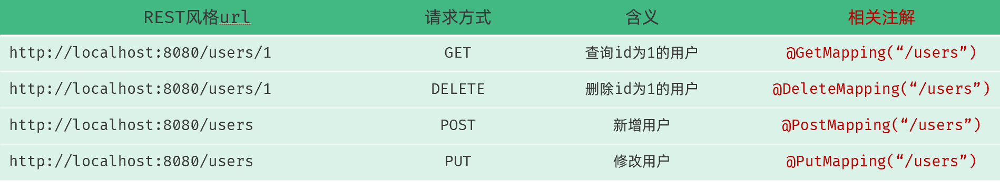

像@GetMapping("/users")内部就封装了@RequestMapping(value = "/users",method = RequestMethod.*GET* )。

> 注意事项：
>
> - REST是风格，是约定方式，约定不是规定，可以打破
>
> - 描述模块的功能通常使用复数，也就是加s的格式来描述，表示此类资源，而非单个资源。如：users、emps、books…
>

### 3.2.Apifox

我们上面讲到，在这个案例中，我们将会基于Restful风格的接口进行交互，那么其中就涉及到常见的4中请求方式，包括：POST、DELETE、PUT、GET。

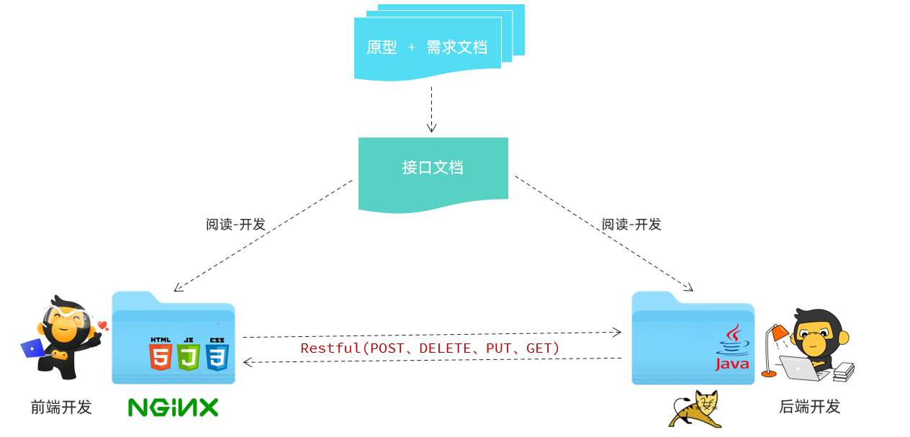

因为在浏览器地中所发起的所有的请求，都是GET方式的请求。那大家就需要思考两个问题：

- 前后端都在并行开发，后端开发完对应的接口之后，如何对接口进行请求测试呢？

- 前后端都在并行开发，前端开发过程中，如何获取到数据，测试页面的渲染展示呢？

那这里我们就可以借助一些接口测试工具，比如项：Postman、Apipost、Apifox等。


那这些工具的使用基本类似，只不过Apifox工具的功能更强强大、更加完善，所以我们会采用功能更为强大的Apifox工具。 

**Apifox介绍**

介绍：Apifox是一款集成了Api文档、Api调试、Api Mock、Api测试的一体化协作平台。

作用：接口文档管理、接口请求测试、Mock服务。

官网：[ https://apifox.com/](https://apifox.com/)

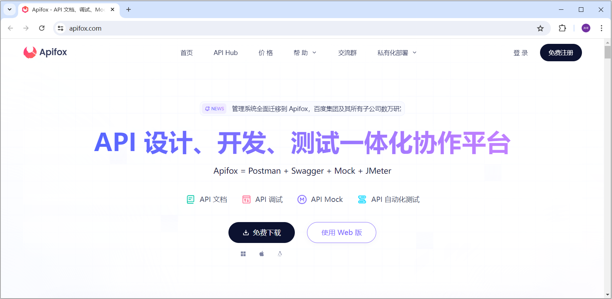

**Apifox安装**

下载Apifox的安装包（资料中已经提供），直接双击安装 。 


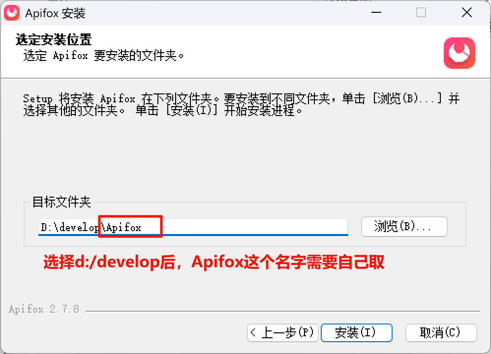

安装完成之后，就可以微信扫码登录Apifox，就可以使用啦。。。

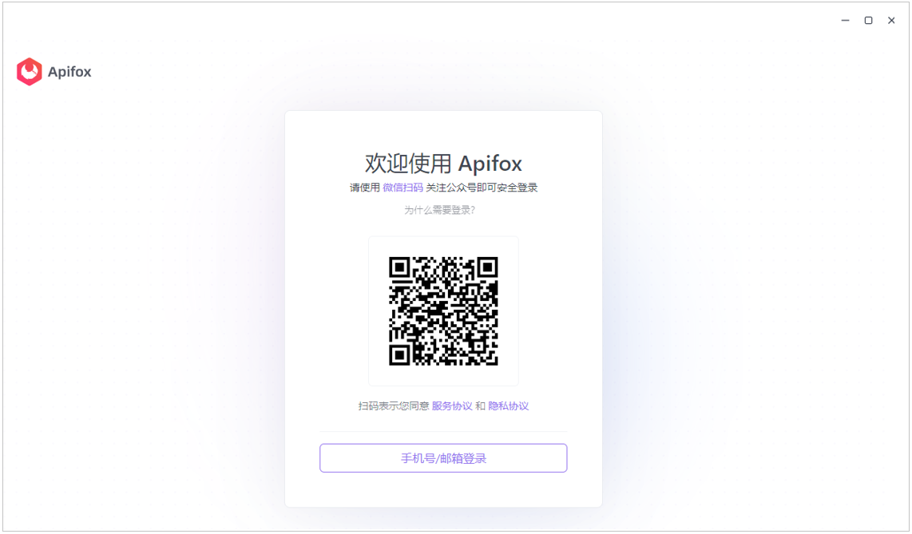

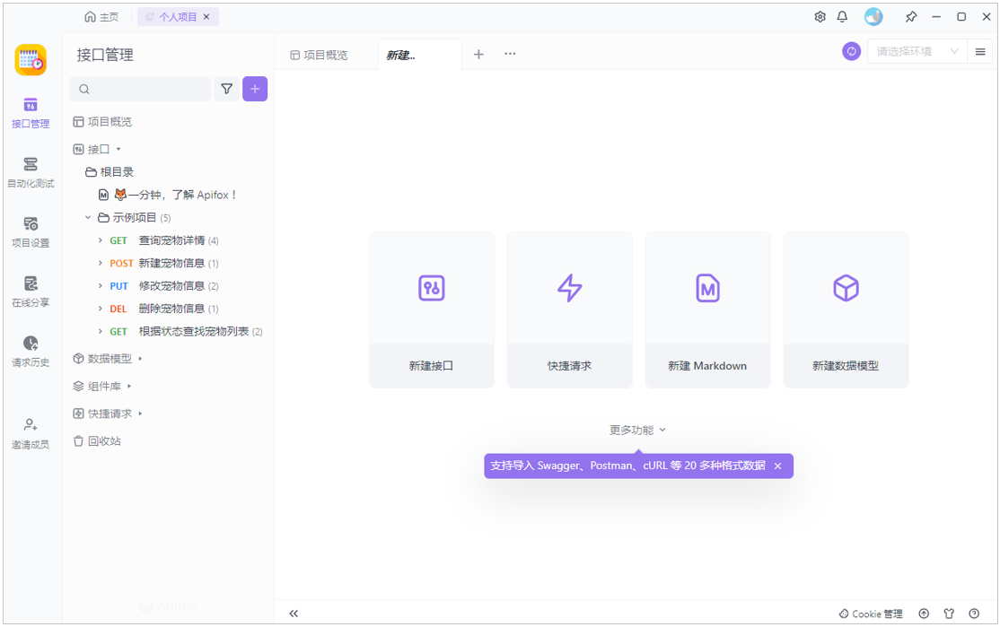

# 三、部门管理\-准备

## 1.数据库表

首先，我们先一起来完成数据库表结构的设计。那在设计阶段呢，我们其实也可以借助于AI来辅助我们完成数据库表的设计。具体的流程如下：

①\. 根据页面原型、需求文档，明确业务需求，确定数据主体/表（确定有哪些表）（AI辅助，开发人员检查、确认调整、优化）。

②\. 根据页面原型、需求文档，确定数据主体之间的关系（一对一、一对多、多对多）（AI辅助，开发人员检查、确认调整、优化）。【多表设计后面学习】

③\. 根据页面原型、需求文档，确定数据主体涉及到的字段、字段的类型、字段的约束等（AI辅助，开发人员检查、确认调整、优化）。

④\. 确定出该模块完整的表结构，建库建表。

部门管理的页面原型及页面开发规则如下：

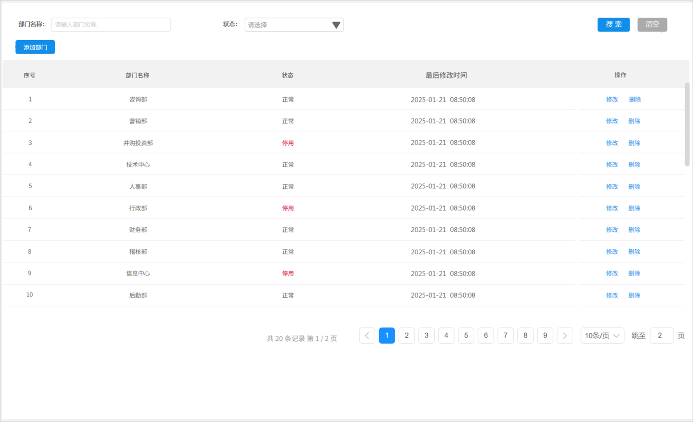

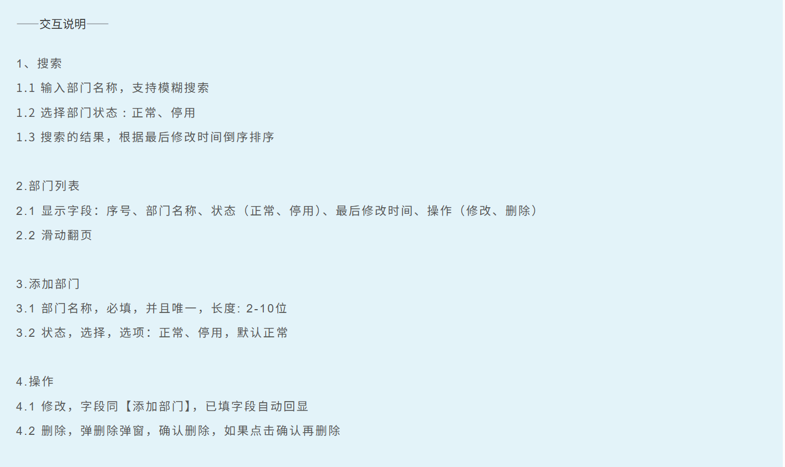

最终部门表的表结构如下：

```sql
-- 创建数据库
create database if not exists qk;
-- 使用数据库
use qk;
-- 部门表
create table dept
(
    id          int unsigned primary key auto_increment comment '部门id，主键',
    name        varchar(10)      not null unique comment '部门名称',
    status      tinyint unsigned not null default 1 comment '状态：0-停用，1-正常',
    create_time datetime         not null comment '创建时间',
    update_time datetime         not null comment '修改时间'
) comment '部门信息表';
-- 添加模拟数据
INSERT INTO dept (id, name, status, create_time, update_time)
VALUES (1, '研发部', 1, '2025-12-26 15:45:31', '2025-12-26 15:27:40'),
       (2, '市场部', 1, '2025-12-26 15:45:31', '2025-12-26 15:27:40'),
       (3, '销售一部', 1, '2025-12-26 15:45:31', '2025-12-26 15:27:46'),
       (4, '人力资源部', 1, '2025-12-26 15:45:31', '2025-12-26 15:27:46'),
       (5, '财务部', 1, '2025-12-26 15:45:31', '2025-12-26 19:28:12'),
       (6, '客服部', 0, '2025-12-26 15:45:31', '2025-12-26 19:28:12'),
       (7, '技术支持部', 1, '2025-12-26 15:45:31', '2025-12-26 19:28:08'),
       (8, '产品部', 1, '2025-12-26 15:45:31', '2025-12-26 19:28:08'),
       (9, '运营部', 0, '2025-12-26 15:45:31', '2025-12-26 19:28:13'),
       (10, '采购部', 1, '2025-12-26 15:45:31', '2025-12-26 19:28:13'),
       (11, '法务部', 0, '2025-12-26 15:45:31', '2025-12-26 19:28:18'),
       (12, '设计部', 1, '2025-12-26 15:45:31', '2025-12-26 19:28:18'),
       (13, '公关部', 0, '2025-12-26 15:45:31', '2025-12-26 19:28:22'),
       (14, '质量部', 1, '2025-12-26 15:45:31', '2025-12-26 19:28:22'),
       (15, '战略部', 1, '2025-12-26 15:45:31', '2025-12-26 19:28:25'),
       (16, '市场一部', 1, '2025-12-09 11:32:42', '2025-12-26 19:28:25');
```

表结构设计好了之后，在Mysql中创建一个数据库，名字为 qk，然后将表结构创建出来。

## 2.实体类

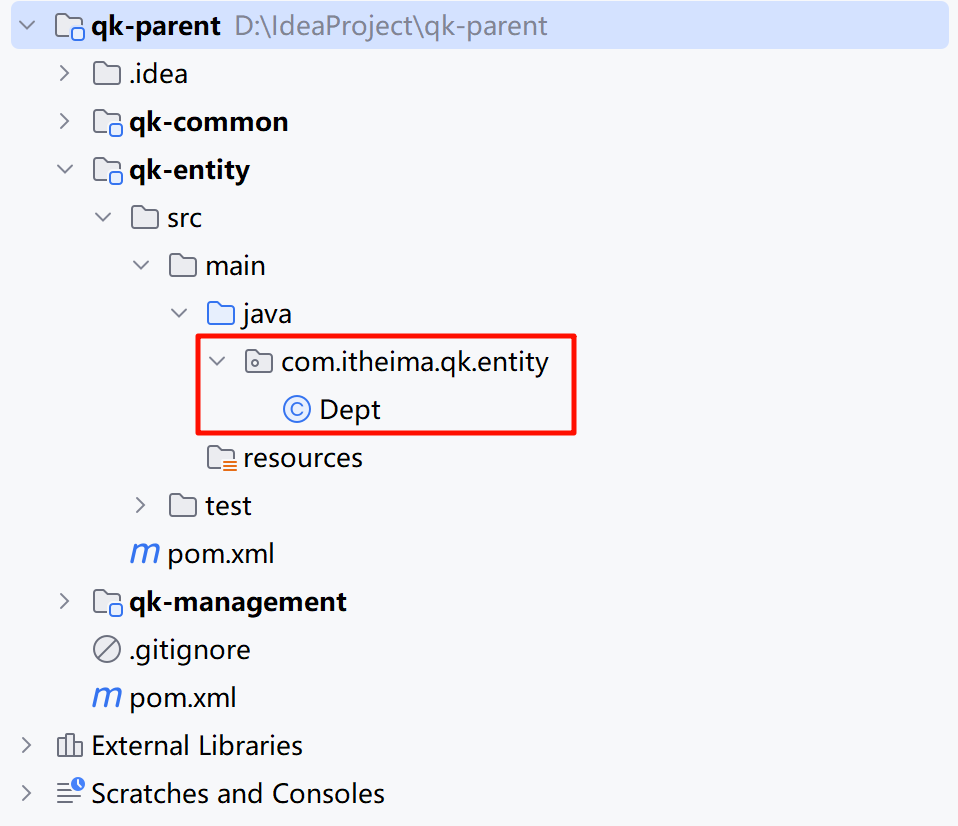

根据上述创建的部门表的表结构，创建对应的实体类Dept，最终Dept部门实体类代码如下：

```java
/**
 * 部门实体类
 */
@Data
@NoArgsConstructor
@AllArgsConstructor
public class Dept {
    private Integer id; // 部门id，主键
    private String name; // 部门名称
    private Integer status; // 状态：0-停用，1-正常
    private LocalDateTime createTime; // 创建时间
    private LocalDateTime updateTime; // 修改时间
}
```

> 备注：实体类，存放在 `qk-entity` 模块下的 `com.itheima.qk.entity` 包中。
>

## 3.准备包结构和基础代码结构

在 `qk-management` 模块下，创建包结构 controller、service、mapper。

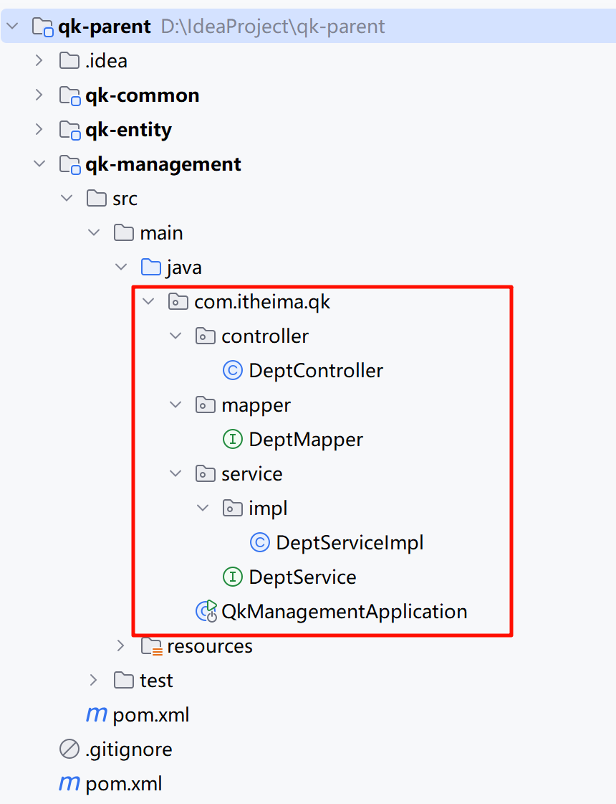

并准备部门管理的基础代码结构: 

1.DeptController

```java
package com.qk.controller;
package com.itheima.qk.controller;

import lombok.extern.slf4j.Slf4j;
import org.springframework.web.bind.annotation.RestController;

@Slf4j
@RestController
public class DeptController {
}
```

2.DeptService

```java
package com.qk.service;

public interface DeptService {
}
```

3.DeptServiceImpl

```java
package com.qk.service.impl;

import com.qk.service.DeptService;
import org.springframework.stereotype.Service;

@Service
public class DeptServiceImpl implements DeptService {
}
```

4.DeptMapper

```java
package com.qk.mapper;

import org.apache.ibatis.annotations.Mapper;

@Mapper
public interface DeptMappper {
}
```

最终代码结构如下:

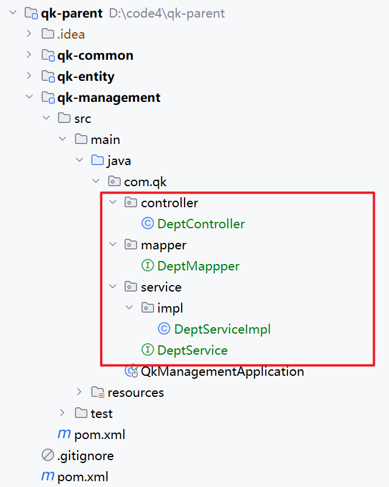

> 注意代码规范！！！！！！
>

## 4.application\.yml配置

在 `qk-management` 模块中，创建一个 `application.yml` 配置文件，来配置数据库连接的信息。具体配置如下：

```yaml
#数据库连接信息
spring:
  datasource:
    driver-class-name: com.mysql.cj.jdbc.Driver # 数据库驱动
    url: jdbc:mysql://localhost:3306/qk # 数据库连接地址
    username: root  # 数据库用户名
    password: 1234  # 数据库密码

#mybatis配置
mybatis:
  configuration:
    log-impl: org.apache.ibatis.logging.stdout.StdOutImpl # mybatis日志输出
    map-underscore-to-camel-case: true    # 开启驼峰命名映射
  mapper-locations: classpath:mapper/*.xml   # mapper映射文件位置
```

# 四、部门管理\-新增

开发流程


## 1.功能开发

### 1.1.基本功能实现

首先我们先看一下部门管理中新增部门的页面原型，具体如下：

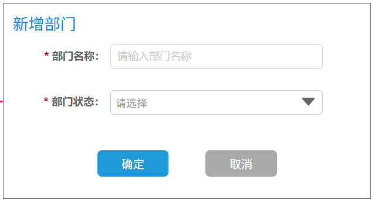

接口文档，可以参照：[附录-接口文档](https://lining-lo.github.io/lining-lo-notes/轻客管家/附录-接口文档.html)

清楚了页面原型与接口文档之后，接下来我们就可以编写对应的提示词来实现新增部门的功能了。

实现流程

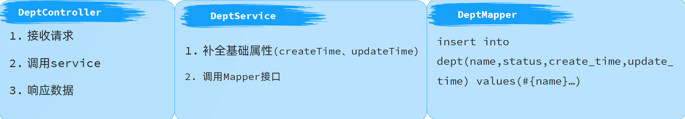

代码实现

1.DeptController 代码如下：

```java
package com.qk.controller;

import com.qk.common.Result;
import com.qk.entity.Dept;
import com.qk.service.DeptService;
import org.springframework.beans.factory.annotation.Autowired;
import org.springframework.web.bind.annotation.PostMapping;
import org.springframework.web.bind.annotation.RequestBody;
import org.springframework.web.bind.annotation.RequestMapping;
import org.springframework.web.bind.annotation.RestController;

/**
 * 部门管理控制器
 */
@Slf4j
@RestController
public class DeptController {
    @Autowired
    private DeptService deptService;
    /**
     新增部门
     * @param dept 封装要新增部门信息(只有name和status)
     @RequestBody :将请求体中的json数据转换(封装)成Java对象，要求json的key要和对象的属性名一样。适用于POST、PUT请求
     */
    @PostMapping("/depts")
    public Result add(@RequestBody Dept dept){
        //1 接收请求参数-->(@RequestBody Dept dept)
        log.info("新增部门，dept={}",dept);
        //2 调用service，新增部门
        deptService.add(dept);
        //3 响应Result结果
        return Result.success();
    }
}
```

2.DeptService 代码如下：

```java
package com.qk.service;

import com.qk.entity.Dept;

/**
 * 部门服务接口
 */
public interface DeptService {
    /**
     * 新增部门
     * @param dept 封装部门信息(包括部门名称、状态)
     */
    void add(Dept dept);
}
```

3.DeptServiceImpl 代码如下：

```java
package com.qk.service.impl;

import com.qk.entity.Dept;
import com.qk.mapper.DeptMapper;
import com.qk.service.DeptService;
import org.springframework.beans.factory.annotation.Autowired;
import org.springframework.stereotype.Service;
import java.time.LocalDateTime;

/**
 * 部门服务实现类
 */
@Service
public class DeptServiceImpl implements DeptService {

    @Autowired
    private DeptMapper deptMapper;
    /**
     * 新增部门
     * @param dept 封装部门信息(包括部门名称、状态)
     */
    @Override
    public void add(Dept dept) {
        //1 设置基础属性
        dept.setCreateTime(LocalDateTime.now());
        dept.setUpdateTime(LocalDateTime.now());
        //2 调用mapper层方法，新增部门
        deptMapper.insert(dept);
    }
}
```

4.DeptMapper代码如下：

```java
package com.qk.mapper;

import com.qk.entity.Dept;
import org.apache .ibatis.annotations.Insert;
import org.apache.ibatis.annotations.Mapper;

/**
 * 部门数据访问接口
 */
@Mapper
public interface DeptMapper {

    /**
     * 插入部门信息
     */
    @Insert("INSERT INTO dept(name, status, create_time, update_time) VALUES(#{name}, #{status}, #{createTime}, #{updateTime})")
    void insert(Dept dept);
}
```

### 1.2.知识点总结

1.json格式请求参数接收

> Controller 中接收json格式的请求参数，通常会使用一个实体对象来接收，在方法形参加上一个注解 @RequestBody。
>

比如：

```java
{
    "name": "行政部",
    "status": 1
}
```

Controller的代码如下:

```java
/**
 * 新增部门
 * @param dept 封装部门信息(包括部门名称、状态)
 */
@PostMapping("/depts")
public Result add(@RequestBody Dept dept) {
    //1 接收请求参数--->(@RequestBody Dept dept)
    log.info("新增部门：{}", dept);
    //2 调用service层方法，新增部门
    deptService.add(dept);
    //3 响应Result
    return Result.success();
}
```

> 注意，如果使用 Dept 对象来接收前端传递的json格式的请求参数，就需要保证该对象中有name和status属性，最终json格式中的name这个key的值，就会封装到dept对象的name属性中； json格式中的status这个key的值，最终就会封装到dept对象的status属性中。
>

> 场景：在POST、PUT请求方式中，前端传递json格式的请求参数，服务端可以使用java对象封装，方法形参前需要使用@RequestBody注解。
>

2.@PostMapping

如果想限定当前接口只有Post请求才允许访问时，可以在Controller方法上加上 @PostMapping 注解。

```java
/**
 * 新增部门
 * @param dept 封装部门信息(包括部门名称、状态)
 */
@PostMapping("/depts")
public Result add(@RequestBody Dept dept) {
    //1 接收请求参数--->(@RequestBody Dept dept)
    log.info("新增部门：{}", dept);
    //2 调用service层方法，新增部门
    deptService.add(dept);
    //3 响应Result
    return Result.success();
}
```

## 2.前后端联调

### 2.1.联调测试

完成了新增部门的功能，我们也通过 Apifox 工具测试通过了，下面我们再基于前后端分离的方式进行接口联调（先用现成的前端代码测试，后面再去写前端代码）。具体操作如下：

1.将资料中提供的 "前端环境" 文件夹中的压缩包，拷贝到一个没有中文不带空格的目录下。


2.解压\(解压到当前目录\)

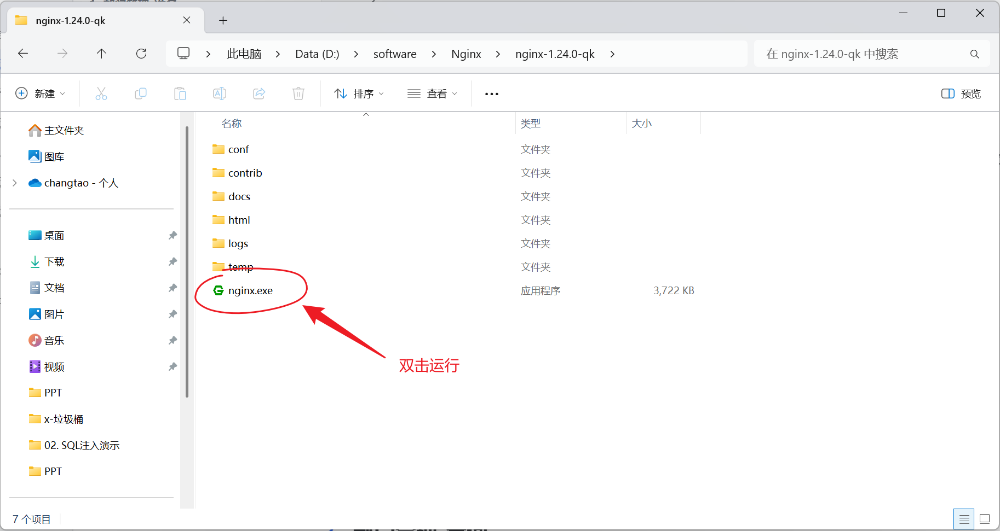

3.双击 `nginx.exe` 启动Nginx，一闪而过，就说明nginx已启动完成。

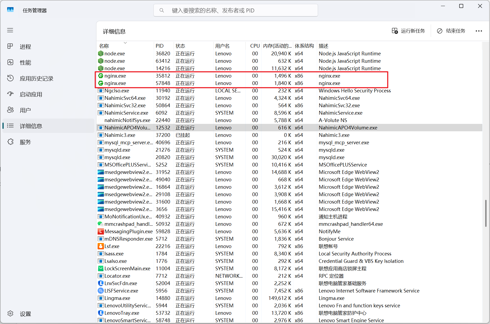

如果在任务管理器中，能看到上述两个进程，就说明nginx已经启动成功。

4.打开浏览器，访问：[http://localhost:90](http://localhost:90/)

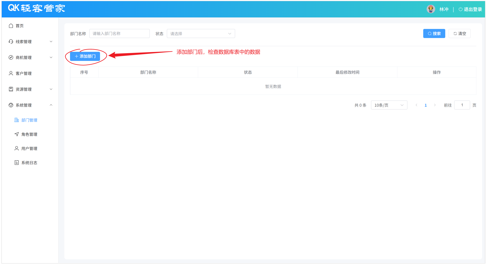

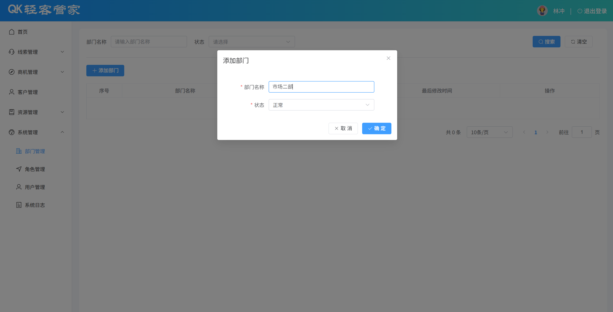

### 2.2.请求访问流程

前端工程请求服务器的地址为 `http://localhost:90/api/depts`，是如何访问到后端的tomcat服务器的？

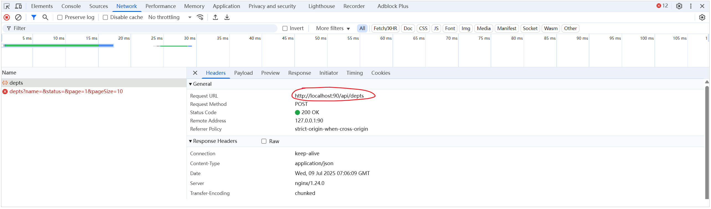

其实这里，是通过前端服务Nginx中提供的反向代理功能实现的。

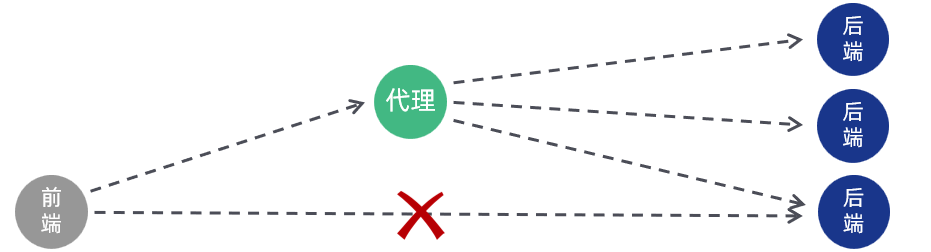

1.浏览器发起请求，请求的是localhost:90 ，那其实请求的是nginx服务器。

2.在nginx服务器中呢，并没有对请求直接进行处理，而是将请求转发给了后端的tomcat服务器，最终由tomcat服务器来处理该请求。

这个过程就是通过nginx的反向代理实现的。 

> 反向代理是一种网络架构，服务器为后端的服务器做代理，客户端的请求直接请求代理服务器，然后转发给后端的服务器。（安全、灵活、负载均衡）
>

那为什么浏览器不直接请求后端的tomcat服务器，而是直接请求nginx服务器呢，主要有以下几点原因：


- 安全：由于后端的tomcat服务器一般都会搭建集群，会有很多的服务器，把所有的tomcat暴露给前端，让前端直接请求tomcat，对于后端服务器是比较危险的。

- 灵活：基于nginx的反向代理实现，更加灵活，后端想增加、减少服务器，对于前端来说是无感知的，只需要在nginx中配置即可。

- 负载均衡：基于nginx的反向代理，可以很方便的实现后端tomcat的负载均衡操作。


具体的请求访问流程，及Nginx的反向代理配置如下：

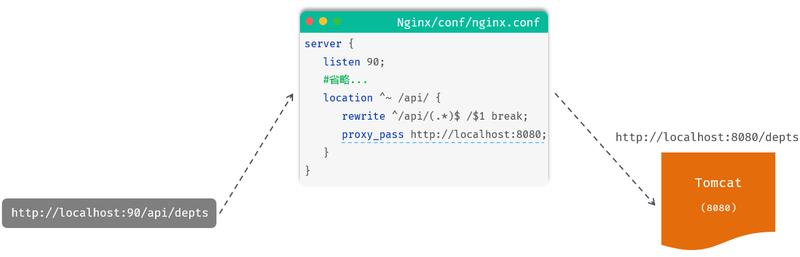

- location：用于定义匹配特定uri请求的规则。

- ^\~ /api/：优先前缀匹配，且一旦匹配到该规则，Nginx 会停止搜索其他正则表达式匹配（如 `~` 或 `~*`）。

- rewrite：该指令用于重写匹配到的uri路径。

- proxy\_pass：该指令用于代理转发，它将匹配到的请求转发给位于后端的指令服务器。

> 提示：新增部门所有功能完成，并测试通过后，记得提交代码到本地仓库并推送至远程仓库。
>

# 五、部门管理\-查询

## 1.功能分析

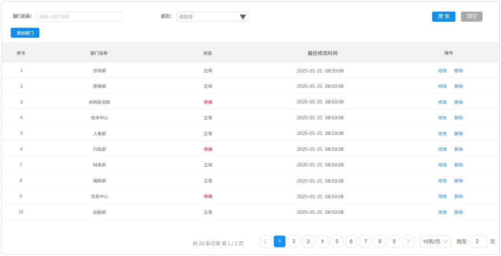

通过页面原型我们可以看到，由于企业中部门的数据可能会比较多，所以这里要进行分页查询展示（比如：一页展示10条数据，如果还想看其他的数据，可以通过点击页码进行查询），并在需求文档中也要求，还要对查询的结果，根据最后修改时间进行倒序排序。

带条件分页查询sql语句：

```sql
select * from dept where name like concat('%',#{name},'%') and status=#{status} order by update_time desc
```

> 注意：limit是mysql的方言，不通用，在sql语句中不写，使用PageHelper分页助手实现分页查询。并且sql语句要使用动态sql。
>

而在查询部门数据的时候，我们可以看到在搜索栏有对应的搜索条件，如：部门名称、状态。 而在分页查询时，底部有对应的分页条，我们可以选择要查询那一页的数据，也可以选择每页要展示多少条数据。

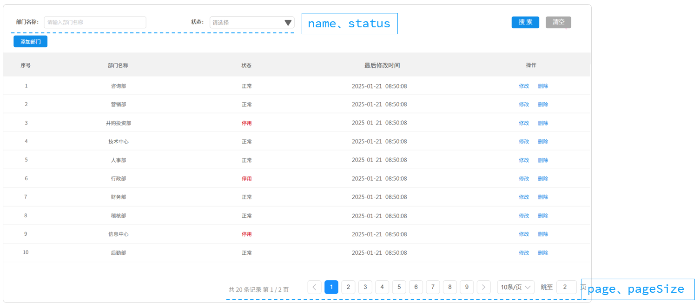

所以，这里在查询的时候，我们要给服务端传递的有4个参数，分别是：部门名称name、状态status、页码page、每页展示记录数pageSize。

那最终服务端需要给前端返回的数据包括哪些呢？ 首先，部门列表是需要返回给前端，然后渲染展示在表格中的。 其次，就是总记录数。（对于总页数，其实并不需要给前端返回，因为只要返回总记录数，那对应的总页数，前端可以自动计算出来）。

结果列表的查询sql：`select * from dept where .... limit ?,? ` ，第一个参数为起始索引，第二个参数为每页展示记录数。

前端传递过来的是页码，并没有起始索引。 起始索引 = （页码 \- 1）\* 每页展示记录数

总记录数的查询sql：`select count(*) from dept where ...`

> 分页功能是后台管理系统中的常见需求，但原生分页查询实现较为繁琐。为此，第三方组织专门为Mybatis框架开发了PageHelper分页插件，可大幅简化分页查询操作。接下来我们将演示如何使用PageHelper来实现高效的分页功能。
>

## 2.接口文档

具体的接口文档，可以参照： [附录-接口文档](https://lining-lo.github.io/lining-lo-notes/轻客管家/附录-接口文档.html)

通过接口文档，我们可以看到，最终服务端响应给前端的数据格式为：

```json
{
    "code": 1,
    "msg": "success",
    "data": {
        "total": 3,
        "rows": [
            {
                "id": 1,
                "name": "市场一部",
                "status": 1,
                "createTime": "2025-03-23T16:48:58",
                "updateTime": "2025-04-24T20:36:04"
            },
            {
                "id": 2,
                "name": "市场二部",
                "status": 1,
                "createTime": "2025-03-23T16:16:26",
                "updateTime": "2025-04-20T14:18:05"
            },
            {
                "id": 3,
                "name": "稽核",
                "status": 0,
                "createTime": "2025-03-23T17:49:10",
                "updateTime": "2025-04-18T16:32:40"
            }
        ]
    }
}
```

其实，对应分页查询来说，无论是哪个业务模块的分页查询，给前端响应的数据格式都是固定的，包含两项信息：total 表示总记录数，rows 表示结果列表。

那为了方便于数据封装，我们可以定义一个分页结果的封装类 PageResult，将其存放在 `qk-common` 模块的 `com.itheima.qk.common` 包下。

具体代码如下：

```java
package com.itheima.qk.common.domain;

import lombok.AllArgsConstructor;
import lombok.Data;
import lombok.NoArgsConstructor;
import java.util.List;

/**
 * 分页结果封装类
 * 用于封装分页查询的结果，包含总记录数和当前页的数据列表
 */
@Data
@NoArgsConstructor
@AllArgsConstructor
public class PageResult<T> {
    /**
     * 总记录数
     */
    private long total;

    /**
     * 当前页的数据列表
     */
    private List<T> rows;

}
```

## 3.功能实现

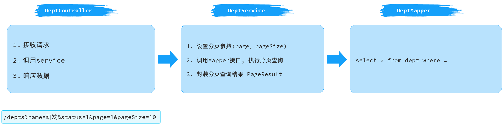

### 3.1.Controller层接收请求参数

```java
/**
 带条件分分页查询
 * @param name 部门名称
 * @param status 部门状态
 * @param page 当前页码
 * @param pageSize 每页条数
 * @return 分页结果
  获取查询参数：url?name=value&name=value格式的参数：保证请求参数名称和方法形参变量名一样，springboot就能自动接收请求参数，如果不一样，就需要使用@RequestParam注解指定请求参数的名称。
 * @RequestParam :
 *  1、当请求参数名称和形参变量名不一致时，可以使用@RequestParam指定请求参数的名称赋值给形参变量
 *  2、可以设置前端必须传递某个请求参数，使用@RequestParam的required属性设置为true（默认值），如果不是必须就设置为false。
 *  3、可以给形参设置默认值,使用@RequestParam的defaultValue属性
 */
@GetMapping("/depts")
public Result page(String name, Integer status,
                   @RequestParam(defaultValue = "1") Integer page,
                   @RequestParam(defaultValue = "10") Integer pageSize){
    //1 接收请求参数-->(String name,Integer status,Integer page, Integer pageSize)
    log.info("分页查询部门，参数：name={},status={},page={},pageSize={}",name,status,page,pageSize);
    //2 调用service分页查询，获取分页结果PageResult
    //3 响应Result结果
    return Result.success();
}
```

### 3.2.PageHelper

PageHelper是第三方提供的Mybatis框架的分页插件，用来简化分页查询操作，提高开发效率。

官网：[https://pagehelper.github.io/](https://pagehelper.github.io/)

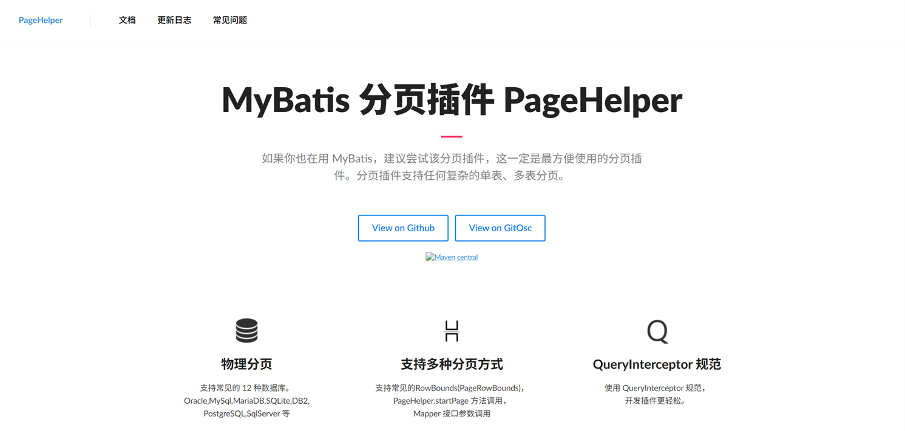


要使用PageHelper分页插件，我们需要引入对应的依赖。具体操作如下：

1.`qk-parent` 中统一管理依赖的版本

```xml
<properties>
    <maven.compiler.source>17</maven.compiler.source>
    <maven.compiler.target>17</maven.compiler.target>
    <project.build.sourceEncoding>UTF-8</project.build.sourceEncoding>
    <!--自定义属性-->
    <mybatis.version>3.0.5</mybatis.version>
    <mybatis.test.version>3.0.5</mybatis.test.version>
    <pagehelper.version>2.1.0</pagehelper.version>
</properties>

<dependencies>
    <dependency>
        <groupId>org.projectlombok</groupId>
        <artifactId>lombok</artifactId>
        <version>1.18.38</version>
    </dependency>
</dependencies>

<dependencyManagement>
    <dependencies>
        <dependency>
            <groupId>org.mybatis.spring.boot</groupId>
            <artifactId>mybatis-spring-boot-starter</artifactId>
            <version>${mybatis.version}</version>
        </dependency>

        <dependency>
            <groupId>org.mybatis.spring.boot</groupId>
            <artifactId>mybatis-spring-boot-starter-test</artifactId>
            <version>${mybatis.test.version}</version>
        </dependency>

        <dependency>
            <groupId>com.github.pagehelper</groupId>
            <artifactId>pagehelper-spring-boot-starter</artifactId>
            <version>${pagehelper.version}</version>
        </dependency>
    </dependencies>
</dependencyManagement>
```

2.`qk-management` 中引入依赖

```xml
<dependency>
    <groupId>com.github.pagehelper</groupId>
    <artifactId>pagehelper-spring-boot-starter</artifactId>
</dependency>
```

### 3.3.代码实现

1.DeptController

所在模块: `qk-management`，所在包：`com.qk.controller`

```java
/**
 * 条件分页查询部门
 * @param name     部门名称
 * @param status   状态
 * @param page     页码
 * @param pageSize 每页记录数
 * @return 分页查询结果
 */
@GetMapping("/depts")
public Result page(String name,Integer status,
                   @RequestParam(defaultValue = "1") Integer page,
                   @RequestParam(defaultValue = "10") Integer pageSize) {
    //1 接收请求参数 @RequestParam(defaultValue = "1")指定请求参数名称或者设置默认值
    log.info("条件分页查询部门，参数：name={},status={},page={},pageSize={}", name, status, page, pageSize);
    //2 调用service，得到分页结果PageResult
    PageResult<Dept> pageResult = deptService.page(name, status, page, pageSize);
    //3 响应Result
    return Result.success(pageResult);
}
```

2.DeptService

所在模块: `qk-management`，所在包：`com.qk.service`

```java
/**
 * 条件分页查询部门
 *
 * @param name     部门名称
 * @param status   状态
 * @param page     页码
 * @param pageSize 每页记录数
 * @return 分页查询结果
 */
PageResult<Dept> page(String name, Integer status, Integer page, Integer pageSize);
```

3.DeptServiceImpl

所在模块: `qk-management`，所在包：`com.qk.service.impl`

```java
/**
 * 条件分页查询部门
 * @param name     部门名称
 * @param status   状态
 * @param page     页码
 * @param pageSize 每页记录数
 * @return 分页查询结果
 */
@Override
public PageResult<Dept> page(String name, Integer status, Integer page, Integer pageSize) {
    //1 设置分页参数
    PageHelper.startPage(page, pageSize);
    //2 调用mapper层方法，分页查询部门
    Page<Dept> p = (Page<Dept>)deptMapper.list(name, status);
    //3 封装PageResult对象并返回
    return new PageResult<>(p.getTotal(), p.getResult());
}
```

4.DeptMapper

所在模块: `qk-management`，所在包：`com.qk.mapper`

```java
/**
 * 根据条件查询部门
 * @param name     部门名称
 * @param status   状态
 */
List<Dept> list(String name, Integer status);
```

5.DeptMapper\.xml

所在模块: `qk-management`，放在 resources/mapper 目录中。

```xml
<?xml version="1.0" encoding="UTF-8" ?>
<!DOCTYPE mapper PUBLIC "-//mybatis.org//DTD Mapper 3.0//EN" "http://mybatis.org/dtd/mybatis-3-mapper.dtd" >
<mapper namespace="com.itheima.qk.mapper.DeptMapper">

    <!--带条件查询部门，如果使用PageHelper就是分页查询
     @param name 部门名称
     @param status 部门状态
     Page<Dept> list(String name, Integer status);-->
    <select id="list" resultType="com.itheima.qk.entity.Dept">
        select id, name, status, create_time, update_time from dept
        <where>
            <if test="name!=null and name!=''">
                name like concat('%',#{name},'%')
            </if>
            <if test="status!=null">
                and status=#{status}
            </if>
        </where>
        order by update_time desc
    </select>
</mapper>
```

注意，由于上述的DeptMapper\.xml文件，放在resources/mapper中，所以需要在 application\.yml 配置文件中指定 mapper配置文件的存放路径：

```yaml
#数据库连接信息
spring:
  datasource:
    driver-class-name: com.mysql.cj.jdbc.Driver
    url: jdbc:mysql://localhost:3306/qk
    username: root
    password: 1234

#mybatis配置
mybatis:
  configuration:
    log-impl: org.apache.ibatis.logging.stdout.StdOutImpl
    map-underscore-to-camel-case: true
  mapper-locations: classpath:mapper/*.xml
```

代码编写完毕之后，我们就可以通过Apifox来进行接口测试了：

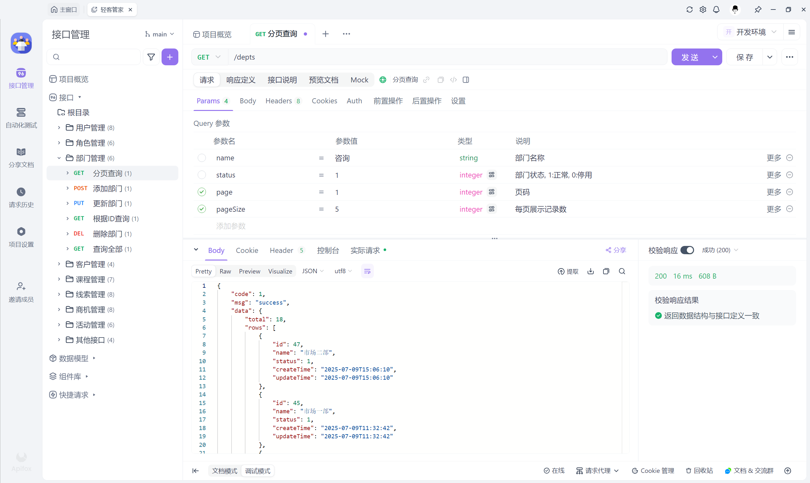

接口联调：

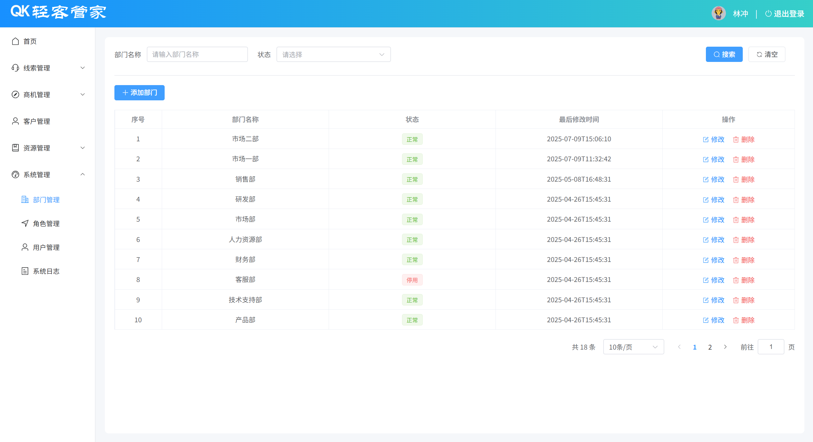

## 4.知识点总结

PageHelper 是Mybatis的分页插件，用来简化原始的分页操作。

### 4.1.操作步骤

1.引入依赖

```xml
<dependency>
    <groupId>com.github.pagehelper</groupId>
    <artifactId>pagehelper-spring-boot-starter</artifactId>
    <version>2.1.0</version>
</dependency>
```

2.Service层的代码实现

固定步骤: 

- 调用PageHelper中的静态方法，来设置分页参数：`PageHelper.startPage(page, pageSize);`
- 指定列表查询。（查询时，不需要考虑任何与分页相关的内容）
- 获取分页结果，直接将查询返回的List\<Dept\>集合强转为Page对象，然后从Page对象中获取分页结果。

```java
/**
 * 条件分页查询部门
 * @param name     部门名称
 * @param status   状态
 * @param page     页码
 * @param pageSize 每页记录数
 * @return 分页查询结果
 */
@Override
public PageResult<Dept> page(String name, Integer status, Integer page, Integer pageSize) {
    //1 设置分页参数
    PageHelper.startPage(page, pageSize);
    //2 调用mapper层方法，分页查询部门
    Page<Dept> p = (Page<Dept>)deptMapper.list(name, status);
    //3 封装PageResult对象并返回
    return new PageResult<>(p.getTotal(), p.getResult());
}
```

> 其实使用了分页插件之后，我们在调用Mapper接口方法查询时，查询返回的List\<Dept\>集合，实际的类型为Page，所以是可以直接强转为Page的。

### 4.2.运行机制

我们打开Idea的控制台，可以看到在进行分页查询时，输出的sql语句。

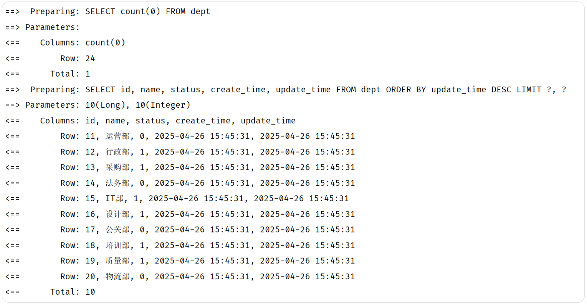

我们看到执行了两条sql语句，而这两条sql语句，其实是从我们在Mapper接口中定义的sql演变而来的。

第一条sql语句，用来查询总记录数。 

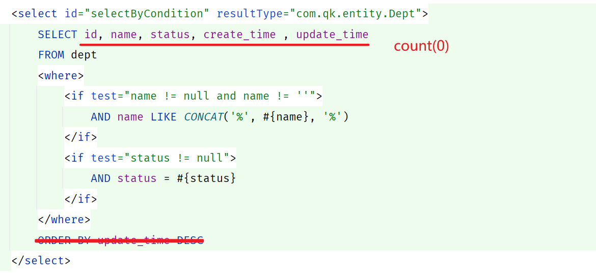

其实就是将我们编写的sql语句进行的改造增强，将查询返回的字段列表替换成了 `count(0)` 来统计总记录数。

第二条sql语句，用来进行分页查询，查询指定页码对应 的数据列表。

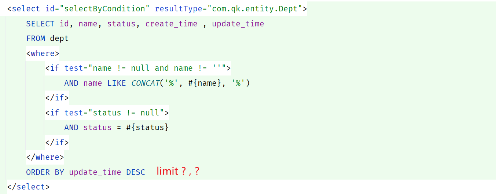

其实就是将我们编写的sql语句进行的改造增强，在sql语句之后拼接上了limit进行分页查询（如果测试时查询的是第一页，起始索引是0，所以简写为limit ？）

而PageHelper在进行分页查询时，会执行上述两条sql语句，并将查询到的总记录数，与数据列表封装到了 `Page<Emp>` 对象中，我们再获取查询结果时，只需要调用Page对象的方法就可以获取。

> 注意：
>
> - PageHelper实现分页查询时，sql语句的结尾一定一定一定不要加分号\(;\)\.。
>
> - PageHelper只会对紧跟在其后的第一条sql语句进行分页处理。
>

> 提示：新增部门所有功能完成，并测试通过后，记得提交代码到本地仓库并推送至远程仓库。
>

# 六、部门管理\-修改

## 1.功能分析

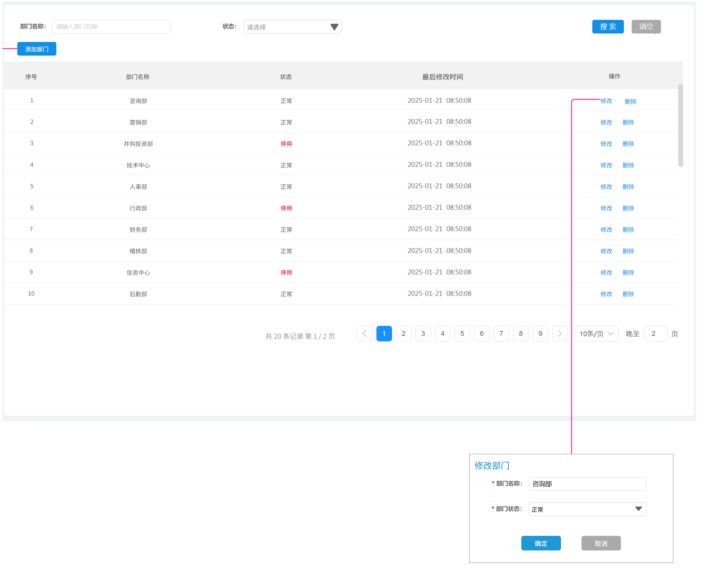

在修改部门数据时，需要分为两步完成：

首先，先需要将部门的数据查询，并展示在表单中，先让用户看到原来的数据是什么样子的，这个呢，也叫查询回显。

然后，在原来数据的基础上来修改部门的数据，并修改后的数据保存起来。

## 2.接口文档

经过分析，我们可以看到这里呢，会涉及到两个接口：

第一个接口是 根据ID查询部门数据的接口。

第二个接口是 修改部门数据的接口。

具体的接口文档，可以参照： [附录-接口文档](https://lining-lo.github.io/lining-lo-notes/轻客管家/附录-接口文档.html)

## 3.根据ID查询部门

sql语句

```sql
select * from dept where id=#{id}
```

### 3.1.功能实现

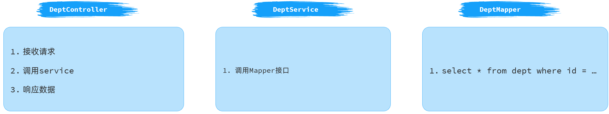

1.DeptController

```java
/**
 根据id查询部门
 * @param id 要查询的部门id
 * @PathVariable：获取路径参数(/depts/{id})。当{}中占位符的名称和形参变量名不一样时，需要在@PathVariable中指定占位符的名称。例如：(@PathVariable("id") Integer deptId)。如果一样就不用写占位符的名称。例如：(@PathVariable Integer id)
 */
@GetMapping("/depts/{id}")
public Result getById(@PathVariable Integer id) {
    //1 获取请求参数--->(@PathVariable Integer id)
    log.info("根据ID查询部门，参数：{}", id);
    //2 调用service层方法，根据ID查询部门
    Dept dept = deptService.getById(id);
    //3 响应Result
    return Result.success(dept);
}
```

2.DeptService

```java
/**
 * 根据ID查询部门
 * @param id 部门ID
 */
Dept getById(Integer id);
```

3.DeptServiceImpl

```java
/**
 * 根据ID查询部门
 * @param id 部门ID
 */
@Override
public Dept getById(Integer id) {
    //直接调用mapper层方法，根据id查询部门
    return deptMapper.getById(id);
}
```

4.DeptMapper

```java
/**
 根据id查询部门
 @param id 要查询的部门id
 @return 部门对象
 */
@Select("select id, name, status, create_time, update_time from dept where id=#{id}")
Dept getById(Integer id);
```

代码完成之后，打开Apifox进行接口测试：

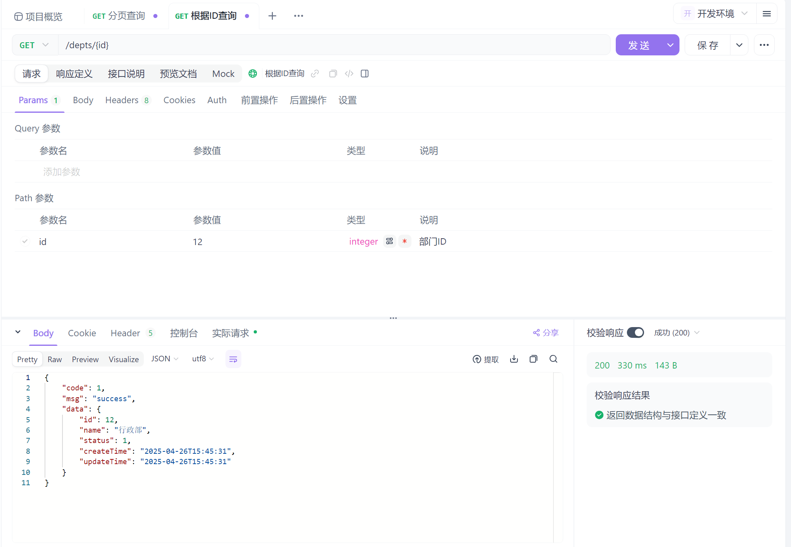

接口测试通过之后，我们再打开前端页面进行前后端联调测试。

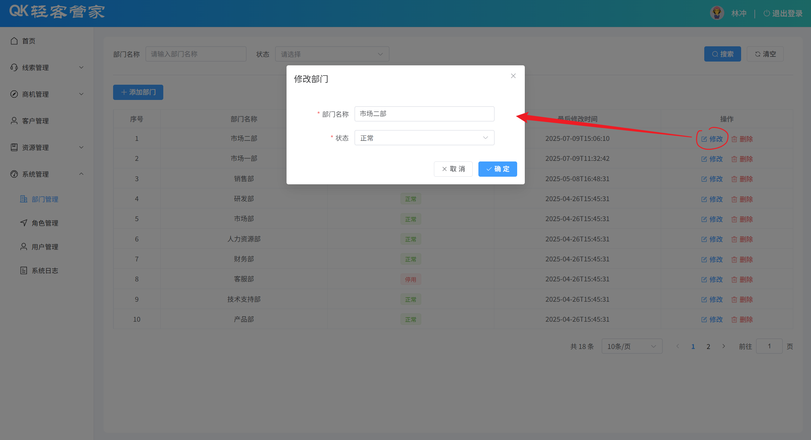

### 3.2.知识点

> Controller 中如何接收前端传递的路径参数，比如：/depts/1，/depts/12等。（在请求url中传递过来的请求参数称为路径参数）
>
> Controller 中接收路径参数，需要使用`@PathVariable`注解。

具体用法如下：

```java
/**
 * 根据ID查询部门
 * @param id 部门ID
 * @return 查询结果
 */
@GetMapping("/depts/{id}")
public Result getById(@PathVariable("id") Integer deptId) {
    //1 获取请求参数--->(@PathVariable Integer deptId
    log.info("根据ID查询部门，参数：{}", deptId);
    //2 调用service层方法，根据ID查询部门
    Dept dept = deptService.getById(deptId);
    //3 响应Result
    return Result.success(dept);
}
```

而如果我们在声明请求路径时，路径参数名与controller 方法形参名一致，那么此时，@PathVariable注解的value属性是可以省略的。如下：

```java
/**
 * 根据ID查询部门
 * @param id 部门ID
 * @return 查询结果
 */
@GetMapping("/depts/{id}")
public Result getById(@PathVariable Integer id) {
    //1 获取请求参数--->(@PathVariable Integer id)
    log.info("根据ID查询部门，参数：{}", id);
    //2 调用service层方法，根据ID查询部门
    Dept dept = deptService.getById(id);
    //3 响应Result
    return Result.success(dept);
}
```

> 提示：新增部门所有功能完成，并测试通过后，记得提交代码到本地仓库并推送至远程仓库。
>

## 4.修改部门

sql语句

```sql
update dept set name=#{name},status=#{status},update_time=#{updateTime} where id=#{id}
```

### 4.1.功能实现

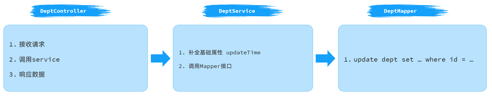

1.DeptController

```java
/**
 * 修改部门
 * @param dept 部门信息
 */
@PutMapping("/depts")
public Result update(@RequestBody Dept dept) {
    //1 接收请求参数--->(@RequestBody Dept dept)
    log.info("修改部门：{}", dept);
    //2 调用service层方法，修改部门
    deptService.update(dept);
    //3 响应Result
    return Result.success();
}
```

2.DeptService

```java
/**
 * 修改部门
 * @param dept 部门信息
 */
void update(Dept dept);
```

3.DeptServiceImpl

```java
/**
 * 修改部门
 * @param dept 部门信息
 */
@Override
public void update(Dept dept) {
    //1 设置基础属性(更新时间)
    dept.setUpdateTime(LocalDateTime.now());
    //2 调用mapper层方法，修改部门
    deptMapper.updateById(dept);
}
```

4.DeptMapper

```java
/**
 * 更新部门信息
 * @param dept 部门实体
 */
@Update("UPDATE dept SET name = #{name}, status = #{status}, update_time = #{updateTime} WHERE id = #{id}")
void updateById(Dept dept);
```

代码完成之后，打开Apifox进行接口测试：

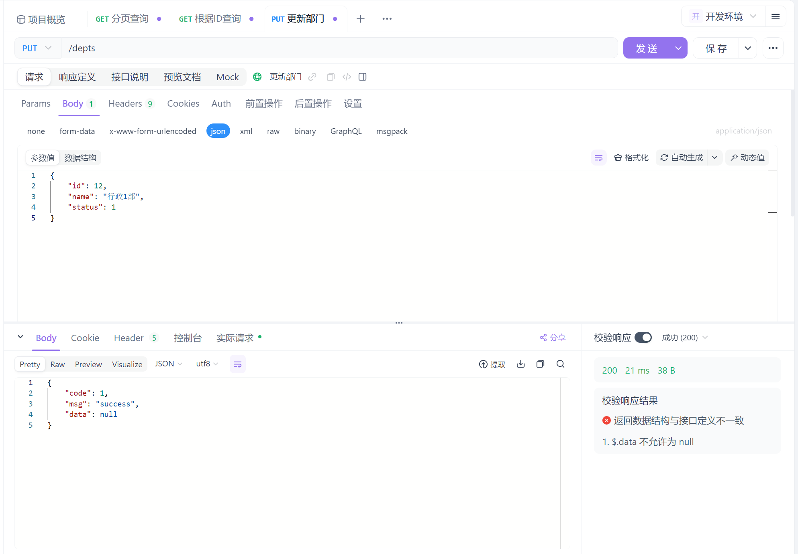

### 4.2.程序优化

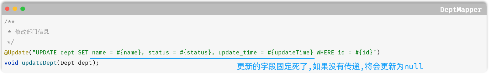

目前我们在更新部门信息的时候，要修改的字段包括：name、status、update\_time 这三个字段，要更新的字段直接固定死了，如果我们在更新数据的时候，status字段对应的值没有传递，那默认就是null，此时就会把这个部门的状态更新为null值。

因此，这里要更新的字段不应该固定死，而应该是动态的，如果传递了对应的字段值，就更新，没有传递对应的字段值， 就不更新，这样才更加灵活。那这里呢，我们就可以使用动态sql解决这个问题。具体如下：

1.DeptMapper 接口

```java
/**
 * 更新部门信息
 * @param dept 部门实体
 */
//@Update("UPDATE dept SET name = #{name}, status = #{status}, update_time = #{updateTime} WHERE id = #{id}")
void updateById(Dept dept);
```

由于动态sql相对复杂，我们采用xml映射文件配置，把注解中配置的sql语句直接注释掉。

2.DeptMapper\.xml 

```xml
<!-- 修改部门信息 -->
<update id="updateById" >
    UPDATE dept
    <set>
        <if test="name != null and name != ''">
            name = #{name},
        </if>
        <if test="status != null">
            status = #{status},
        </if>
        <if test="updateTime != null">
            update_time = #{updateTime}
        </if>
    </set>
    WHERE id = #{id}
</update>
```

> 动态sql标签\<set\>：会自动的生成set关键字，并会自动的去除最后一个更新字段多余的逗号。
>

代码编写完毕后，我们可以再次打开Apifox进行测试。

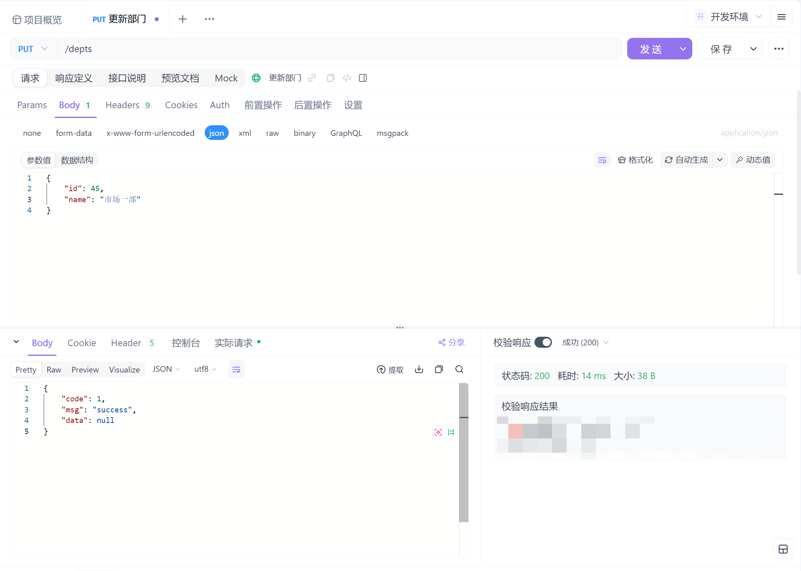

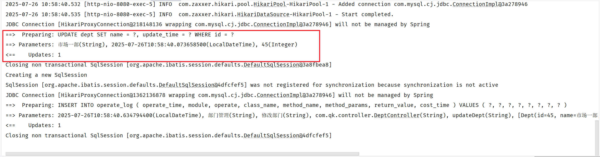

接口测试通过之后，我们再打开前端页面进行前后端联调测试。

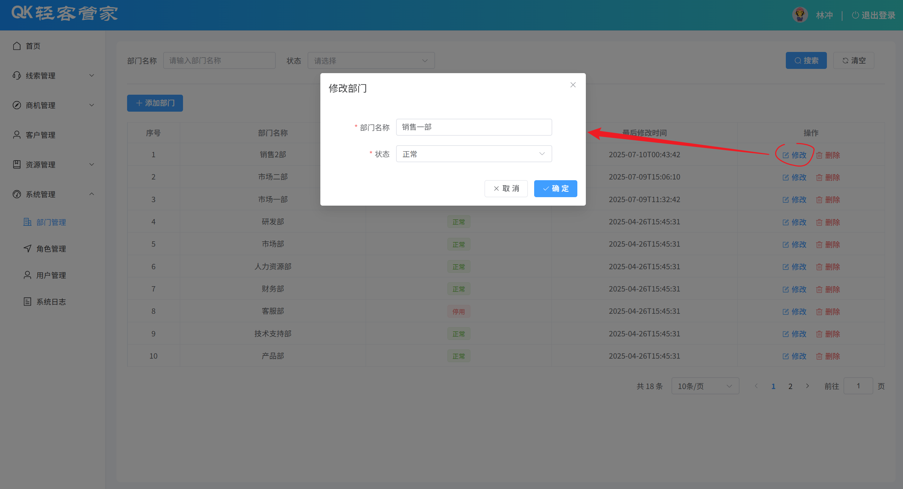

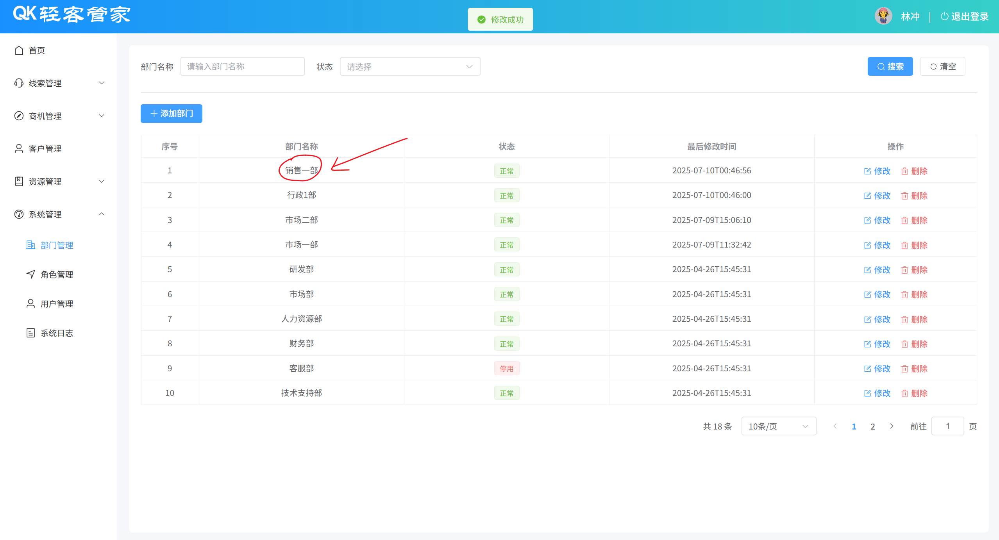

> 提示：新增部门所有功能完成，并测试通过后，记得提交代码到本地仓库并推送至远程仓库。
>

# 七、部门管理\-删除

## 1.功能分析

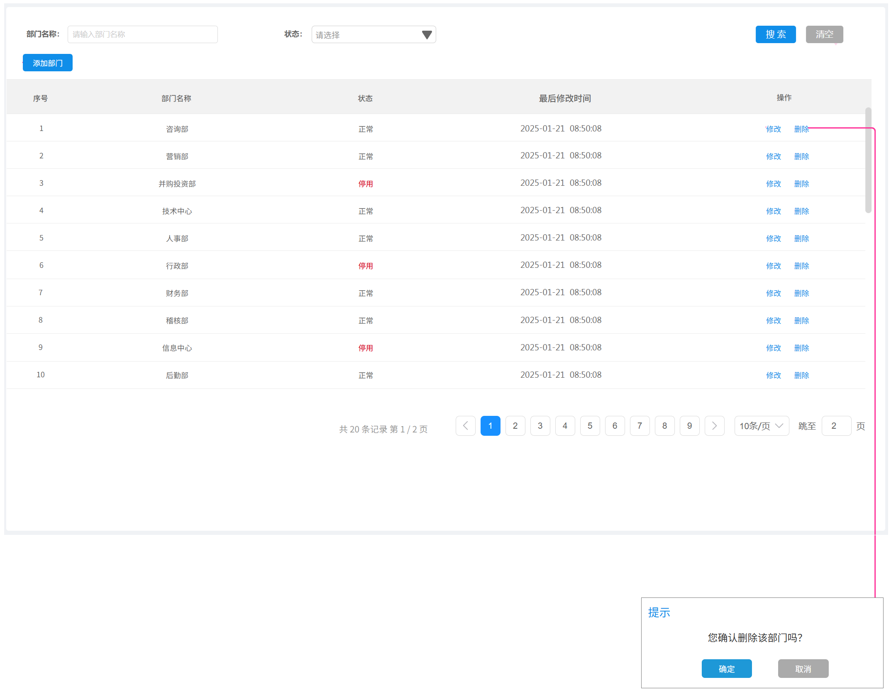

当点击部门列表后面的 "删除" 按钮时，在页面上会进行二次确认，如果点击 "确认" 此时就要根据ID删除部门信息了。

sql语句

```sql
delete from dept where id=#{id}
```

## 2.接口文档

删除部门的接口信息，参照部门管理的接口文档： [附录-接口文档](https://lining-lo.github.io/lining-lo-notes/轻客管家/附录-接口文档.html)

## 3.功能实现

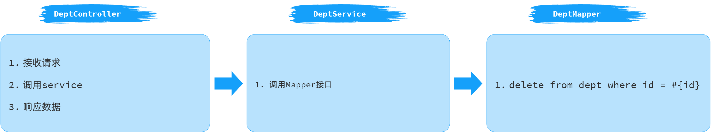

1.DeptController

```java
/**
 * 删除部门
 * @param id 部门ID
 */
@DeleteMapping("/depts/{id}")
public Result delete(@PathVariable Integer id) {
    //1 接收请求参数--->(@PathVariable Dept dept)
    log.info("删除部门，id：{}", id);
    //2 调用service层方法，删除部门
    deptService.delete(id);
    //3 响应Result
    return Result.success();
}
```

2.DeptService

```java
/**
 * 删除部门
 * @param id 部门ID
 */
void delete(Integer id);
```

3.DeptServiceImpl

```java
/**
 * 删除部门
 * @param id 部门ID
 */
@Override
public void delete(Integer id) {
    //调用mapper层方法，根据id删除部门
    deptMapper.deleteById(id);
}
```

4.DeptMapper

```java
/**
 * 根据ID删除部门
 * @param id 部门ID
 */
@Delete("DELETE FROM dept WHERE id = #{id}")
void deleteById(Integer id);
```

代码编写完毕之后，重新启动服务，打开Apifox进行测试：

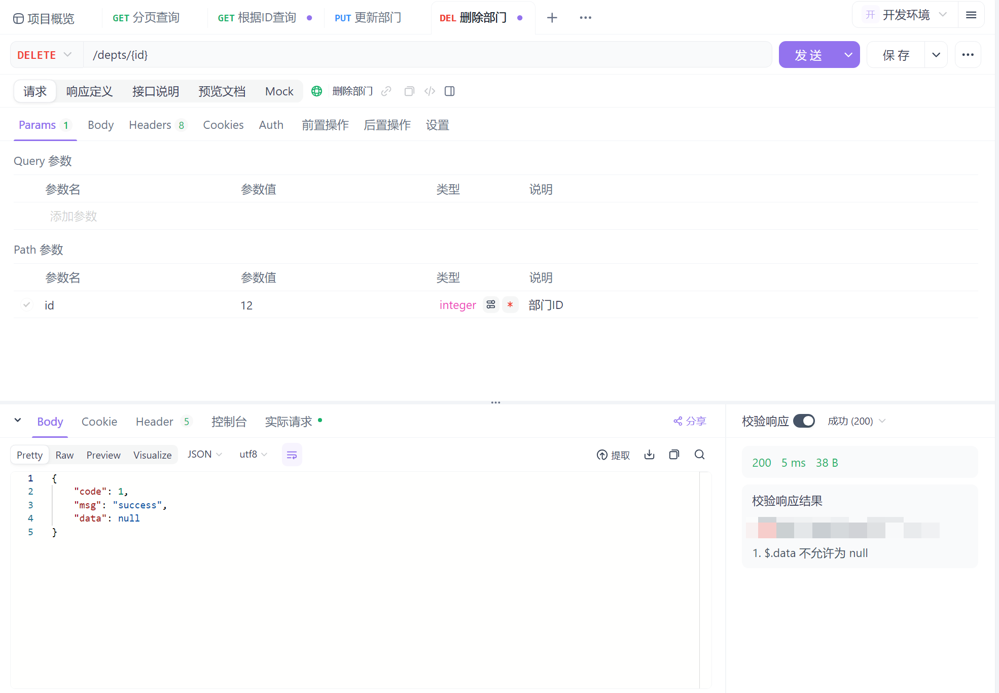

Apifox接口测试通过之后，再进行前后端联调测试：

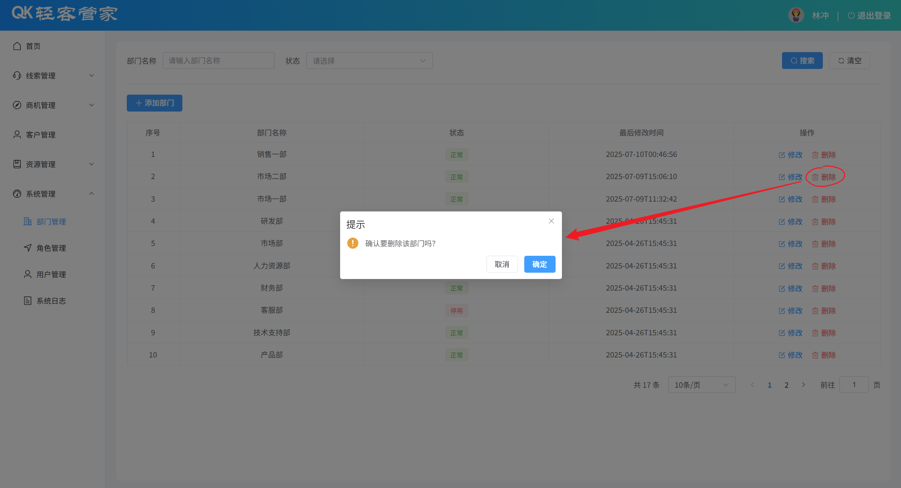

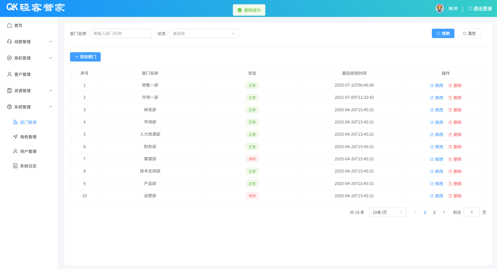

> 提示：删除部门的功能完成，并测试通过后，记得提交代码到本地仓库并推送至远程仓库。
>

## 4.@RequestMapping

到此呢，关于基本的部门的增删改查功能，我们已经实现了。  我们会发现，我们在 `DeptController` 中所定义的方法，所有的请求路径，都是 `/depts` 开头的，只要操作的是部门数据，请求路径都是 `/depts` 开头。 

那么这个时候，我们其实是可以把这个公共的路径 `/depts` 抽取到类上的，那在各个方法上，就可以省略了这个 `/depts` 路径。 代码如下：

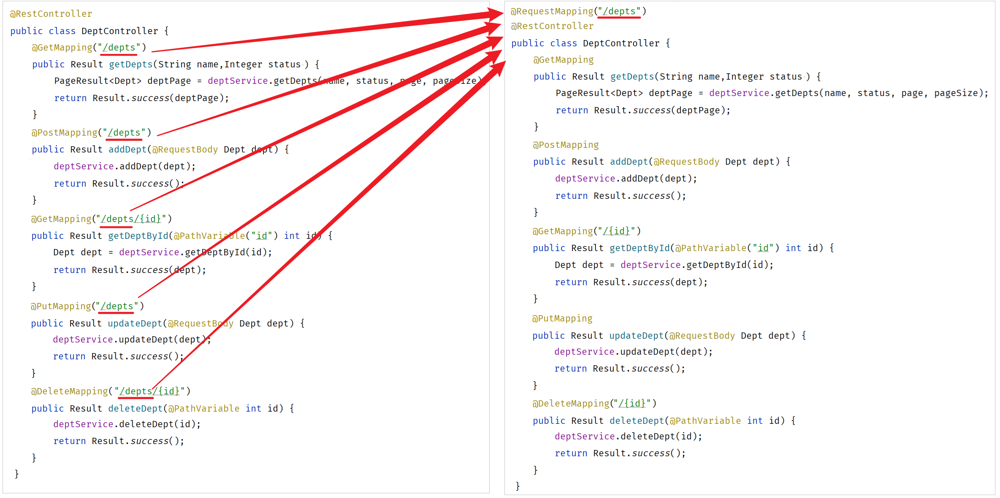

> @ReuqestMapping：一个完整的请求路径，应该是类上的@RequestMapping注解的value属性值 \+ 方法上的@RequestMapping注解的value属性值。
>

Controller层完整代码：

```java
@Slf4j
@RestController
@RequestMapping("/depts") //给该类中所有的方法定义一个公共访问路径，访问方法时都需要带上这个路径
public class DeptController {
    @Autowired
    private DeptService deptService;

    /**
     根据id删除部门
     * @param id 要删除的部门id
     */
    @DeleteMapping("/{id}")
    public Result delete(@PathVariable Integer id){
        //1 获取请求参数-->(@PathVariable Integer id)
        log.info("删除部门，参数：id={}",id);
        //2 调用service，根据id删除部门
        deptService.delete(id);
        //3 响应Result结果
        return Result.success();
    }

    /**
     修改部门
     * @param dept 封装新的部门信息
     */
    @PutMapping
    public Result update(@RequestBody Dept dept){
        //1 接收请求参数-->(@RequestBody Dept dept)
        log.info("修改部门，参数：dept={}",dept);
        //2 调用service，修改部门
        deptService.update(dept);
        //3 响应Result结果
        return Result.success();
    }

    /**
     根据id查询部门
     * @param id 要查询的部门id
     * @return 部门对象
     * @PathVariable：接收路径参数，如果路径参数{id}的名称和形参变量名不一样，则需要在注解中指定占位符的名称。
     * 例如：(@PathVariable("id") Integer deptId)
     */
    @GetMapping("/{id}")
    public Result getById(@PathVariable Integer id){
        //1 接收请求参数-->(@PathVariable Integer id)
        //2 调用service，根据id查询部门
        Dept dept = deptService.getById(id);
        //3 响应Result结果
        return Result.success(dept);
    }

    /**
     带条件分分页查询
     * @param name 部门名称
     * @param status 部门状态
     * @param page 当前页码
     * @param pageSize 每页条数
     * @return 分页结果
      获取查询参数：url?name=value&name=value格式的参数：保证请求参数名称和方法形参变量名一样，springboot就能自动接收请求参数，如果不一样，就需要使用@RequestParam注解指定请求参数的名称。
     * @RequestParam :
     *  1、当请求参数名称和形参变量名不一致时，可以使用@RequestParam指定请求参数的名称赋值给形参变量
     *  2、可以设置前端必须传递某个请求参数，使用@RequestParam的required属性设置为true（默认值），如果不是必须就设置为false。
     *  3、可以给形参设置默认值,使用@RequestParam的defaultValue属性
     */
    @GetMapping
    public Result page(String name, Integer status,
                       @RequestParam(defaultValue = "1") Integer page,
                       @RequestParam(defaultValue = "10") Integer pageSize){
        //1 接收请求参数-->(String name,Integer status,Integer page, Integer pageSize)
        log.info("分页查询部门，参数：name={},status={},page={},pageSize={}",name,status,page,pageSize);
        //2 调用service分页查询，获取分页结果PageResult
        PageResult<Dept> pageResult = deptService.page(name,status,page,pageSize);
        //3 响应Result结果
        return Result.success(pageResult);
    }

    /**
     新增部门
     * @param dept 封装要新增部门信息(只有name和status)
     @RequestBody :将请求体中的json数据转换(封装)成Java对象，要求json的key要和对象的属性名一样。适用于POST、PUT请求
     */
    @PostMapping
    public Result add(@RequestBody Dept dept){
        //1 接收请求参数-->(@RequestBody Dept dept)
        log.info("新增部门，dept={}",dept);
        //2 调用service，新增部门
        deptService.add(dept);
        //3 响应Result结果
        return Result.success();
    }
}
```

# 八、异常处理

## 1.问题分析

当我们在添加部门 或 修改部门数据的时候，如果输入一个在数据库表中已经存在的部门名称，点击保存按钮之后，前端提示了错误信息，但是返回的结果并不是统一的响应结果，而是框架默认返回的错误结果 。

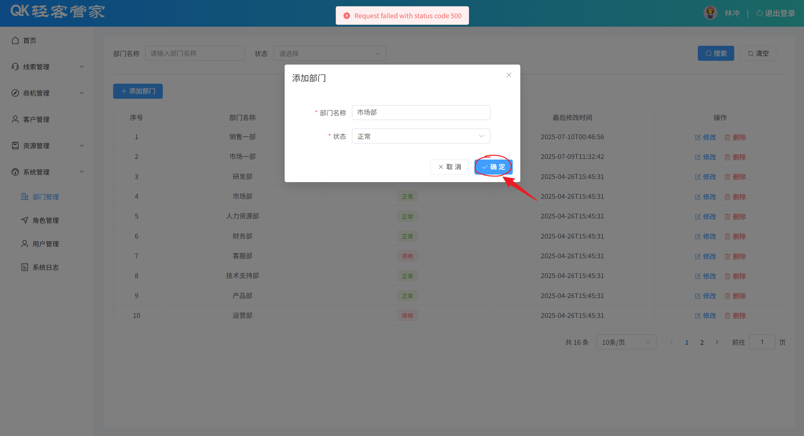

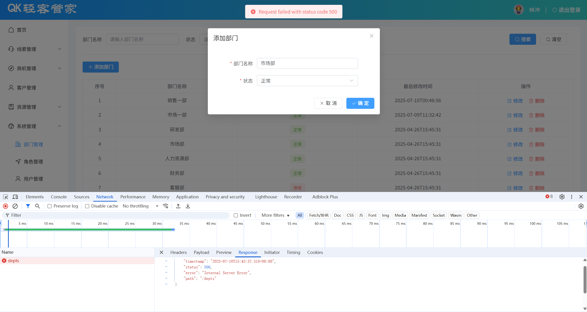

状态码为500，表示服务器端异常，我们打开idea，来看一下，服务器端出了什么问题。

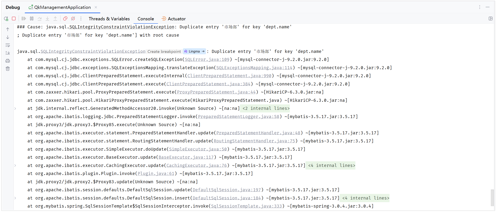

上述错误信息的含义是，`dept`部门表的`name` 部门名称字段的值重复了，因为在数据库表`dept`中已经有了`市场部`这个部门了，我们之前设计这张表时，为`name`字段建议了唯一约束，所以该字段的值是不能重复的。

而当我们再将该部门的部门名称也设置为 `市场部`，就违反了唯一约束，此时就会报错。

我们来看一下出现异常之后，最终服务端给前端响应回来的数据长什么样。

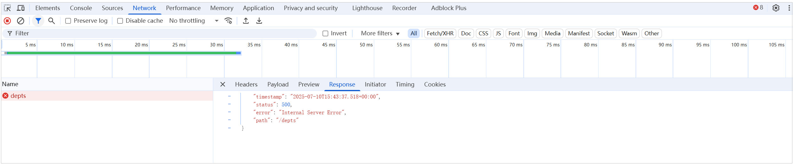

响应回来的数据是一个json格式的数据。但这种json格式的数据还是我们开发规范当中所提到的统一响应结果Result吗？显然并不是。由于返回的数据不符合开发规范，所以前端并不能解析出响应的json数据 。

接下来我们需要思考的是出现异常之后，当前案例项目的异常是怎么处理的？ 答案：没有做任何的异常处理

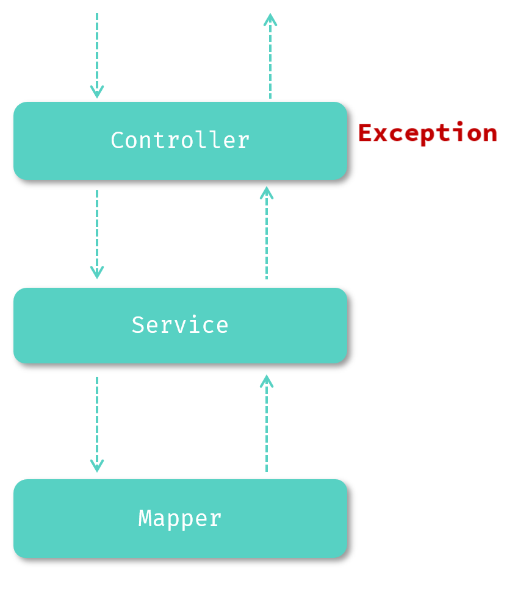

当我们没有做任何的异常处理时，我们三层架构处理异常的方案：

Mapper接口在操作数据库的时候出错了，此时异常会往上抛\(谁调用Mapper就抛给谁\)，会抛给service。 

service 中也存在异常了，会抛给controller。

而在controller当中，我们也没有做任何的异常处理，所以最终异常会再往上抛。最终抛给框架之后，框架就会返回一个json格式的数据，里面封装的就是错误的信息，但是框架返回的json格式的数据并不符合我们的开发规范。

## 2.解决方案

那么在三层构架项目中，出现了异常，该如何处理? 

方案一：在所有Controller的所有方法中进行try…catch处理

缺点：代码臃肿（不推荐）

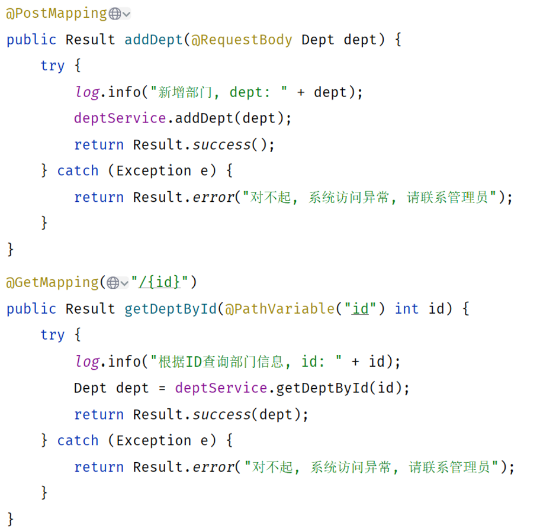

方案二：全局异常处理器

好处：简单、优雅（推荐）

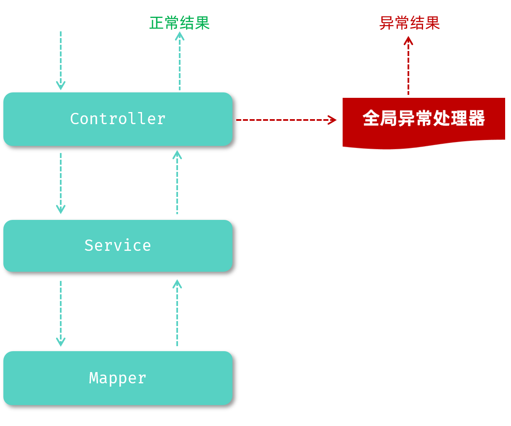

## 3.全局异常处理器

我们该怎么样定义全局异常处理器？

定义全局异常处理器非常简单，在`qk-management`的`exception包`\(没有就创建\)中定义一个类，在类上加上一个注解@RestControllerAdvice，加上这个注解就代表我们定义了一个全局异常处理器。

在全局异常处理器当中，需要定义一个方法来捕获异常，在这个方法上需要加上注解@ExceptionHandler。通过@ExceptionHandler注解当中的value属性来指定我们要捕获的是哪一类型的异常。

```java
package com.qk.exception;

import com.qk.common.Result;
import lombok.extern.slf4j.Slf4j;
import org.springframework.web.bind.annotation.ExceptionHandler;
import org.springframework.web.bind.annotation.RestControllerAdvice;

@Slf4j
@RestControllerAdvice  //表示该类是一个处理异常的类，类中可以定义若干个方法处理不同类型的异常，处理完之后可以返回json结果
public class GlobalExceptionHandler {

    @ExceptionHandler  //表示该方法是一个处理异常的方法，默认处理方法形参中定义的异常及其子类异常。
    public Result doException(Exception ex){
        //1 将来可以将异常信息保存到文件、数据库中--->记录日志。此处暂时打印即可
        //log.error("异常信息：{}",ex.getMessage());
        ex.printStackTrace();
        return Result.error("服务正在升级，请稍后重试！");
    }

    @ExceptionHandler  //表示该方法是一个处理异常的方法，默认处理方法形参中定义的异常及其子类异常。
    //@ExceptionHandler(SQLException.class)//如果指定了要处理的异常类型，就按照注解中指定的异常及其子类异常
    public Result doDuplicateKeyException(DuplicateKeyException ex){
        //1 将来可以将异常信息保存到文件、数据库中--->记录日志。此处暂时打印即可
        //log.error("异常信息：{}",ex.getMessage());
        ex.printStackTrace();
        //2 获取异常原因中的重复的名称，例如：Duplicate entry '市场二部' for key 'dept.name'
        String[] split = ex.getCause().getMessage().split(" "); //["Duplicate","entry","市场二部",...]
        return Result.error(split[2]+"重复了");
    }
}
```

> @RestControllerAdvice = @ControllerAdvice \+ @ResponseBody
>
> 处理异常的方法返回值会转换为json后再响应给前端
>

重新启动SpringBoot程序，打开浏览器，再来测试一下修改员工这个操作，我们依然设置已存在的 `市场一部` 这个部门名称：

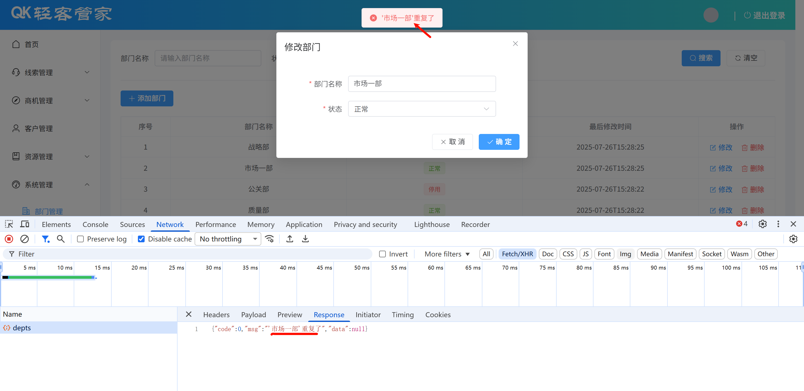

此时，我们可以看到，出现异常之后，异常已经被全局异常处理器捕获了。然后返回的错误信息，被前端程序正常解析，然后提示出了对应的错误提示信息。

以上就是全局异常处理器的使用，主要涉及到两个注解：

- @RestControllerAdvice  //表示当前类为全局异常处理器

- @ExceptionHandler  //指定可以捕获哪种类型的异常进行处理
