# 一、用户管理-说明

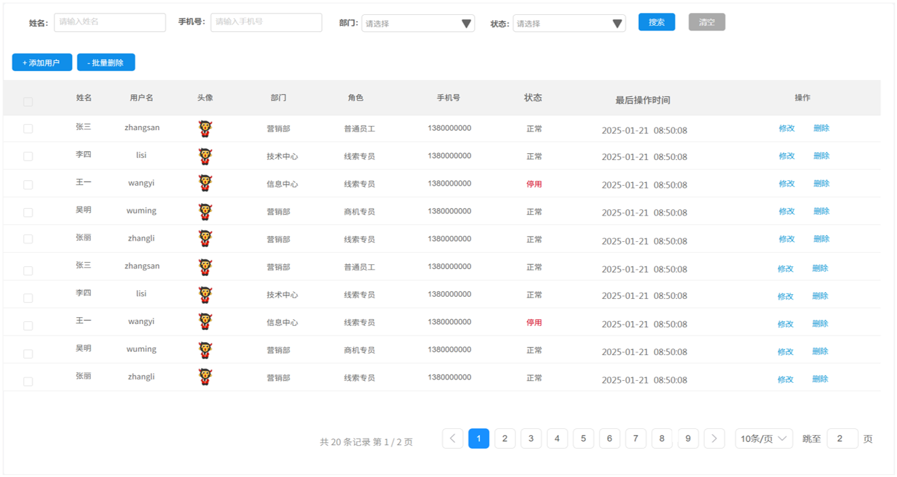

从页面原型中，我们就能够看出来。用户管理的功能中，包含了用户信息的：

1. 条件分页查询

2. 新增用户

3. 修改用户

4. 删除用户

那今天呢，我们先来完成用户信息的条件分页查询功能。 首先，我们先来准备数据库表：

```sql
-- 用户表
create table user(
    id          int unsigned primary key auto_increment comment 'id, 主键',
    username    varchar(20)      not null unique comment '用户名，唯一',
    password    varchar(64)      not null comment '密码',
    name        varchar(20)      not null comment '姓名',
    phone       char(11)         not null unique comment '手机号，唯一',
    email       varchar(50)      not null unique comment '邮箱，唯一',
    gender      tinyint unsigned not null comment '性别，1: 男，2: 女',
    status      tinyint unsigned not null comment '状态，1: 正常，0: 停用',
    dept_id     int unsigned comment '部门id，关联部门表主键',
    role_id     int unsigned comment '角色id，关联角色表主键',
    image       varchar(255) comment '头像url',
    remark      varchar(50) comment '备注，50字以内',
    create_time datetime         not null comment '创建时间',
    update_time datetime         not null comment '修改时间'
) comment '用户表';

INSERT INTO user (id, username, password, name, phone, email, gender, status, dept_id, role_id, image, remark,
                  create_time, update_time)
VALUES (1, 'zhangsan', '4e7bdb88640b376ac6646b8f1ecfb558', '张三', '13800138001', 'admin@example.com', 1, 1, 6, 1,
        'https://zxy-data.oss-cn-hangzhou.aliyuncs.com/icon/1.png', '系统管理员',
        '2025-05-12 11:39:03', '2025-06-21 15:25:55'),
       (2, 'lisi', 'c3cb6d12c40908943b64bc0681af47db', '李四', '13800138002', 'editor1@example.com', 1, 1, 4, 2,
        'https://zxy-data.oss-cn-hangzhou.aliyuncs.com/icon/2.png', '内容编辑',
        '2025-05-12 11:39:03', '2025-06-21 15:26:00'),
       (3, 'sunwuji', '368a7fccd730d807f41e2161798e13ca', '孙无忌', '18809091111', 'sunwuji@163.com', 1, 1, 5, 2,
        'https://zxy-data.oss-cn-hangzhou.aliyuncs.com/icon/3.png',
        '孙无忌刚入职，先在销售部磨炼磨炼', '2025-05-12 16:46:21', '2025-07-14 18:13:45'),
       (4, 'songjiang', 'a91b1cfe31e6b534537ab992e06380f8', '宋江', '13800000001', 'songjiang@example.com', 1, 1, 5, 2,
        'https://zxy-data.oss-cn-hangzhou.aliyuncs.com/icon/4.png', 'Remark 1',
        '2025-05-14 15:49:31', '2025-07-14 18:13:45'),
       (5, 'lujunyi', 'ef73dd11149e096116f755a171eb3fec', '卢俊义', '13800000002', 'lujunyi@example.com', 1, 1, 3, 7,
        'https://zxy-data.oss-cn-hangzhou.aliyuncs.com/icon/1.png', 'Remark 2',
        '2025-05-14 15:49:31', '2025-07-14 18:13:45'),
       (6, 'wuyong', 'd74bcf7b7f805922e4ad42315f3a8cde', '吴用', '13800000003', 'wuyong@example.com', 1, 0, 7, 2,
        'https://zxy-data.oss-cn-hangzhou.aliyuncs.com/icon/2.png', 'Remark 3',
        '2025-05-14 15:49:31', '2025-07-14 18:13:45'),
       (7, 'gongsunsheng', 'ee3a229f2f3d2bd7c9dd3eeb4eda02b3', '公孙胜', '13800000004', 'gongsunsheng@example.com', 1,
        1, 5, 2, 'https://zxy-data.oss-cn-hangzhou.aliyuncs.com/icon/3.png',
        'Remark 4', '2025-05-14 15:49:31', '2025-07-14 18:13:45'),
       (8, 'linchong', '786271307576f1ee762341173a2caa48', '林冲', '13800000006', 'linchong@example.com', 1, 1, 4, 3,
        'https://zxy-data.oss-cn-hangzhou.aliyuncs.com/icon/4.png', 'Remark 6',
        '2025-05-14 15:49:31', '2025-07-14 18:13:45'),
       (9, 'qinming', '23b9c4ea1f4d1844acd20a5314da8553', '秦明', '13800000007', 'qinming@example.com', 1, 1, 5, 2,
        'https://zxy-data.oss-cn-hangzhou.aliyuncs.com/icon/1.png', 'Remark 7',
        '2025-05-14 15:49:31', '2025-07-14 18:13:45'),
       (10, 'huarong', '19d59a4e1e63552228b73b2cb2b5fcdd', '花荣', '13800000008', 'huayong@example.com', 1, 1, 6, 1,
        'https://zxy-data.oss-cn-hangzhou.aliyuncs.com/icon/2.png', 'Remark 8',
        '2025-05-14 15:49:31', '2025-07-14 18:13:45'),
       (11, 'huyan', 'fbb39f3019cc4f5444dbd6b623f71a1a', '呼延灼', '13800000009', 'huyan@example.com', 1, 0, 8, 2,
        'https://zxy-data.oss-cn-hangzhou.aliyuncs.com/icon/3.png', 'Remark 9',
        '2025-05-14 15:49:31', '2025-07-14 18:13:45'),
       (12, 'huaqian', '1007f13423a57bc0390d9510f96d0322', '花千朵', '13800000010', 'huaqian@example.com', 2, 1, 10, 3,
        'https://zxy-data.oss-cn-hangzhou.aliyuncs.com/icon/4.png', 'Remark 10',
        '2025-05-14 15:49:31', '2025-07-14 18:13:45'),
       (13, 'shaqianmo', '29d6fb85ac49d6d82b9b6dfd5f62939a', '杀阡陌', '13509091456', 'shaqianmo@163.com', 0, 1, 5, 2,
        'https://zxy-data.oss-cn-hangzhou.aliyuncs.com/icon/1.png', '',
        '2025-06-19 17:48:39', '2025-07-14 18:13:45'),
       (14, 'baizihua', 'f1659bd8a56022d817d6bd124c6181e8', '白子画', '13609091206', 'baizihua@163.com', 1, 1, 3, 7,
        'https://zxy-data.oss-cn-hangzhou.aliyuncs.com/icon/2.png', '系统研发',
        '2025-06-22 14:33:49', '2025-07-14 18:13:45'),
       (15, 'huaqiangu', 'be6485aab12634baf922b3dbe407fcda', '花千骨', '15809092819', 'huaqiangu@163.com', 0, 1, 6, 7,
        'https://zxy-data.oss-cn-hangzhou.aliyuncs.com/icon/3.png',
        '花千骨是一个普通用户', '2025-06-24 10:40:20', '2025-07-14 18:13:45'),
       (16, 'kuangyetian', '5e3c47c0d266439d7ce704972c92086a', '旷野天', '13689281921', 'kuangyetian@163.com', 1, 1, 9,
        7, 'https://zxy-data.oss-cn-hangzhou.aliyuncs.com/icon/4.png',
        '新入职的技术员旷野天', '2025-06-27 19:38:34', '2025-07-14 18:13:45');
```

## 1.分析

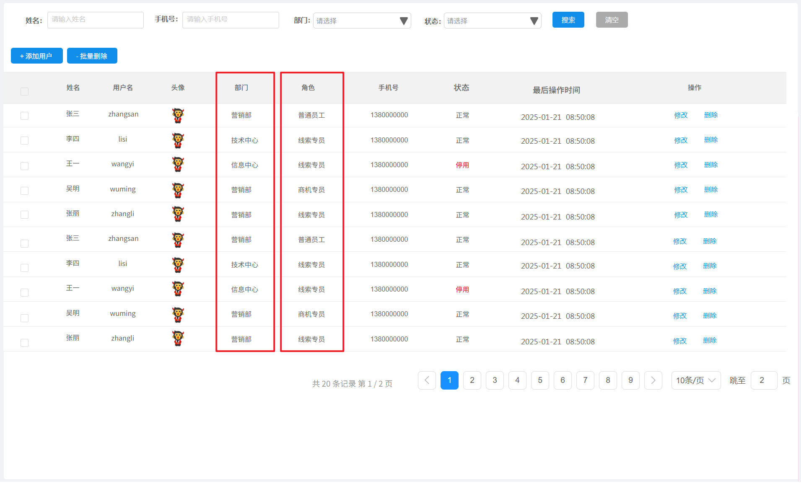

通过页面原型，我们可以看到，在用户信息列表查询展示时，不仅要展示 姓名、用户名、头像、手机号、状态这些用户的基本信息，还要展示用户所属部门的部门名称、用户关联角色的角色名称等信息。

那这里要展示的用户基本信息数据来源于用户表 user，部门名称数据来源于部门表 dept，角色名称数据来源于角色表 role，所以这里会涉及到三张表的连接查询。

我们可以先一起借助于AI来完成sql语句的编写 （不考虑对应的查询条件）：

```sql
-- 查询所有的用户信息, 及其所属部门的部门名称, 关联角色的角色名称
/*
——交互说明——
1、搜索
1.1 用户姓名：请输入姓名，支持汉字的模糊搜索
1.2 手机号：根据手机号进行搜索，支持模糊搜索
1.3 部门：根据选择的部门进行查询
1.4 状态：正常、停用，根据选择的状态查询
1.5 查询结果，根据最后修改时间进行倒序排序
*/
select
    u.*,
    d.name as dept_name,
    r.name as role_name
from user u
    left join dept d on u.dept_id = d.id
    left join role r on u.role_id = r.id
where
    u.name like concat('%','张','%') 
    and u.phone like concat('%','138','%') 
    and u.status = 1 and u.dept_id = 2
order by u.update_time desc
```

## 2.接口文档

用户管理对应的接口文档，请参考：[附录-接口文档](https://lining-lo.github.io/lining-lo-notes/轻客管家/附录-接口文档.html)

## 3.准备工作

1.根据数据库表`user`，定义对应的实体类 `User`，实体类存放模块 `qk-entity`，存放包 `com.qk.entity`。 实体类的代码如下：

```java
/**
 * 用户实体类
 */
@Data
public class User {
    private Integer id; //主键，唯一标识
    private String username;    //用户名，唯一
    private String password;    //密码
    private String name;    //姓名
    private String phone;   //手机号，唯一
    private String email;   //邮箱，唯一
    private Integer gender; //性别，1: 男，2: 女
    private Integer status; //状态，1: 正常，0: 停用
    private Integer deptId; //部门id，关联部门表主键
    private Integer roleId; //角色id，关联角色表主键
    private String image;   //头像url路径
    private String remark;  //备注，50字以内
    private LocalDateTime createTime;   //创建时间
    private LocalDateTime updateTime;   //修改时间
    
    //扩展属性
    private String deptName; //部门名称
    private String roleName; //角色名称
}
```

> 注意：在上述实体类中，增加了两个扩展字段，分别是 `deptName`，`roleName` 用来封装查询返回的部门名称以及角色名称。（扩展属性的名字取决于接口文档中定义的前后端交互的规范）
>

2.定义实体类，封装前端传递的多个请求参数。

在 `qk-entity` 模块的 `com.qk.dto` 包下创建实体类 `UserQueryDto`，具体代码如下：

```java
package com.qk.dto;

import lombok.Data;
/**
 * /users?name=张&status=1&phone=13309091111&deptId=5&page=1&pageSize=5
 * 封装查询参数
 */
@Data
public class UserQueryDto {
    private String name; // 姓名
    private Integer status; // 状态
    private String phone; // 手机
    private Integer deptId; // 部门
    private Integer page = 1; // 页码
    private Integer pageSize = 10; // 每页条数
}
```

> DTO：（Data Transfer Object）数据传输对象， 用于前端与服务端之间的数据传输对象。
>

## 4.列表查询

需求分析完毕，并且完成了基本的准备工作之后，接下来，我们就可以来完成具体的功能实现。代码如下：

1.UserController

存放模块 `qk-management`，存放包 `com.qk.controller`。代码如下：

```java
/**
 * 用户管理控制器
 */
@Slf4j
@RestController
@RequestMapping("/users")
public class UserController {

    @Autowired
    private UserService userService;
    /**
     带条件分页查询
     * @param queryDto 封装查询条件、当前页码、每页条数
     * @return 分页结果
     * 注意：形参前面不能使用@RequestBody注解，因为该注解是接收请求体中的json数据，当前请求参数不在请求体中，也不是json数据，所以不能用。
     */
    @GetMapping
    public Result page(UserQueryDto queryDto){
        //1 接收请求参数-->(UserQueryDto queryDto)
        log.info("分页查询参数：{}" ,queryDto);
        //2 调用service层方法分页查询，得到PageResult分页结果
        PageResult<User> pageResult = userService.page(queryDto);
        //3 响应Result对象
        return Result.success(pageResult);
    }
}
```

2.UserService

存放模块 `qk-management`，存放包 `com.qk.service`。代码如下：

```java
/**
 * 用户管理Service接口
 */
public interface UserService {

    /**
     带条件分页查询
     * @param queryDto 封装查询条件、当前页码、每页条数
     * @return 分页结果
     */
    PageResult<User> page(UserQueryDto queryDto);
}   
```

3.UserServiceImpl

存放模块 `qk-management`，存放包 `com.qk.service.impl`。代码如下：

```java
/**
 * 用户服务实现类
 */
@Service
public class UserServiceImpl implements UserService {

    @Autowired
    private UserMapper userMapper;

    /**
     带条件分页查询
     @param queryDto 封装查询条件、当前页码、每页条数
     @return 分页结果
     */
    @Override
    public PageResult<User> page(UserQueryDto queryDto) {
        //1 设置分页参数(当前页码和每页条数)
        PageHelper.startPage(queryDto.getPage(),queryDto.getPageSize());
        //2 调用Mapper层方法，分页查询
        Page<User> page = (Page<User>)userMapper.list(queryDto);
        //3 获取分页结果封装成PageResult对象返回
        return new PageResult<>(page.getTotal(),page.getResult());
    }
}
```

4.UserMapper

存放模块 `qk-management`，存放包 `com.qk.mapper`。代码如下：

```java
/**
 * 用户数据访问接口
 */
@Mapper
public interface UserMapper {

    /**
     带条件分页查询
     @param queryDto 封装查询条件、当前页码、每页条数
     */
    List<User> list(UserQueryDto queryDto);

}
```

5.UserMapper\.xml

存放模块 `qk-management`，存放位置 `resources/mapper`。代码如下：

```xml
<?xml version="1.0" encoding="UTF-8" ?>
<!DOCTYPE mapper PUBLIC "-//mybatis.org//DTD Mapper 3.0//EN" "http://mybatis.org/dtd/mybatis-3-mapper.dtd" >
<mapper namespace="com.itheima.qk.mapper.UserMapper">
    
    <!-- 动态条件查询用户列表List<User> list(UserQueryDto userQueryDto) -->
    <select id="list" resultType="com.itheima.qk.entity.User">
        select u.*, d.name as dept_name, r.name as role_name
        from user u
            left join dept d on u.dept_id = d.id
            left join role r on u.role_id = r.id
        <where>
            <if test="name != null and name != ''">
                and u.name like concat('%', #{name}, '%')
            </if>
            <if test="status != null">
                and u.status = #{status}
            </if>
            <if test="phone != null and phone != ''">
                and u.phone like concat('%', #{phone}, '%')
            </if>
            <if test="deptId != null">
                and u.dept_id = #{deptId}
            </if>
        </where>
        order by u.create_time desc
    </select>
</mapper>
```

代码编写完毕之后，就可以打开Apifox进行接口测试了。 

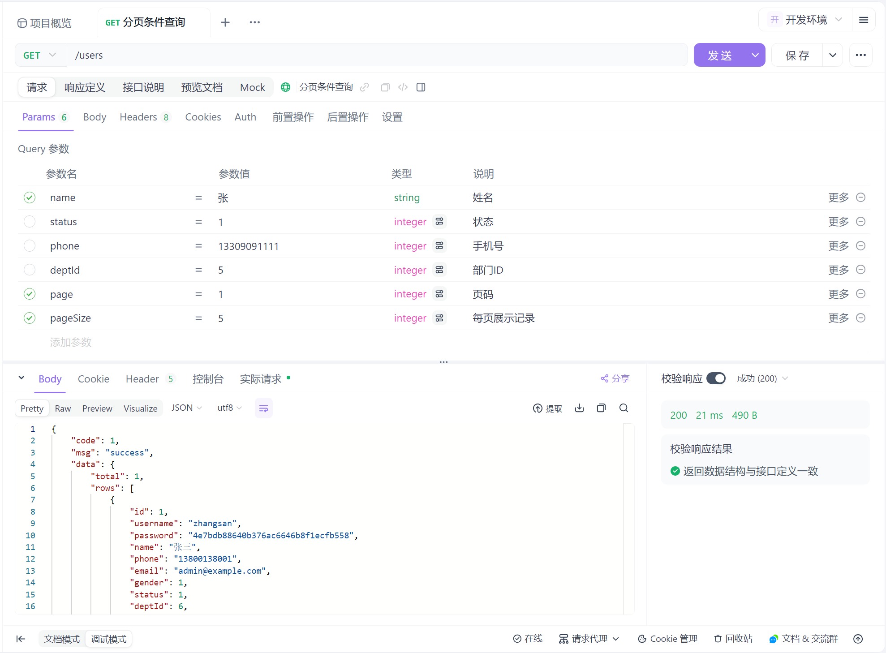

接口测试通过之后，我们就可以打开前端页面进行前后端联调测试了。

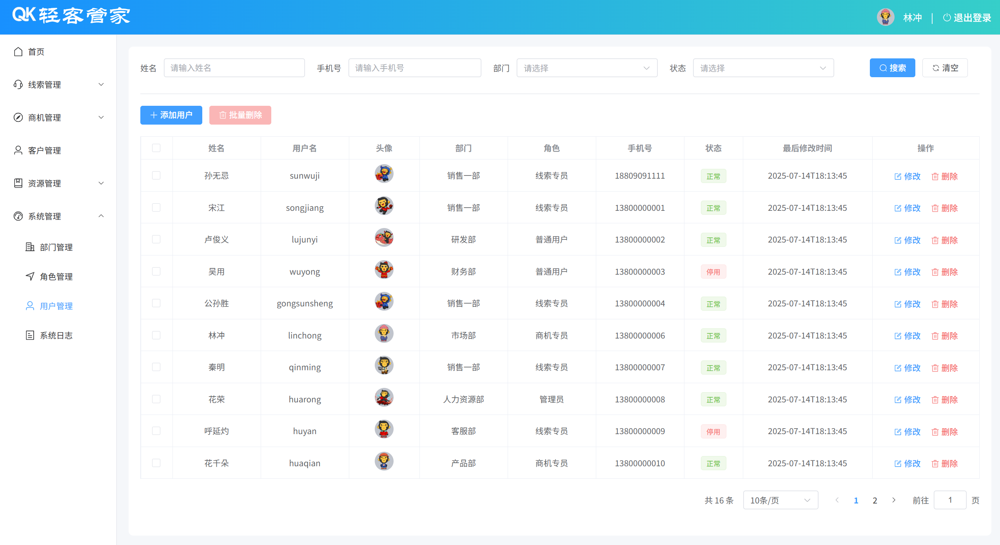

# 二、用户管理-新增

## 1.需求分析

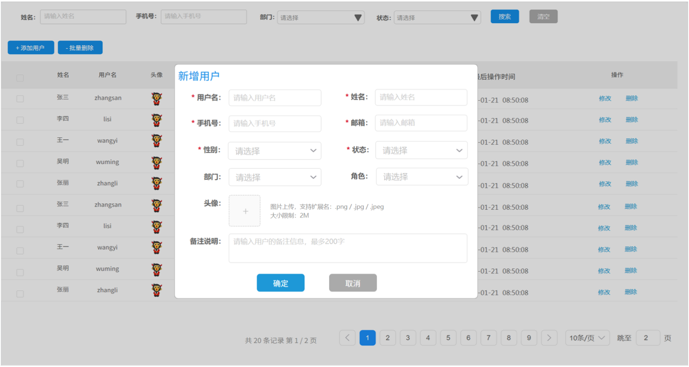

那在新增用户时，不仅要录入用户的用户名、姓名、手机号、邮箱等这些用户的基本信息，还需要上传员工的头像，而这个头像上传呢，就会涉及到文件上传，这个我们稍后再来详细讲解。目前我们先完成新增用户的基本功能实现。

录入了这些用户的信息之后，点击 "确定" 就要将表单的数据提交到服务端，保存到数据库。

```sql
insert into user(username, password, name, phone, email, gender, status, dept_id, role_id, image, remark, create_time, update_time) VALUES (?,?,?,?,?,?,?,?,?,?,?,?,?)
```

## 2.接口文档

具体的接口信息，请查看用户管理的接口文档：[附录-接口文档](https://lining-lo.github.io/lining-lo-notes/轻客管家/附录-接口文档.html)

## 3.功能实现

1.UserController

在UserController中增加如下方法:

```java
/**
 新增用户
 * @param user 封装用户信息(不包含password、createTime、updateTime)
 */
@PostMapping
public Result add(@RequestBody User user){
    //1 接收请求参数-->(@RequestBody User user)
    log.info("新增用户：{}", user);
    //2 调用service，新增用户
    userService.add(user);
    //3 响应Result
    return Result.success();
}
```

2.UserService

在UserService中增加如下接口方法:

```java
/**
 新增用户
 * @param user 封装用户信息(不包含password、createTime、updateTime)
 */
void add(User user);
```

3.UserServiceImpl

在UserServiceImpl中增加如下方法:

```java
/**
 新增用户
 @param user 封装用户信息(不包含password、createTime、updateTime)
 */
@Override
public void add(User user) {
    //1 设置默认密码
    user.setPassword(user.getUsername()+"123");
    //2 设置创建时间、更新时间
    user.setCreateTime(LocalDateTime.now());
    user.setUpdateTime(LocalDateTime.now());
    //3 调用Mapper层方法，新增用户
    userMapper.insert(user);
}
```

4.UserMapper

在UserMapper中增加如下接口方法:

```java
/**
 新增用户
 @param user 封装用户信息
 */
@Insert("INSERT INTO user(username, password, name, phone, email, gender, status, dept_id, role_id, image, remark, create_time, update_time) VALUES(#{username}, #{password}, #{name}, #{phone}, #{email}, #{gender}, #{status}, #{deptId}, #{roleId}, #{image}, #{remark}, #{createTime}, #{updateTime})")
void insert(User user);
```

功能完成之后，我们就可以打开前端页面进行测试了。

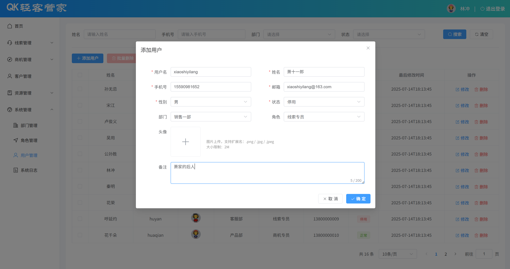


## 4.功能完善

### 4.1.分析

通过刚才的测试，我们可以看到用户的数据可以正常的添加，并录入到数据库中。

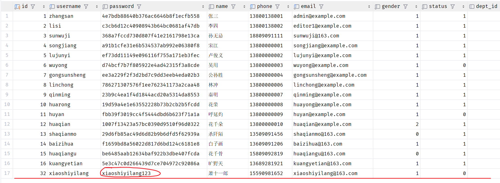

但是我们可以看到，用户的访问密码在数据库表中是以明文的形式存储的，这是非常不安全的，存在数据泄露的风险（任何人只要看到表中的数据，就能清楚的知道用户名和密码的信息了，就可以登录系统进行操作了） 。

所以，在项目开发中，数据库中的密码通常我们都会以密文（对明文进行加密）的形式进行存储的，确保数据的安全性，访问密码泄露的风险。

### 4.2.密码加密

密码加密的方式有很多，最为场景，使用最为广泛的当属MD5。

MD5：是一种信息摘要算法，一种被广泛使用的密码散列函数，可以产生出一个128位（16字节）的散列值，通常用于登录密码加密处理（只能加密不能解密）。

具体流程如下：

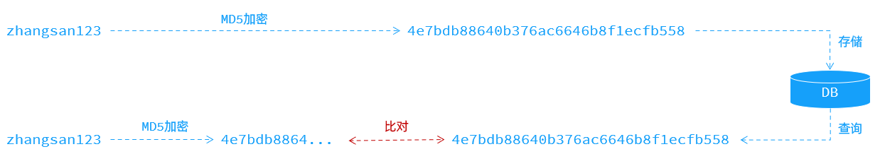

流程说明：

- 存储：在新增用户的时候，在往数据库保存用户信息的时候，要对明文的密码进行MD5加密，将加密后的密文存储再数据库表中。

- 查询：在用户登录的时候，输入密码，输入的是明文，那么此时我们要想验证用户输入密码的正确性，就可以把用户输入的明文进行MD5加密，然后再个数据库中查询出来的密文进行对比，如果一致，就说明密码正确。

接下来，我们就来完善新增用户的代码，在保存用户信息到数据库之前，对密码进行MD5加密，具体代码完善如下：

调整完善 `UserServiceImpl` 中的 `addUser` 方法。

```java
/**
 * 新增用户
 * @param user 用户信息
 */
@Override
public void add(User user) {
    //1 设置默认密码：用户名+123
    //user.setPassword(user.getUsername()+"123");
    //使用MD5算法对密码进行加密
    user.setPassword(DigestUtils.md5DigestAsHex((user.getUsername()+"123").getBytes()));
    //2 设置创建时间和更新时间为当前时间
    user.setCreateTime(LocalDateTime.now());
    user.setUpdateTime(LocalDateTime.now());
    //3 调用mapper层方法，保存用户
    userMapper.insert(user);
}
```

# 三、用户管理-文件上传

在我们完成的 新增用户 功能中，还存在一个问题：没有头像\(图片缺失\)

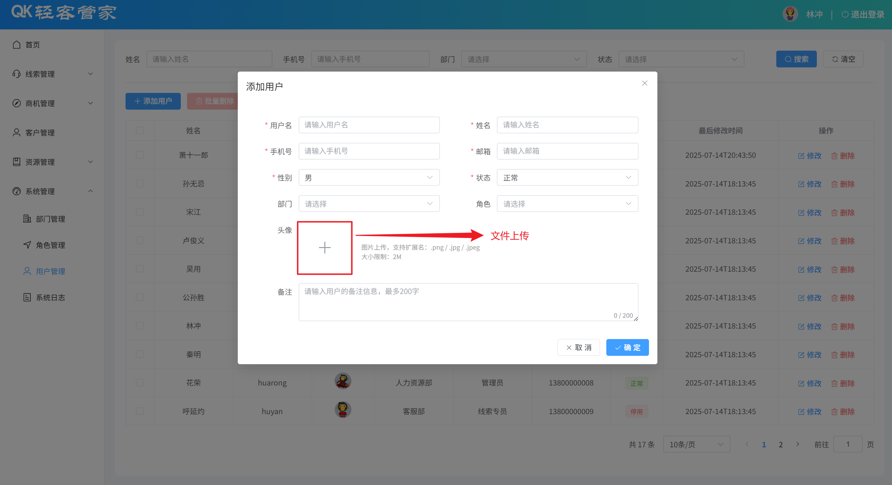

上述问题，需要我们通过文件上传技术来解决。下面我们就进入到文件上传技术的学习。

文件上传技术这块我们主要讲解三个方面：

- 首先我们先对文件上传做一个整体的介绍

- 接着再学习文件上传的本地存储方式

- 最后学习云存储方式。

接下来我们就先来学习下什么是文件上传。

## 1.简介

文件上传，是指将本地图片、视频、音频等文件上传到服务器，供其他用户浏览或下载的过程。

文件上传在项目中应用非常广泛，我们经常发微博、发微信朋友圈都用到了文件上传功能。


在我们的项目中，在新增用户的时候，要上传员工的头像，此时就会涉及到文件上传的功能。在进行文件上传时，我们点击加号或者是点击图片，就可以选择手机或者是电脑本地的图片文件了。当我们选择了某一个图片文件之后，这个文件就会上传到服务器，从而完成文件上传的操作。

1.前端代码形式如下:

```html
<!DOCTYPE html>
<html lang="en">
<head>
    <meta charset="UTF-8">
    <title>上传文件</title>
</head>
<body>
    
    <form action="/upload" method="post" enctype="multipart/form-data">
        姓名: <input type="text" name="username"><br>
        年龄: <input type="text" name="age"><br>
        头像: <input type="file" name="file"><br>
        <input type="submit" value="提交">
    </form>
    
</body>
</html>
```

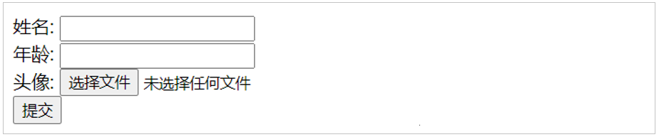

上传文件的原始form表单，要求表单必须具备以下三点（上传文件页面三要素）：

- 表单必须有file域，用于选择要上传的文件

- 表单提交方式必须为POST：通常上传的文件会比较大，所以需要使用 POST 提交方式

- 表单的编码类型enctype必须要设置为：multipart/form\-data：普通默认的编码格式是不适合传输大型的二进制数据的，所以在文件上传时，表单的编码格式必须设置为multipart/form\-data

前端页面的3要素我们了解后，接下来我们就来验证下所讲解的文件上传3要素。

在提供的资料中有一个名叫 "文件上传" 的文件夹，直接将里的 `upload.html` 文件，复制到springboot项目工程下的static目录里面。

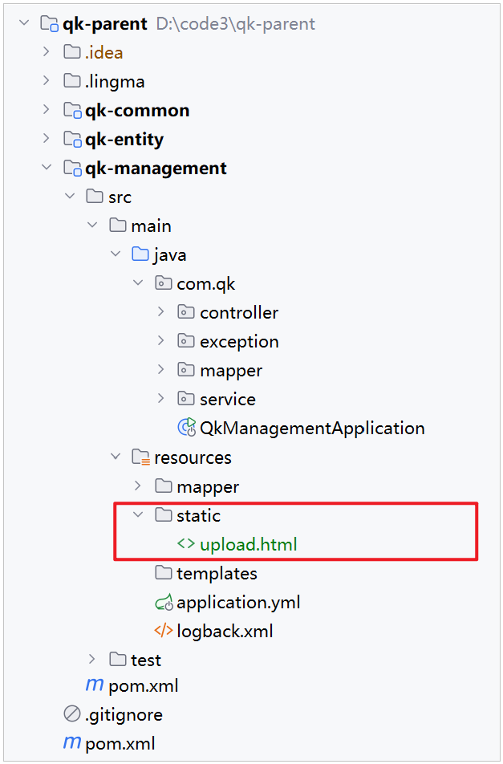

2.服务端代码形式如下

```java
package com.qk.controller;

import com.qk.common.Result;
import lombok.extern.slf4j.Slf4j;
import org.springframework.web.bind.annotation.PostMapping;
import org.springframework.web.bind.annotation.RestController;
import org.springframework.web.multipart.MultipartFile;
import java.io.File;

@Slf4j
@RestController
public class UploadController {

    /**
     * 文件上传
     */
    @PostMapping("/upload")
    public Result upload(String username, Integer age, MultipartFile file) throws Exception {
        log.info("上传文件开始...{}, {}, {}", username, age, file);
        file.transferTo(new File("D:/./images/" + file.getOriginalFilename()));
        return Result.success();
    }

}
```

在定义的方法中接收提交过来的数据 （方法中的形参名和请求参数的名字保持一致）

- 用户名：`String  name`

- 年龄： `Integer  age`

- 文件： `MultipartFile  file`

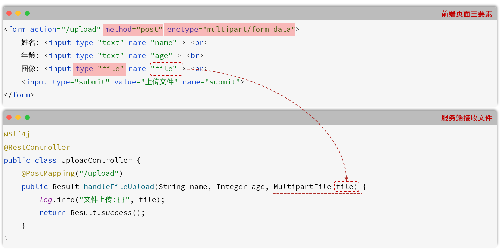

> Spring中提供了一个API：MultipartFile，使用这个API就可以来接收到上传的文件
>

问题1：如果表单项的名字和方法中形参名不一致，该怎么办？

```java
public Result upload(String username, 
                        Integer age,  
                        MultipartFile image) //image形参名和请求参数名file不一致
```

解决：使用@RequestParam注解进行参数绑定

```java
public Result upload(String username,
                     Integer age, 
                     @RequestParam("file") MultipartFile image)
```

## 2.本地存储

上面我们已经完成了文件上传最基本的功能实现，已经可以在服务端接收到上传的文件，并将文件保存在本地服务器的磁盘目录中了。 但是我们测试的时候发现，如果上传的文件名相同，后面上传的会覆盖前面上传的文件，那接下来，我们就要来优化这一块的功能。

代码实现如下：

```java
package com.qk.controller;

import com.qk.common.Result;
import lombok.extern.slf4j.Slf4j;
import org.springframework.web.bind.annotation.PostMapping;
import org.springframework.web.bind.annotation.RestController;
import org.springframework.web.multipart.MultipartFile;
import java.io.File;
import java.util.UUID;

@Slf4j
@RestController
public class UploadController {

    /**
     文件上传
     @param image 上传的图片
     */
    @PostMapping("/upload")
    public Result upload(MultipartFile image) throws IOException {
        //log.info("上传文件：{}", image.getOriginalFilename());
        //1 获取原始文件名
        String filename = image.getOriginalFilename();  //例如：a.jpg
        //2 需求：生成唯一文件名
        //2.1 使用Java提供的UUID工具类生成一个唯一32位字符串。例如：23nnsd5-sk429sdf-234s8
        String uuid = UUID.randomUUID().toString();
        //2.2 获取原始文件名中的后缀名
        //int index = filename.lastIndexOf(".");
        String suffix = filename.substring(filename.lastIndexOf("."));
        //2.3 将唯一字符串+后缀名组成新的文件名
        filename = uuid + suffix;
        //3 将客户端上传的图片保存到指定的目录中
        image.transferTo(new File("D:/upload", filename));
        return Result.success("D:/upload/" + filename);
    }
}
```

> MultipartFile 常见方法： 
> 
> - `String  getOriginalFilename();`  //获取原始文件名
> 
> - `void  transferTo(File dest);`` `   //将接收的文件转存到磁盘文件中
> 
> - `long  getSize();`   //获取文件的大小，单位：字节
> 
> - `byte[]  getBytes();`` `   //获取文件内容的字节数组
> 
> - `InputStream  getInputStream();`    //获取接收到的文件内容的输入流
> 

利用 `Apifox` 测试，注意：请求参数名和controller方法形参名保持一致。

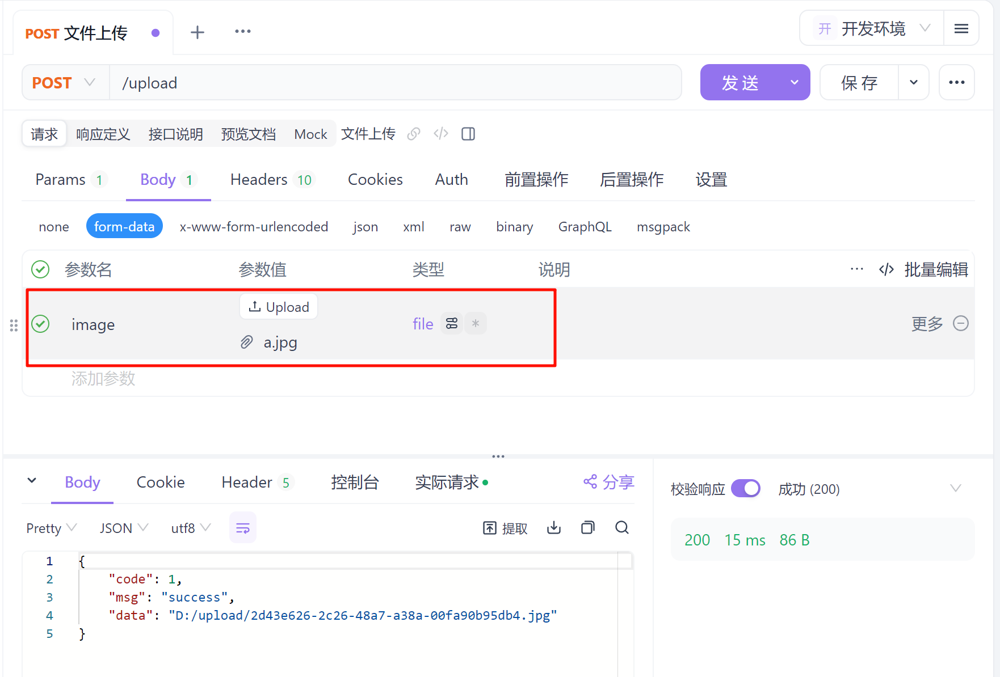

通过 `Apifox` 测试，我们发现文件上传是没有问题的。

在解决了文件名唯一性的问题后，我们再次上传一个较大的文件\(超出1M\)时发现，后端程序报错：

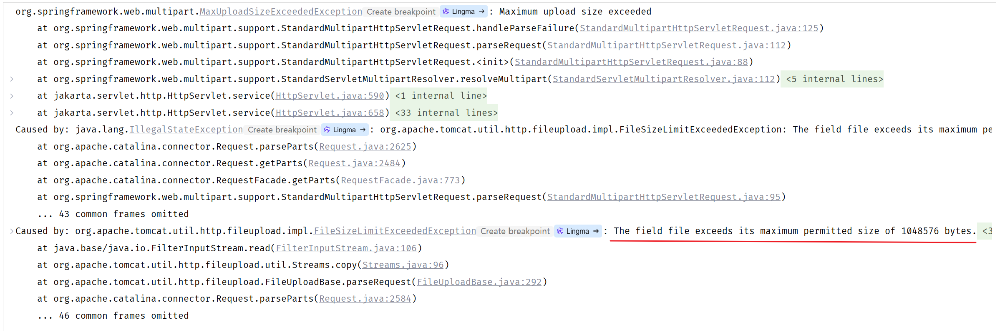

报错原因呢，是因为：在SpringBoot中，文件上传时默认单个文件最大大小为1M

那么如果需要上传大文件，可以在 `application.properties` 进行如下配置：

```yaml
spring：
    servlet:
      multipart:
        max-file-size: 10MB #单个文件最大10MB
        max-request-size: 100MB #请求总大小最大100MB
```

> 说明：
>
> max\-file\-size：表示单个文件最大大小。
>
> max\-request\-size：表示单个请求最大大小。
>

到时此，我们文件上传的本地存储方式已完成了。但是这种本地存储方式还存在一问题： 

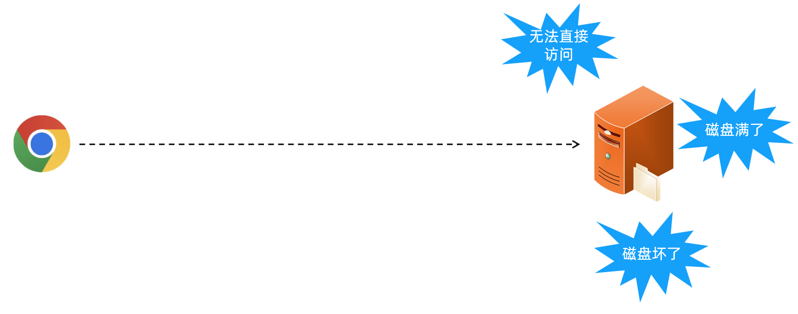

如果直接存储在服务器的磁盘目录中，存在以下缺点：

- 不安全：磁盘如果损坏，所有的文件就会丢失

- 容量有限：如果存储大量的图片，磁盘空间有限\(磁盘不可能无限制扩容\)

- 无法直接访问

为了解决上述问题呢，通常有两种解决方案：

- 自己搭建存储服务器，如：fastDFS 、MinIO

- 使用现成的云服务，如：阿里云，腾讯云，华为云

## 3.阿里云OSS

阿里云是阿里巴巴集团旗下全球领先的云计算公司，也是国内最大的云服务提供商 。

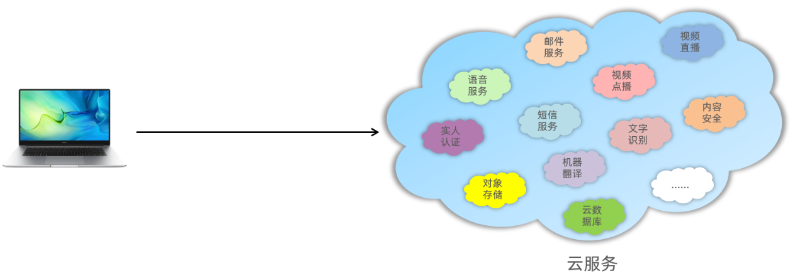

> 云服务指的就是通过互联网对外提供的各种各样的服务，比如像：语音服务、短信服务、邮件服务、视频直播服务、文字识别服务、对象存储服务等等。
>
> 当我们在项目开发时需要用到某个或某些服务，就不需要自己来开发了，可以直接使用阿里云提供好的这些现成服务就可以了。比如：在项目开发当中，我们要实现一个短信发送的功能，如果我们项目组自己实现，将会非常繁琐，因为你需要和各个运营商进行对接。而此时阿里云完成了和三大运营商对接，并对外提供了一个短信服务。我们项目组只需要调用阿里云提供的短信服务，就可以很方便的来发送短信了。这样就降低了我们项目的开发难度，同时也提高了项目的开发效率。（大白话：别人帮我们实现好了功能，我们只要调用即可）
>
> 云服务提供商给我们提供的软件服务通常是需要收取一部分费用的。
>

阿里云对象存储OSS（Object Storage Service），是一款海量、安全、低成本、高可靠的云存储服务。使用OSS，您可以通过网络随时存储和调用包括文本、图片、音频和视频等在内的各种文件。

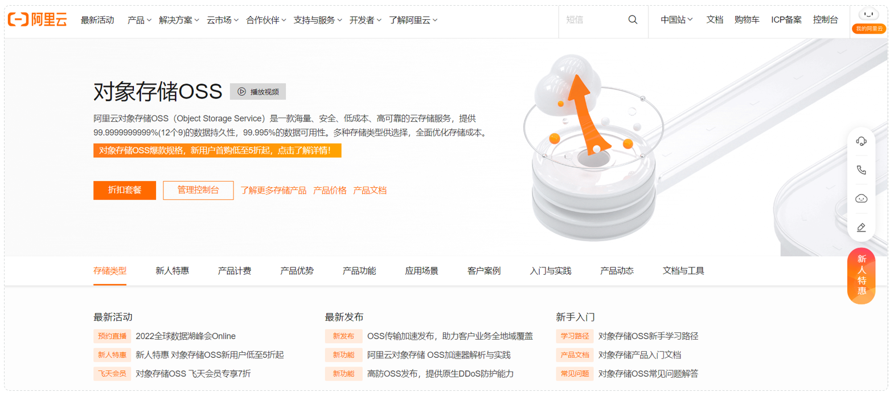

在我们使用了阿里云OSS对象存储服务之后，我们的项目当中如果涉及到文件上传这样的业务，在前端进行文件上传并请求到服务端时，在服务器本地磁盘当中就不需要再来存储文件了。我们直接将接收到的文件上传到oss，由 oss帮我们存储和管理，同时阿里云的oss存储服务还保障了我们所存储内容的安全可靠。

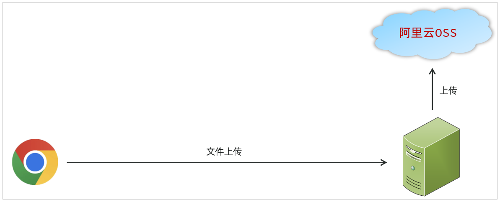

那我们学习使用这类云服务，我们主要学习什么呢？其实我们主要学习的是如何在项目当中来使用云服务完成具体的业务功能。而无论使用什么样的云服务，阿里云也好，腾讯云、华为云也罢，在使用第三方的服务时，操作的思路都是一样的。

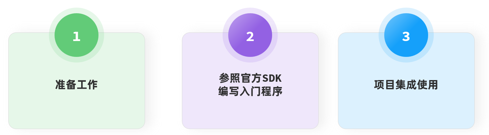

> SDK：Software Development Kit 的缩写，软件开发工具包，包括辅助软件开发的依赖（jar包）、代码示例等，都可以叫做SDK。
>
> 简单说，sdk中包含了我们使用第三方云服务时所需要的依赖，以及一些示例代码。我们可以参照sdk所提供的示例代码就可以完成入门程序。
>

### 3.1.准备

第三方服务使用的通用思路，我们做一个简单介绍之后，接下来我们就来介绍一下我们当前要使用的阿里云oss对象存储服务具体的使用步骤。

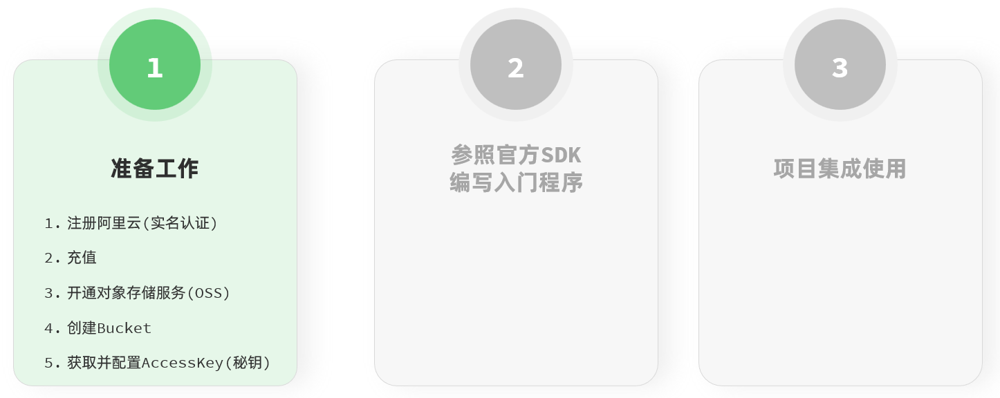

> Bucket：存储空间是用户用于存储对象（Object，就是文件）的容器，所有的对象都必须隶属于某个存储空间。
>

**账号准备**

下面我们根据之前介绍的使用步骤，完成准备工作：

1.注册阿里云账户（注册完成后需要实名认证）

[https://account.aliyun.com/login/login.htm?oauth_callback=https%3A%2F%2Fwww.aliyun.com%2F](https://account.aliyun.com/login/login.htm?oauth_callback=https%3A%2F%2Fwww.aliyun.com%2F)


2.注册并完成登录之后，点击右上角"控制台"。


**开通OSS云服务**

1.点击左上角"汉堡按钮"控制台找到对象存储OSS服务

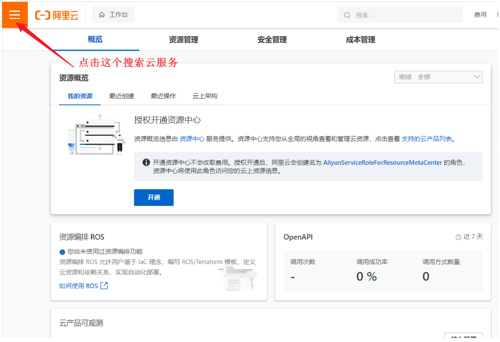

选择要开通的服务

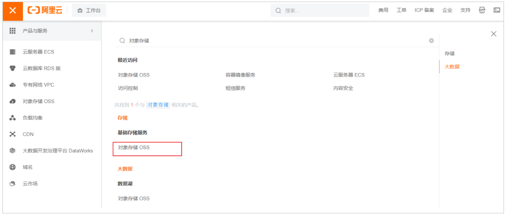

如果是第一次访问，还需要开通对象存储服务OSS 

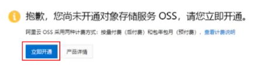

2.开通OSS服务之后，就可以进入到阿里云对象存储的控制台

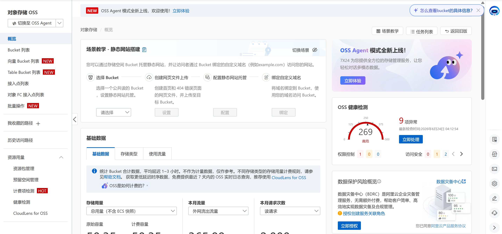

**创建Bucket桶**

3.点击左侧的 "Bucket列表"，创建一个Bucket

输入Bucket的相关信息\.

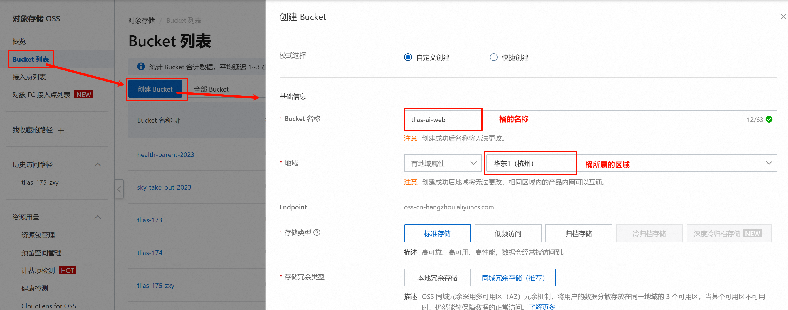

创建完桶\(存储空间\)之后，进入到桶中，然后修改桶的访问权限，如下所示：

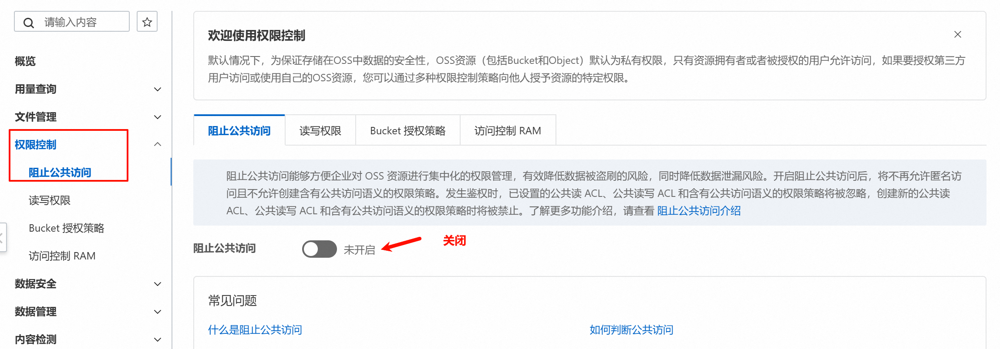

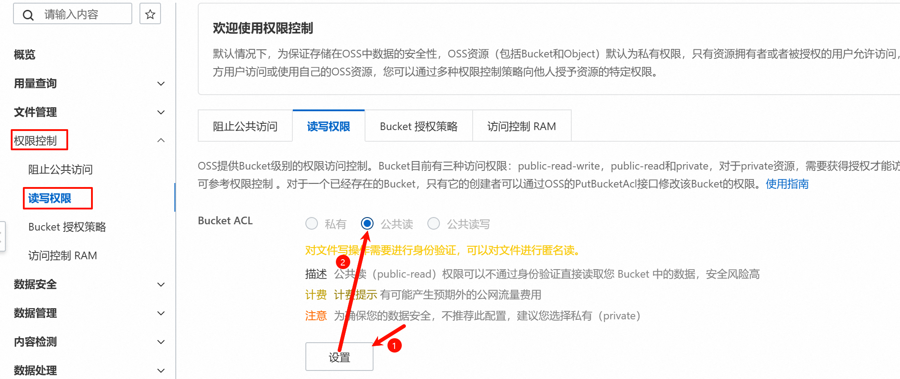


**创建AccessKey**

点击 "AccessKey管理"，进入到管理页面。

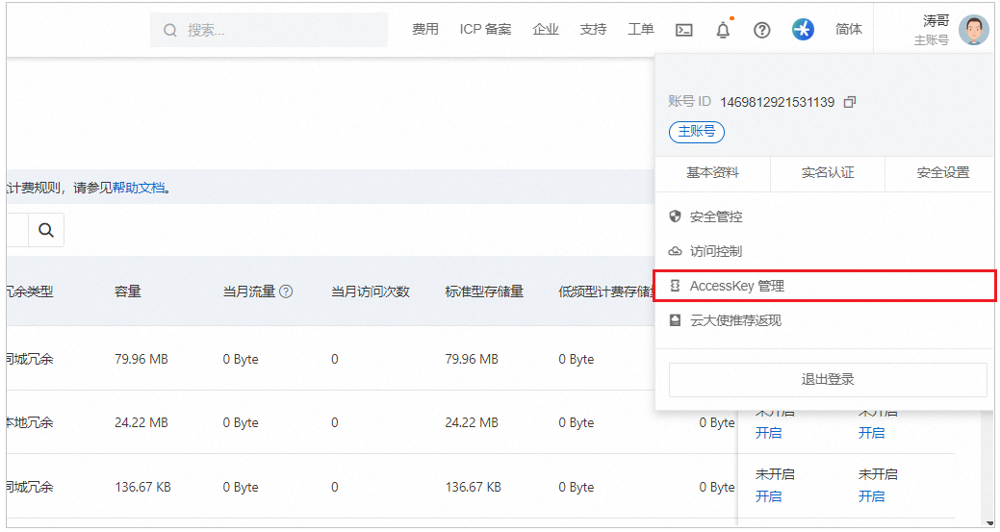

点击 "创建AccessKey"。

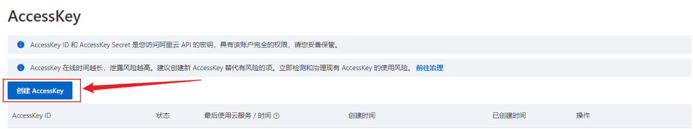

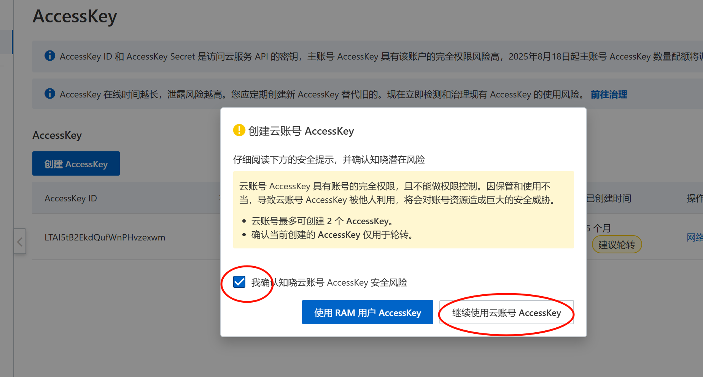

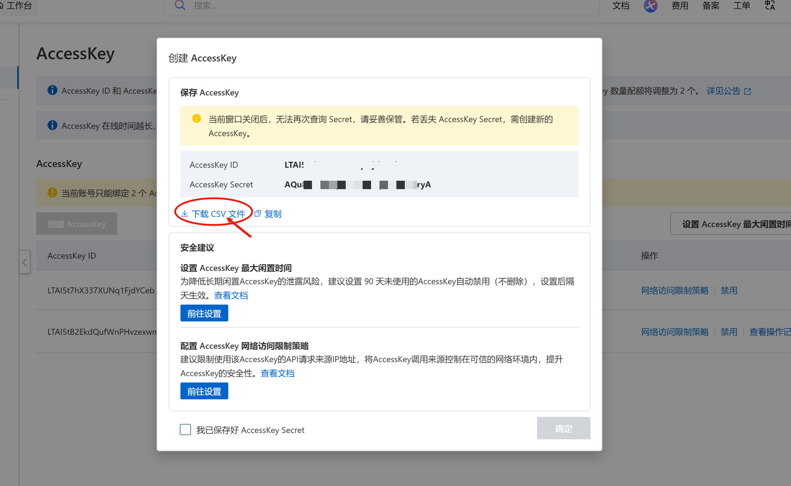

### 3.2.入门

阿里云oss 对象存储服务的准备工作我们已经完成了，接下来我们就来完成第二步操作：参照官方所提供的sdk示例来编写入门程序。

首先我们需要来打开阿里云OSS的官方文档，在官方文档中找到 SDK 的示例代码：

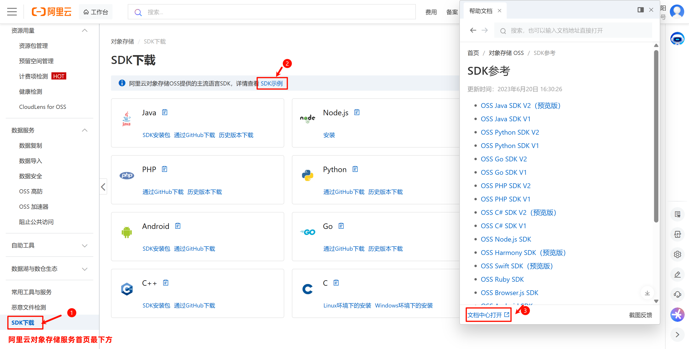

如果是在实际开发当中，我们是需要从前往后仔细的去阅读这一份文档的，但是由于现在是教学，我们就只挑重点的去看。有兴趣的同学大家下来也可以自己去看一下这份官方文档。

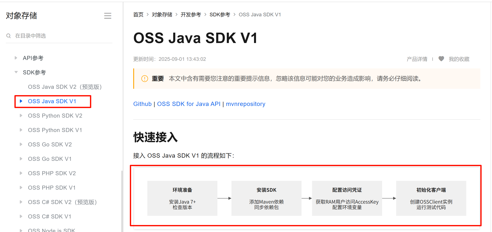

**第一步：环境准备**

我们已经安装过jdk，且版本高于java7，这一步就不用做了。

**第二步：安装SDK**

参照文档，引入依赖：

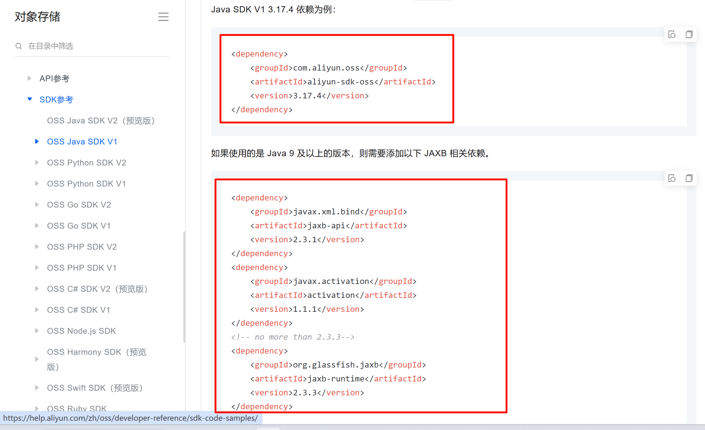

先在`qk-parent`父模块的pom\.xml中版本锁定

```xml
<properties>
    <aliyun.sdk.version>3.17.4</aliyun.sdk.version>
    <jaxb.version>2.3.1</jaxb.version>
    <activation.version>1.1.1</activation.version>
    <jaxb.runtime.version>2.3.3</jaxb.runtime.version>
</properties>


<dependencyManagement>
    <dependencies>
        <dependency>
            <groupId>com.aliyun.oss</groupId>
            <artifactId>aliyun-sdk-oss</artifactId>
            <version>${aliyun.sdk.version}</version>
        </dependency>

        <dependency>
            <groupId>javax.xml.bind</groupId>
            <artifactId>jaxb-api</artifactId>
            <version>${jaxb.version}</version>
        </dependency>

        <dependency>
            <groupId>javax.activation</groupId>
            <artifactId>activation</artifactId>
            <version>${activation.version}</version>
        </dependency>

        <dependency>
            <groupId>org.glassfish.jaxb</groupId>
            <artifactId>jaxb-runtime</artifactId>
            <version>${jaxb.runtime.version}</version>
        </dependency>
    </dependencies>
</dependencyManagement>
```

再在 `qk-common` 模块的pom\.xml配置文件中，引入aliyunoss的依赖

```xml
<dependencies>
    <!--阿里云OSS依赖-->
    <dependency>
        <groupId>com.aliyun.oss</groupId>
        <artifactId>aliyun-sdk-oss</artifactId>
    </dependency>

    <dependency>
        <groupId>javax.xml.bind</groupId>
        <artifactId>jaxb-api</artifactId>
    </dependency>

    <dependency>
        <groupId>javax.activation</groupId>
        <artifactId>activation</artifactId>
    </dependency>

    <dependency>
        <groupId>org.glassfish.jaxb</groupId>
        <artifactId>jaxb-runtime</artifactId>
    </dependency>
</dependencies>
```

**第三步：配置访问凭证**

以管理员身份打开CMD命令行，执行如下命令，配置系统的环境变量。

```shell
setx OSS_ACCESS_KEY_ID "xxxxxxxxxxxxxxxxxxxxxxxxxxxxxx"
setx OSS_ACCESS_KEY_SECRET "xxxxxxxxxxxxxxxxxxxxxxxxxx"
```

注意：将上述的ACCESS\_KEY\_ID  与 ACCESS\_KEY\_SECRET 的值一定要替换成自己的 。

执行如下命令，验证环境变量是否生效。

```shell
echo %OSS_ACCESS_KEY_ID%
echo %OSS_ACCESS_KEY_SECRET%
```

**第四步：初始化客户端**

参照文档，复制并修改入门程序：

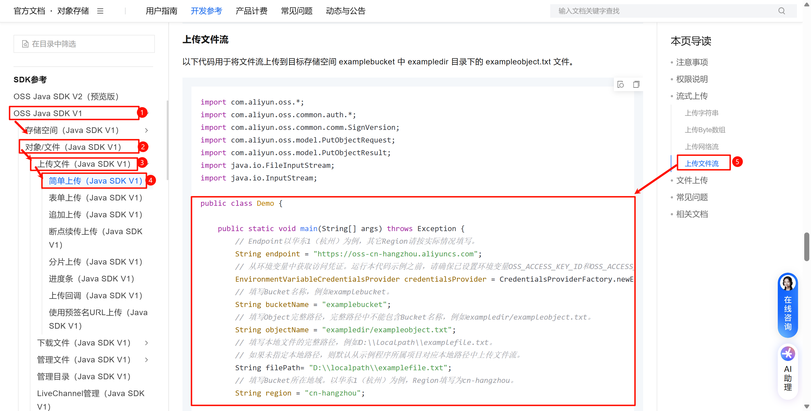

或者

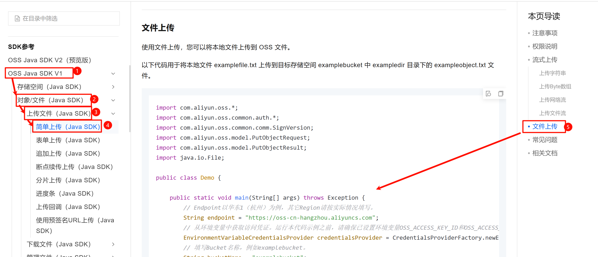

将官方提供的入门程序，复制过来，将里面的参数值改造成我们自己的即可。代码如下：

```java
import com.aliyun.oss.*;
import com.aliyun.oss.common.auth.*;
import com.aliyun.oss.common.comm.SignVersion;
import com.aliyun.oss.model.PutObjectRequest;
import com.aliyun.oss.model.PutObjectResult;
import java.io.File;

public class Demo {

    public static void main(String[] args) throws Exception {
        // Endpoint以华东1（杭州）为例，其它Region请按实际情况填写。
        String endpoint = "https://oss-cn-hangzhou.aliyuncs.com";
        // 从环境变量中获取访问凭证。运行本代码示例之前，请确保已设置环境变量OSS_ACCESS_KEY_ID和OSS_ACCESS_KEY_SECRET。
        EnvironmentVariableCredentialsProvider credentialsProvider = CredentialsProviderFactory.newEnvironmentVariableCredentialsProvider();
        // 填写Bucket名称，例如examplebucket。
        String bucketName = "qk-parent-zz";
        // 填写Object完整路径，完整路径中不能包含Bucket名称，例如exampledir/exampleobject.txt。
        //String objectName = "aaa/a.jpg"; //文件在bucket桶中的路径+名称.此处会创建一个aaa目录，a.jpg存到这个目录中
        String objectName = "a.jpg"; //文件在bucket桶中的路径+名称
        // 填写本地文件的完整路径，例如D:\\localpath\\examplefile.txt。
        // 如果未指定本地路径，则默认从示例程序所属项目对应本地路径中上传文件流。
        String filePath= "D:/image/a.jpg";  //要上传的文件路径
        // 填写Bucket所在地域。以华东1（杭州）为例，Region填写为cn-hangzhou。
        String region = "cn-hangzhou";
        
        // 创建OSSClient实例。
        // 当OSSClient实例不再使用时，调用shutdown方法以释放资源。
        ClientBuilderConfiguration clientBuilderConfiguration = new ClientBuilderConfiguration();
        clientBuilderConfiguration.setSignatureVersion(SignVersion.V4);        
        OSS ossClient = OSSClientBuilder.create()
        .endpoint(endpoint)
        .credentialsProvider(credentialsProvider)
        .clientConfiguration(clientBuilderConfiguration)
        .region(region)               
        .build();

        try {
            InputStream inputStream = new FileInputStream(filePath);
            // 创建PutObjectRequest对象。
            PutObjectRequest putObjectRequest = new PutObjectRequest(bucketName, objectName, inputStream);
            // 创建PutObject请求。
            PutObjectResult result = ossClient.putObject(putObjectRequest);
        } catch (OSSException oe) {
            System.out.println("Caught an OSSException, which means your request made it to OSS, "
                    + "but was rejected with an error response for some reason.");
            System.out.println("Error Message:" + oe.getErrorMessage());
            System.out.println("Error Code:" + oe.getErrorCode());
            System.out.println("Request ID:" + oe.getRequestId());
            System.out.println("Host ID:" + oe.getHostId());
        } catch (ClientException ce) {
            System.out.println("Caught an ClientException, which means the client encountered "
                    + "a serious internal problem while trying to communicate with OSS, "
                    + "such as not being able to access the network.");
            System.out.println("Error Message:" + ce.getMessage());
        } finally {
            if (ossClient != null) {
                ossClient.shutdown();
            }
        }
    }
} 
```

> 切记，大家需要将上面的 `endpoint` ，`bucketName`，`objectName`，`file` 都需要改成自己的。
>
> 在以上代码中，需要替换的内容为：
>
> - endpoint：阿里云OSS中的bucket对应的域名
>
> - bucketName：Bucket名称
>
> - objectName：对象名称，在Bucket中存储的对象的名称
>
> - file：文件路径
>

运行以上程序后，会把本地的文件上传到阿里云OSS服务器上。

### 3.3.集成

**介绍**

阿里云oss对象存储服务的准备工作以及入门程序我们都已经完成了，接下来我们就需要在案例当中集成oss对象存储服务，来存储和管理案例中上传的图片。

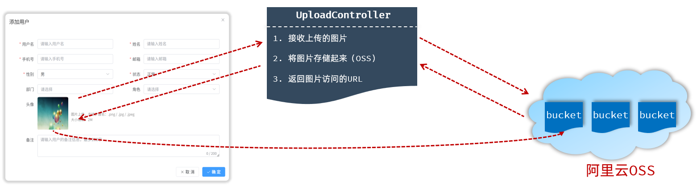

> 在新增用户的时候，上传用户的头像，而之所以需要上传用户的图像，是因为将来我们需要在系统页面当中访问并展示用户的图像。而要想完成这个操作，需要做两件事：
> 
> 1. 需要上传用户的头像，并把头像保存起来（存储到阿里云OSS）
> 
> 2. 访问员工头像（通过头像在阿里云OSS的存储地址访问图像）
> 
>     OSS中的每一个文件都会分配一个访问的url，通过这个url就可以访问到存储在阿里云上的图片。所以需要把url返回给前端，这样前端就可以通过url获取到图像。
> 

我们参照接口文档来开发文件上传功能：

基本信息

- 请求路径：/upload
- 请求方式：POST
- 接口描述：上传图片接口

请求参数

- 参数格式：multipart/form\-data
- 参数说明：

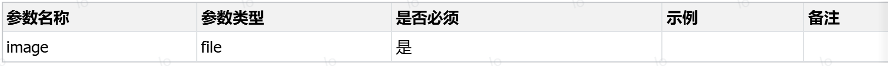

响应数据

- 参数格式：application/json
- 参数说明：
- 响应数据样例：

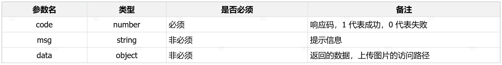

```JSON
{
    "code": 1,
    "msg": "success",
    "data": "https://web-framework.oss-cn-hangzhou.aliyuncs.com/2022-09-02-00-27-0400.jpg"
}
```

**实现**

引入阿里云OSS上传文件工具类（由官方的示例代码改造而来）

提示词：

> 帮我根据这个Demo，生成一个文件上传的工具类 AliyunOSSOperator，并将其交给IOC容器管理，在工具类中定义一个文件上传的方法 upload，文件上传完毕后，要返回该文件访问的url地址，url地址的形式如下: https://qk\-parent\-zxy\.oss\-cn\-hangzhou\.aliyuncs\.com/a\.jpg \(是由endpoint，bucket，objectName拼起来的\)。
>

AI最终就会生成如下工具类，该工具类需要存放在 `qk-common` 模块的 `com.qk.utils` 包中。 

1.引入依赖

在 `qk-common` 模块的pom\.xml配置文件中，除了引入aliyunoss的依赖，还要引入springboot的基础依赖（因为用到的spring的注解）。

```xml
<dependencies>
    <dependency>
        <groupId>org.springframework.boot</groupId>
        <artifactId>spring-boot</artifactId>
    </dependency>
</dependencies>
```

2.引入工具类

在 `qk-common` 模块的 `com.qk.utils` 包中，引入如下工具类。

```java
@Slf4j
@Component
public class AliyunOSSOperator {

    private static final String ENDPOINT = "https://oss-cn-hangzhou.aliyuncs.com";
    private static final String BUCKET_NAME = "qk-parent-zxy";
    private static final String REGION = "cn-hangzhou";

    public String upload(byte[] content, String originalFilename) throws Exception {
        // 获取原始文件名的后缀名
        String suffixName = originalFilename.substring(originalFilename.lastIndexOf("."));
        //生成唯一文件名
        String objectName = UUID.randomUUID().toString() + suffixName;
        // 创建OSSClient实例
        ClientBuilderConfiguration clientBuilderConfiguration = new ClientBuilderConfiguration();
        clientBuilderConfiguration.setSignatureVersion(SignVersion.V4);
        OSS ossClient = null;
        try {
            ossClient = OSSClientBuilder.create()
                    .endpoint(ENDPOINT)
                    .credentialsProvider(new EnvironmentVariableCredentialsProvider())
                    .clientConfiguration(clientBuilderConfiguration)
                    .region(REGION)
                    .build();
            // 创建PutObjectRequest对象
            PutObjectRequest putObjectRequest = new PutObjectRequest(BUCKET_NAME, objectName, new ByteArrayInputStream(content));
            // 上传文件
            ossClient.putObject(putObjectRequest);
            // 返回文件访问URL
            return "https://" + BUCKET_NAME + "." + ENDPOINT.substring(8) + "/" + objectName;
        } catch (Exception e) {
            log.error("Caught an OSSException: " + e.getMessage());
            throw e;
        } finally {
            if (ossClient != null) {
                ossClient.shutdown();
            }
        }
    }
}
```

3.修改UploadController代码

调整 `qk-management` 模块中 UploadController 类中文件上传的代码。

```java
@Slf4j
@RestController
public class UploadController {

    @Autowired
    private AliyunOSSOperator aliyunOSSOperator;

    /**
     * 文件上传
     */
    @PostMapping("/upload")
    public Result upload(MultipartFile image) throws Exception {
        log.info("文件上传开始：{}", image.getOriginalFilename());
        //1 获取文件名
        String filename = image.getOriginalFilename(); //a.jpg  b.jpg...
        
        //2 将文件上传到阿里云oss对象存储服务器并获取图片的访问地址
        String url = aliyunOSSOperator.upload(image.getBytes(), filename);
        
        //3 返回图片的访问路径
        return Result.success(url);
    }
}
```

使用 Apifox 测试：

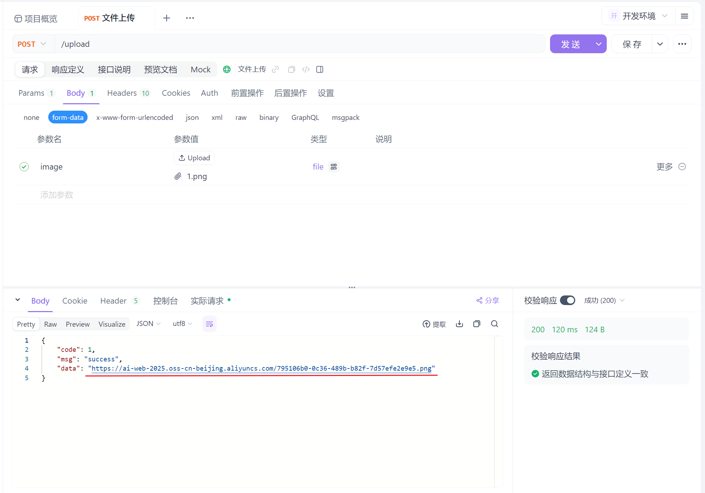

接口测试通过之后，我们就可以进行前后端联调了。

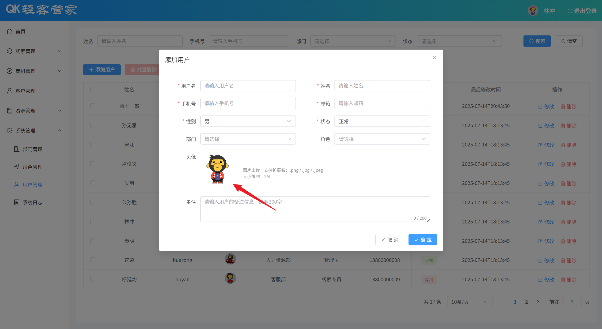

## 4.功能优化

员工管理的新增功能我们已开发完成，但在我们所开发的程序中还一些小问题，下面我们就来分析一下当前案例中存在的问题以及如何优化解决。

在刚才我们制作的AliyunOSS操作的工具类中，我们直接将 endpoint、bucketName参数直接在java文件中写死了。如下所示：

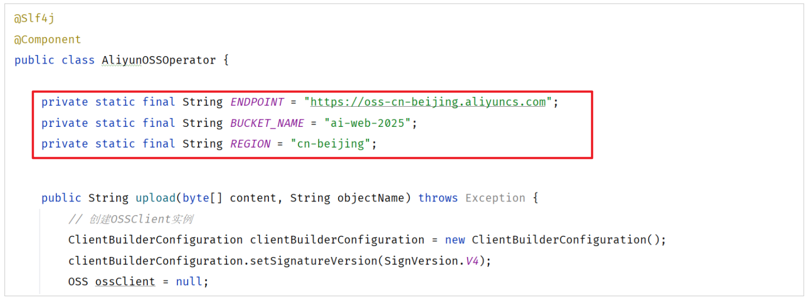

如果后续，项目要部署到测试环境、上生产环境，我们需要来修改这两个参数。 而如果开发一个大型项目，所有用到的技术涉及到的这些个参数全部写死在java代码中，是非常不便于维护和管理的。 

### 4.1.@Value

那么对于这些容易变动的参数，我们可以将其配置在配置文件中，然后通过 `@Value` 注解来注解外部配置的属性。如下所示：

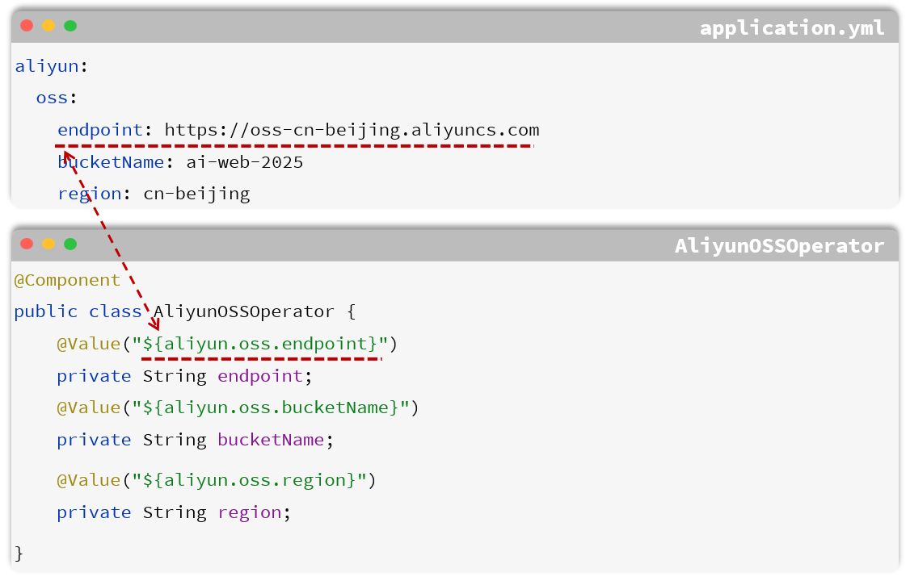

具体实现代码如下：

1.application\.yml

```yaml
#阿里云OSS
aliyun:
  oss:
    endpoint: https://oss-cn-hangzhou.aliyuncs.com
    bucketName: qk-parent-zxy
    region: cn-hangzhou
```

2.AliyunOSSOperator

```java
@Slf4j
@Component
public class AliyunOSSOperator {

    //需求：读取yml文件中的配置信息赋值给成员变量
    //方式一：使用@Value("${key}")将属于一个一个注入给成员变量
    @Value("${aliyun.oss.endpoint}")
    private String endpoint;
    @Value("${aliyun.oss.bucketName}")
    private String bucketName;
    @Value("${aliyun.oss.region}")
    private String region;

    public String upload(byte[] content, String originalFilename) throws Exception {
    // 获取原始文件名的后缀名
    String suffixName = originalFilename.substring(originalFilename.lastIndexOf("."));
    //生成唯一文件名
    String objectName = UUID.randomUUID().toString() + suffixName;
    // 创建OSSClient实例
    ClientBuilderConfiguration clientBuilderConfiguration = new ClientBuilderConfiguration();
    clientBuilderConfiguration.setSignatureVersion(SignVersion.V4);
    OSS ossClient = null;
    try {
        ossClient = OSSClientBuilder.create()
                .endpoint(endpoint)
                .credentialsProvider(new EnvironmentVariableCredentialsProvider())
                .clientConfiguration(clientBuilderConfiguration)
                .region(region)
                .build();
        // 创建PutObjectRequest对象
        PutObjectRequest putObjectRequest = new PutObjectRequest(bucketName, objectName, new ByteArrayInputStream(content));
        // 上传文件
        ossClient.putObject(putObjectRequest);
        // 返回文件访问URL
        return "https://" + bucketName + "." + endpoint.substring(8) + "/" + objectName;
    } catch (Exception e) {
        log.error("Caught an OSSException: " + e.getMessage());
        throw e;
    } finally {
        if (ossClient != null) {
            ossClient.shutdown();
        }
    }
  }
}
```

### 4.2.@ConfigurationProperties

如果只有一两个属性需要注入，而且不需要考虑复用性，使用`@Value`注解就可以了。

但是使用@Value注解注入配置文件的配置项，如果配置项多，注入繁琐，不便于维护管理 和 复用。如下所示:

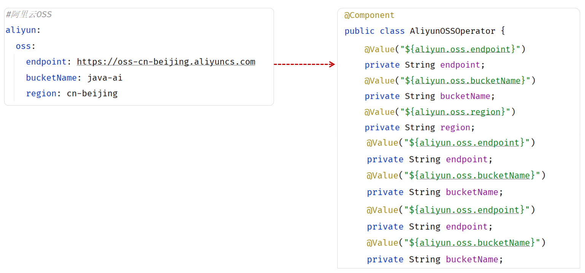

那么有没有一种方式可以简化这些配置参数的注入呢？答案是肯定有，在Spring中给我们提供了一种简化方式，可以直接将配置文件中配置项的值自动的注入到对象的属性中。

Spring提供的简化方式套路：

1.需要创建一个实现类，且实体类中的属性名和配置文件当中key的名字必须要一致

比如：配置文件当中叫endpoint，实体类当中的属性也得叫endpoint，另外实体类当中的属性还需要提供 getter / setter方法

2.需要将实体类交给Spring的IOC容器管理，成为IOC容器当中的bean对象

3.在实体类上添加`@ConfigurationProperties`注解，并通过perfect属性来指定配置参数项的前缀

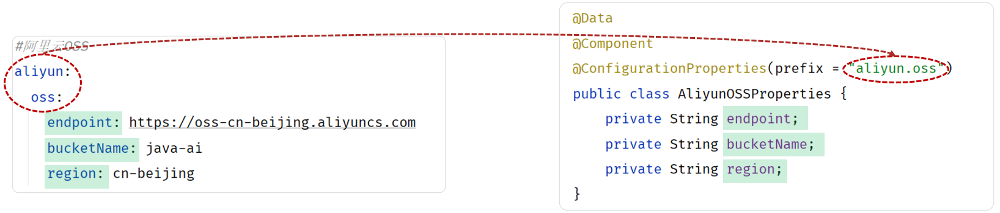

具体实现步骤:

1.定义实体类 `AliyunOSSProperties` ，并交给IOC容器管理

在 `qk-common` 模块的 `com.qk.utils` 包中定义。

```java
@Data
@Component
//将会aliyun.oss下的所有配置信息按照成员变量的名字自动封装。例如：配置中的endpoint 封装到endpoint 属性身上
@ConfigurationProperties(prefix = "aliyun.oss")  
public class AliyunOSSProperties {
    private String endpoint;
    private String bucketName;
    private String region;
}
```

2.修改 `AliyunOSSOperator`

```java
@Slf4j
@Component
public class AliyunOSSOperator {

    //private static final String ENDPOINT = "https://oss-cn-hangzhou.aliyuncs.com";
    //private static final String BUCKET_NAME = "qk-parent-zz";
    //private static final String REGION = "cn-hangzhou";

    //需求：读取yml文件中的配置信息赋值给成员变量
    //方式一：使用@Value("${key}")将属于一个一个注入给成员变量
    //@Value("${aliyun.oss.endpoint}")
    //private String endpoint;
    //@Value("${aliyun.oss.bucketName}")
    //private String bucketName;
    //@Value("${aliyun.oss.region}")
    //private String region;

    //方式二：使用@ConfigurationProperties(prefix = "aliyun.oss")将配置信息按照前缀批量注入到一个对象中
    @Autowired
    private AliyunOSSProperties aliyunOSSProperties;

    public String upload(byte[] content, String originalFilename) throws Exception {
        //从aliyunOSSProperties中获取配置信息
        String endpoint = aliyunOSSProperties.getEndpoint();
        String bucketName = aliyunOSSProperties.getBucketName();
        String region = aliyunOSSProperties.getRegion();

        // 获取原始文件名的后缀名
        String suffixName = originalFilename.substring(originalFilename.lastIndexOf("."));
        //生成唯一文件名
        String objectName = UUID.randomUUID().toString() + suffixName;
        // 创建OSSClient实例
        ClientBuilderConfiguration clientBuilderConfiguration = new ClientBuilderConfiguration();
        clientBuilderConfiguration.setSignatureVersion(SignVersion.V4);
        OSS ossClient = null;
        try {
            ossClient = OSSClientBuilder.create()
                    .endpoint(endpoint)
                    .credentialsProvider(new EnvironmentVariableCredentialsProvider())
                    .clientConfiguration(clientBuilderConfiguration)
                    .region(region)
                    .build();
            // 创建PutObjectRequest对象
            PutObjectRequest putObjectRequest = new PutObjectRequest(bucketName, objectName, new ByteArrayInputStream(content));
            // 上传文件
            ossClient.putObject(putObjectRequest);
            // 返回文件访问URL
            return "https://" + bucketName + "." + endpoint.substring(8) + "/" + objectName;
        } catch (Exception e) {
            log.error("Caught an OSSException: " + e.getMessage());
            throw e;
        } finally {
            if (ossClient != null) {
                ossClient.shutdown();
            }
        }
    }
}
```

代码优化完毕之后，我们可以看到，文件上传的功能依然正常运行。

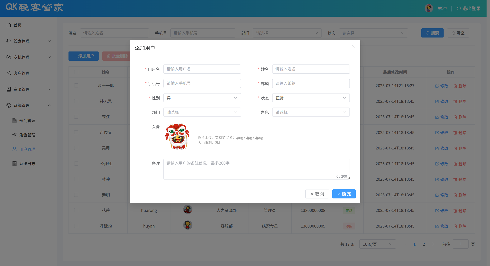

那到此呢，关于用户管理中新增用户的功能，我们就全部搞定了。

> 1.注入外部配置文件中的配置项的两种方式?
>
> - @Value：一个属性一个属性的注入
>
> - @ConfigurationProperties：批量将多个属性注入到bean对象中
>
> 2.两种方式各自的使用场景？
>
> - 如果属性较少,建议@Value注入即可
>
> - 如果属性较多,考虑复用,建议使用@ConfigurationProperties

# 四、用户管理-删除

## 1.分析

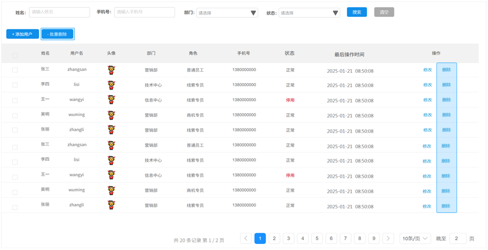

通过页面原型，我们可以看到删除用户有两个入口，分别是：

- 每一条用户信息后面，有一个删除按钮，点击删除就可以删除当前这个用户信息。（删除单个）

- 在表格的上方，有一个批量删除按钮，我们勾选复选框，就可以选中要删除的记录，点击批量删除就可以一次性删除多条记录。（批量删除）

> 思考：针对于删除用户的功能，我们需要开发几个服务端接口？ 
>
> 一个，只需要开发一个批量删除的接口即可，因为删除单个，其实也算是一种特殊的批量删除。

```sql
delete from user where id in(?,?,?) -- ?数量不固定，将来需要定义动态SQL
```

## 2.接口文档

具体的接口文档，参照：[附录-接口文档](https://lining-lo.github.io/lining-lo-notes/轻客管家/附录-接口文档.html)

## 3.功能实现

1.UserController

在UserController中增加如下方法:

```java
/**
 批量删除
 * @param ids 保存批量删除的ID们。例如：/users/2,3,4
 */
@DeleteMapping("/{ids}")
//public Result delete(@PathVariable Integer[] ids){
public Result delete(@PathVariable List<Integer> ids){
    //1 接收请求参数-->(@PathVariable List<Integer> ids)
    log.info("批量删除用户，ids：{}", ids);
    //2 调用service，批量删除
    userService.delete(ids);
    //3 响应Result
    return Result.success();
}
```

2.UserService

在UserService中增加如下方法:

```java
/**
 * 批量删除用户
 * @param ids 用户ID数组
 */
void delete(List<Integer> ids);
```

3.UserServiceImpl

在UserServiceImpl中增加如下方法:

```java
/**
 * 批量删除用户
 * @param ids 用户ID数组
 */
@Override
public void delete(List<Integer> ids) {
    //直接调用mapper层方法，批量删除用户
    userMapper.deleteByIds(ids);
}
```

4.UserMapper

在UserMapper中增加如下方法:

```java
/**
 * 批量删除用户
 * @param ids 用户ID数组
 */
void deleteByIds(List<Integer> ids);
```

5.UserMapper\.xml

在`UserMapper.xml`中增加如下sql配置:

```xml
<!--批量删除  @param ids 保存批量删除的ID们
void deleteByIds(List<Integer> ids);  (?,?,?)
    foreach标签：遍历数组、单列集合、双列集合
        collection="ids"属性：定义要遍历的集合名称
        item="id"属性：定义遍历出来的值用id保存（相当于遍历ids集合，将遍历的值赋值给id遍历）
            #{id}：取遍历出来的值。从id变量中取值放到in的()中
        index="i"属性：如果是遍历单列集合，i表示索引，如果是遍历双列集合，i表示key
        separator=","属性：每次遍历使用的分隔符
        open="("属性：遍历之前要拼接的固定字符
        close=")"属性：遍历结束后要拼接的固定字符
-->
<delete id="deleteByIds">
    delete from user where id in
    <foreach collection="ids" item="id" separator="," open="(" close=")">
        #{id}
    </foreach>
</delete>
<!--<delete id="deleteByIds">
    delete from user where id in (
    <foreach collection="ids" item="id" separator=",">
       #{id}
    </foreach>
    )
</delete>-->
```

代码完成后，重新启动服务，测试一下。

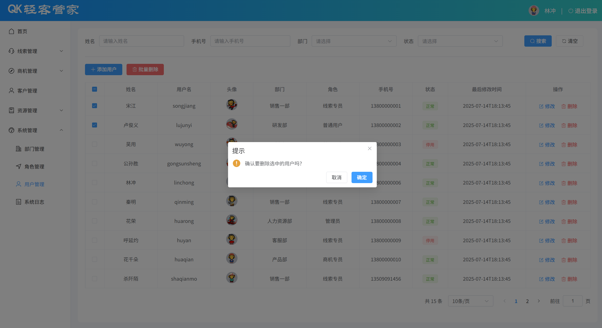

## 4.总结

如何在Controller中接收在路径参数中传递的数组。如：/users/1,2,3 

方式一：集合接收。

```java
@DeleteMapping("/{ids}")
public Result delete(@PathVariable("ids") List<Integer> ids) {
    
}
```

方式二：数组接收。

```java
@DeleteMapping("/{ids}")
public Result delete(@PathVariable("ids") Integer[] ids) {
    
}
```

Mybatis中动态sql标签\<foreach\>的作用及用法。

作用：循环、遍历

属性：

- `collection`：遍历的数组、集合名字

- `item`：遍历出来的元素

- `open`：循环开始前，拼接的sql片段

- `close`：循环结束后，拼接的sql片段

- `separator`：每次循环之间的间隔符

# 五、用户管理-修改

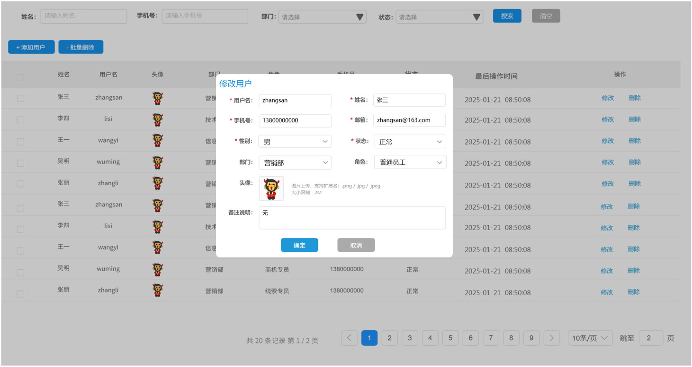

对于修改用户的功能来说，也需要分两步实现：

- 查询回显：根据ID查询用户信息，回显展示在页面中。

- 修改数据：修改ID修改用户信息，修改数据库中的数据。

## 1.查询回显

1.UserController

在UserController中增加如下方法:

```java
/**
 * 根据ID查询用户信息
 * @param id 用户ID
 */
@GetMapping("/{id}")
public Result getById(@PathVariable("id") Integer id) {
    //1 获取请求参数--->(@PathVariable("id") Integer id)
    log.info("根据ID查询用户: {}", id);
    //2 调用service层方法，根据ID查询用户
    User user = userService.getById(id);
    //3 响应Result
    return Result.success(user);
}
```

2.UserService

在UserService中增加如下方法:

```java
/**
 * 根据ID查询用户信息
 * @param id 用户ID
 * @return 用户实体
 */
User getById(Integer id);
```

3.UserServiceImpl

在UserServiceImpl中增加如下方法:

```java
/**
 * 根据ID查询用户信息
 * @param id 用户ID
 * @return 用户实体
 */
@Override
public User getById(Integer id) {
    //直接调用mapper层方法，根据id查询用户信息
    return userMapper.getById(id);
}
```

4.UserMapper

在UserMapper中增加如下方法:

```java
/**
 * 根据ID查询用户信息
 * @param id 用户ID
 * @return 用户实体
 */
@Select("SELECT id, username, password, name, phone, email, gender, status, dept_id, role_id, image, remark, create_time, update_time FROM user WHERE id = #{id}")
User getById(Integer id);
```

代码完成后，重新启动服务，测试一下，我们可以看到，用户信息可以正常查询回显展示了。

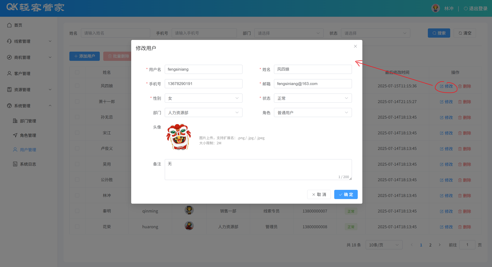

## 2.修改用户

1.UserController

在UserController中增加如下方法:

```java
/**
 * 修改用户信息
 * @param user 用户信息
 */
@PutMapping
public Result update(@RequestBody User user) {
    //1 获取请求参数--->(@RequestBody User user)
    log.info("修改用户: {}", user);
    //2 调用service层方法，修改用户
    userService.update(user);
    //3 响应Result
    return Result.success();
}
```

2.UserService

在UserService中增加如下方法:

```java
/**
 * 修改用户信息
 * @param user 用户信息
 */
void update(User user);
```

3.UserServiceImpl

在UserServiceImpl中增加如下方法:

```java
/**
 * 修改用户信息
 * @param user 用户信息
 */
@Override
public void update(User user) {
    //1 设置更新时间为当前时间
    user.setUpdateTime(LocalDateTime.now());
    //2 密码加密处理
    user.setPassword(DigestUtils.md5DigestAsHex((user.getPassword()+"123").getBytes()));
    //3 调用mapper层方法，修改用户信息
    userMapper.updateById(user);
}
```

4.UserMapper

在UserMapper中增加如下方法:

```java
/**
 * 更新用户信息（动态SQL）
 * @param user 用户实体
 */
void updateById(User user);
```

5.UserMapper\.xml

在`UserMapper.xml`中增加如下sql配置，基于动态sql的形式来更新:

```xml
<!-- 更新用户信息（动态SQL） void updateById(User user);-->
<update id="updateById">
    UPDATE user
    <set>
        <if test="username != null and username != ''">
            username = #{username},
        </if>
        <if test="password != null and password != ''">
            password = #{password},
        </if>
        <if test="name != null and name != ''">
            name = #{name},
        </if>
        <if test="phone != null and phone != ''">
            phone = #{phone},
        </if>
        <if test="email != null and email != ''">
            email = #{email},
        </if>
        <if test="gender != null">
            gender = #{gender},
        </if>
        <if test="status != null">
            status = #{status},
        </if>
        <if test="deptId != null">
            dept_id = #{deptId},
        </if>
        <if test="roleId != null">
            role_id = #{roleId},
        </if>
        <if test="image != null and image != ''">
            image = #{image},
        </if>
        <if test="remark != null and remark != ''">
            remark = #{remark},
        </if>
        update_time = #{updateTime}
    </set>
    WHERE id = #{id}
</update>
```

代码完成后，重新启动服务，测试一下，我们可以看到，用户信息可以正常查询回显展示了。

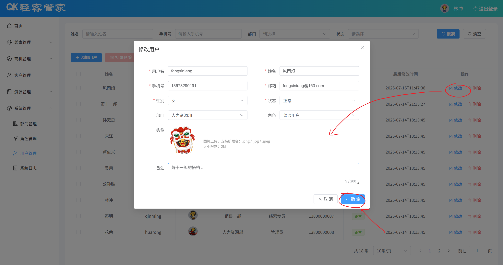

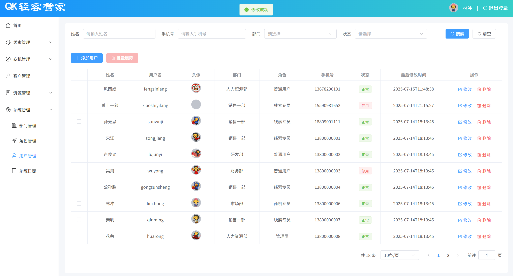


