# 一、线索管理

## 1.说明

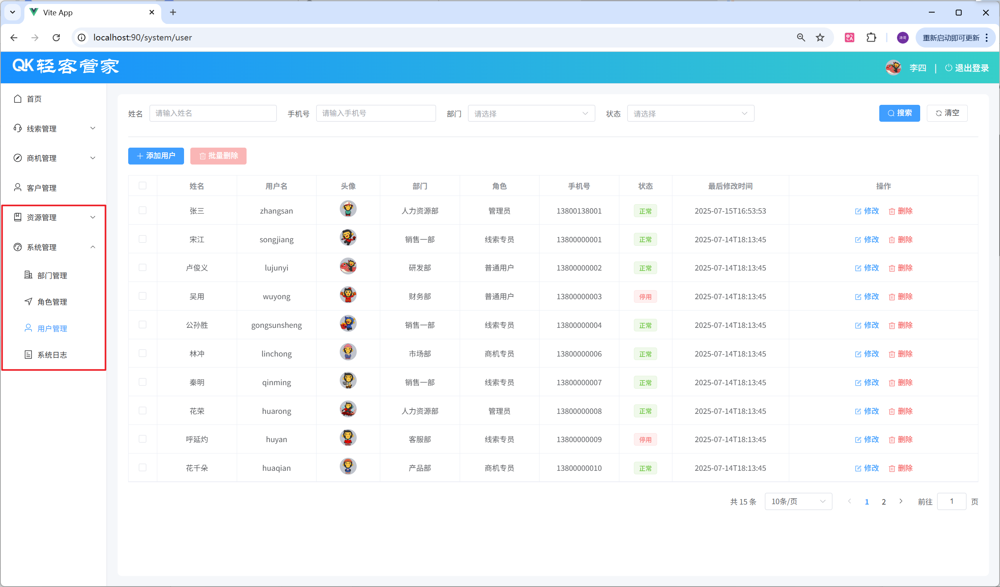

那到此呢，我们已经完成轻客管家项目中的系统管理、资源管理、登录退出等三大功能模块的开发，那在开发这三大模块的功能的时候，我们是基于Mybatis框架来操作对应的数据库表的。

那接下来，我们要来开发线索管理的功能，而在开发线索管理、商机管理、客户管理这些模块的功能的时候，对于持久层的框架我们将会使用另外一个持久层框架MybatisPlus。

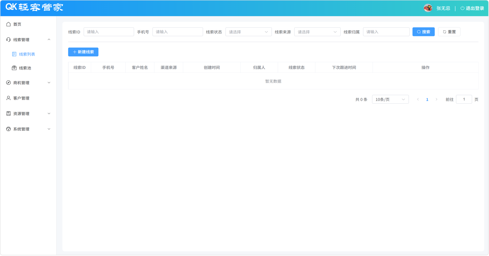

## 2.需求

那接下来，我们要来完成的是线索管理、商机管理、客户管理的功能开发。 


那这里的线索、商机、客户到底是什么意思呢，接下来，我们先来简单介绍一下这些专业术语。


> 线索：线索是未经验证的潜在客户。是与客户初次接触获得的原始信息，可以是从B站、抖音、小红书、快手等线上渠道获取到的手机号码，也可以是在大学宣讲、线下推广等渠道获取到的客户的简单信息（手机号、微信、QQ等），然后通过管理、跟进、转化为最终客户。
>

> 商机：商机是已验证的、有较高成交潜力的客户，通常已明确表达需求或购买意向。
>

> 客户：已与企业发生实际交易或签订合同的主体，即“付费用户”。
>

具体的业务流程如下：

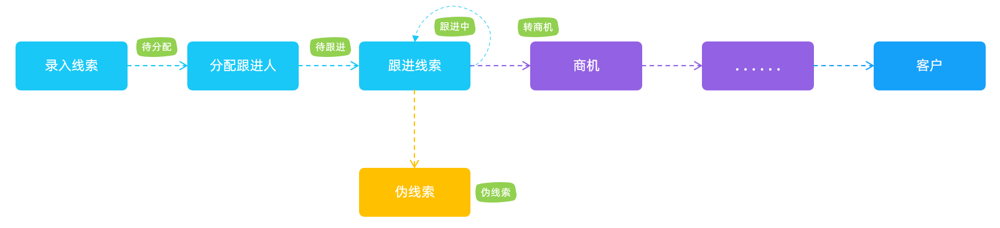


那接下来，我们要完成的就是线索列表的功能实现，具体的页面原型如下：

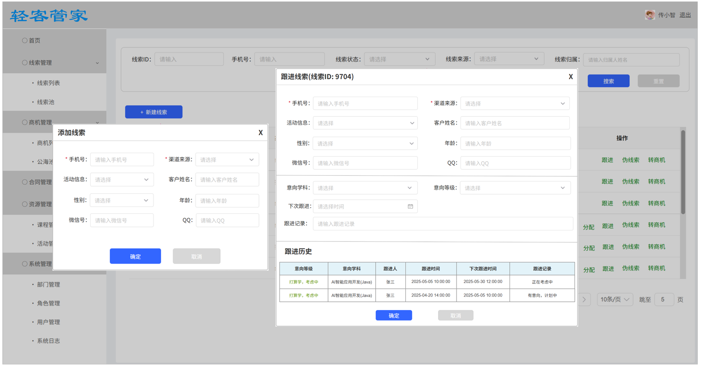

具体的功能包括：添加线索、列表查询、线索分配、线索跟进、伪线索处理、转商机处理。

## 3.准备工作

### 3.1.数据库表

通过页面原型，以及需求文档，我们可以分析出，线索管理模块，会涉及两张表，分别是：线索表、线索跟进记录表。

具体的表结构如下：

```sql
-- 线索表
CREATE TABLE clue (
  id int unsigned PRIMARY KEY AUTO_INCREMENT COMMENT '线索ID, 主键',
  phone char(11) NOT NULL UNIQUE COMMENT '手机号',
  channel tinyint unsigned NOT NULL COMMENT '渠道来源，1:线上活动, 2:推广介绍',
  activity_id int unsigned COMMENT '活动信息，关联活动的ID',
  name varchar(20) COMMENT '客户姓名',
  gender tinyint unsigned COMMENT '性别，1:男, 2:女',
  age tinyint unsigned COMMENT '年龄',
  wechat varchar(50) COMMENT '微信号',
  qq varchar(20) COMMENT 'QQ号',
  user_id int unsigned COMMENT '归属人ID，关联用户ID',
  status tinyint unsigned NOT NULL DEFAULT '1' COMMENT '线索状态，1:待分配, 2:待跟进, 3:跟进中, 4:伪线索, 5:转为商机',
  subject tinyint unsigned COMMENT '意向学科，1:AI智能应用开发(java), 2:AI大模型开发(Python)，3:AI鸿蒙开发，4:AI大数据，5:AI嵌入式，6:AI测试，7:AI运维',
  level tinyint unsigned COMMENT '意向等级, 1:近期学习、2:打算学习(考虑中)、3:进行了解、4:打酱油',
  next_time datetime COMMENT '下次跟进时间',
  create_time datetime not null comment '创建时间',
  update_time datetime not null comment '修改时间'
) COMMENT '线索表';

INSERT INTO clue (id, phone, channel, activity_id, name, gender, age, wechat, qq, user_id, status, subject, level, next_time, create_time, update_time) VALUES 
  (1,'14700000001',1,3,'张思',1,23,'wx2324342323','3434343423',2,3,NULL,NULL,'2025-06-25 10:00:00','2025-05-24 17:13:50','2025-06-21 15:11:34'),
  (2,'13589890912',2,2,'李久阶',1,22,'wx28392839','2323232323',NULL,1,1,NULL,NULL,'2025-05-24 17:16:03','2025-06-21 15:08:16'),
  (3,'13909120913',1,3,'李迪',1,22,'wx17327323','2456754323',NULL,1,1,NULL,NULL,'2025-05-28 11:54:02','2025-07-20 18:08:18'),
  (4,'13688889991',2,2,'钱四',1,21,'wxdjjd92922','2345643236',NULL,1,1,NULL,NULL,'2025-05-28 14:16:55','2025-06-10 21:15:03'),
  (5,'15509091231',2,4,'欧斯卡',2,22,'wx283232423','23456789657',NULL,1,NULL,NULL,NULL,'2025-05-28 19:41:46','2025-05-29 09:48:05'),
  (6,'17709092901',2,10,'奚梦',1,22,'jsdhfsf2324','3456789432',NULL,1,1,NULL,NULL,'2025-05-28 19:44:15','2025-06-10 21:04:18'),
  (7,'13589898881',1,11,'伊斯科',1,19,'wx8943895345','34343232536',NULL,1,2,NULL,NULL,'2025-05-28 19:45:06','2025-06-09 14:42:38'),
  (8,'13511110000',2,12,'齐欧式',1,30,'wxqi299232','2435676543',NULL,1,2,NULL,NULL,'2025-05-29 10:45:07','2025-06-22 14:52:08'),
  (9,'13511110001',2,2,'李秋菊',2,22,'liqiuju23874','234567865',NULL,1,1,NULL,NULL,'2025-05-29 10:47:22','2025-06-22 14:51:37'),
  (10,'13398980102',2,2,'张岱',1,22,'wx13728785434','234567543',NULL,1,1,NULL,NULL,'2025-06-16 15:31:22','2025-07-20 20:59:46'),
  (11,'15508761231',1,1,'卫丹',2,24,'wxweidan1212','8450313640',NULL,1,NULL,NULL,NULL,'2025-07-16 18:46:10','2025-07-20 15:47:32'),
  (12,'17792098192',1,3,'张吉',1,21,'wx289483544','245676856',NULL,1,NULL,NULL,NULL,'2025-07-20 15:17:56','2025-07-20 15:43:56');

-- 线索跟进记录表
CREATE TABLE clue_track_record (
  id int unsigned PRIMARY KEY AUTO_INCREMENT COMMENT '跟进记录ID, 主键',
  clue_id int unsigned NOT NULL COMMENT '线索ID，关联线索ID',
  user_id int unsigned NOT NULL COMMENT '跟进人ID，关联用户ID',
  subject tinyint unsigned COMMENT '意向学科，1:AI智能应用开发(java), 2:AI大模型开发(Python)，3:AI鸿蒙开发，4:AI大数据，5:AI嵌入式，6:AI测试，7:AI运维',
  level tinyint unsigned COMMENT '意向等级, 1:近期学习、2:打算学习(考虑中)、3:进行了解、4:打酱油',
  record varchar(100) COMMENT '跟进记录',
  next_time datetime COMMENT '下次跟进时间',
  type tinyint unsigned COMMENT '跟进类型, 1:正常跟进、0:伪线索',
  false_reason tinyint unsigned COMMENT '伪线索原因, 1:空号、2:停机、3:竞品、4:无法联系、5:其他',
  create_time datetime not null comment '创建时间'
) COMMENT '线索跟进记录表';

INSERT INTO clue_track_record (id, clue_id, user_id, subject, level, record, next_time, type, false_reason, create_time) VALUES 
  (1,1,2,1,1,'无','2025-05-29 10:00:00',1,NULL,'2025-05-29 10:25:00'),
  (2,1,2,1,1,'有意向,目前大三','2025-05-30 10:00:00',1,NULL,'2025-05-29 10:25:00');
```

在轻客管家的数据库中，创建上述两张表。

### 3.2.环境准备

1.在qk\-parent父工程中定义MybatisPlus依赖的版本

```xml
<properties>
    <mybatis.plus.version>3.5.8</mybatis.plus.version>
</properties>

<dependencies>
    <dependency>
        <groupId>com.baomidou</groupId>
        <artifactId>mybatis-plus-spring-boot3-starter</artifactId>
        <version>${mybatis.plus.version}</version>
    </dependency>
</dependencies>
```

2.在qk\-entity中引入MybatisPlus的依赖，因为后期需要在实体类上使用mybatis\-plus提供的注解

```xml
<dependencies>
    <dependency>
        <groupId>com.baomidou</groupId>
        <artifactId>mybatis-plus-spring-boot3-starter</artifactId>
    </dependency>
</dependencies>
```

> 提示：依赖的版本要统一交给父工程进行管理。但是qk\-parent中`mybatis-spring-boot-starter`的版本锁定不要删除，如果删除了，pagehelper\-spring\-boot\-starter依赖中传递的`mybatis-spring-boot-starter`的版本就是2\.3\.x系列的，和springboot3不兼容，报错见下图。最后删除qk\-management中`mybatis-spring-boot-starter`依赖。
>

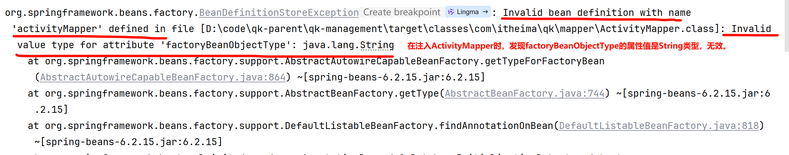

原因：

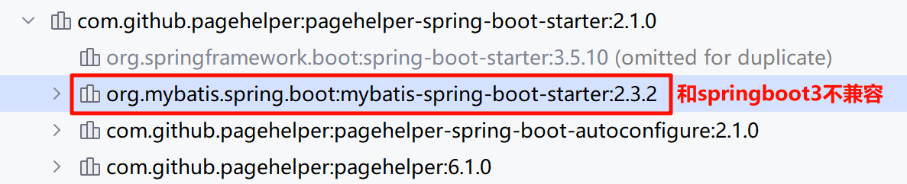

3.在`application.yml`中配置`MybatisPlus`的基础配置，代替mybatis的配置、自动填充和分页插件配置类。

```yaml
#mybatis配置
#mybatis:
#  configuration:
#    log-impl: org.apache.ibatis.logging.stdout.StdOutImpl # mybatis日志输出
#    map-underscore-to-camel-case: true    # 开启驼峰命名映射
#  mapper-locations: classpath:mapper/*.xml   # mapper映射文件位置

#mybatis-plus配置
mybatis-plus:
  configuration:
    log-impl: org.apache.ibatis.logging.stdout.StdOutImpl # mybatis日志输出
    map-underscore-to-camel-case: true # 开启驼峰命名映射
  mapper-locations: mapper/*.xml # mapper映射文件位置
  global-config:
    db-config:
      id-type: auto # 主键自动增长
```

自动填充配置类

```java
@Slf4j
@Component
public class MyMetaObjectHandler implements MetaObjectHandler {
    /**
     设置新增时填充的逻辑
     * @param metaObject 代表要新增的对象，例如新增活动，metaObject表示Activity对象。如果时新增课程，metaObject表示Course对象
     */
    @Override
    public void insertFill(MetaObject metaObject) {
        log.info("开始插入填充...");
        //方案一：使用官方提供的填充代码
        //this.strictInsertFill(metaObject, "createTime", LocalDateTime.class, LocalDateTime.now());
        //this.strictUpdateFill(metaObject, "updateTime", LocalDateTime.class, LocalDateTime.now());
        //方案二：使用自定义填充代码
        metaObject.setValue("createTime",LocalDateTime.now());
        metaObject.setValue("updateTime",LocalDateTime.now());
    }
    
    /**
     设置修改时填充的逻辑
     * @param metaObject 代表要修改的对象，例如修改活动，metaObject表示Activity对象。如果时修改课程，metaObject表示Course对象
     */
    @Override
    public void updateFill(MetaObject metaObject) {
        log.info("开始更新填充...");
        //注意：MetaObjectHandler 提供的默认方法策略是：如果属性有值则不覆盖
        //this.strictUpdateFill(metaObject, "updateTime", LocalDateTime.class, LocalDateTime.now());
        //方案二：使用自定义填充代码
        metaObject.setValue("updateTime",LocalDateTime.now());
    }
}
```

分页插件配置类

```java
@Configuration  //表示该类是一个配置类，类中的方法由spring调用做配置
public class MybatisConfig {
    @Bean //将方法的返回值对象添加到IOC容器中
    public MybatisPlusInterceptor mybatisPlusInterceptor() {
        // 初始化Mybatis-Plus核心插件
        MybatisPlusInterceptor mybatisPlusInterceptor = new MybatisPlusInterceptor();
        // 添加分页插件
        mybatisPlusInterceptor.addInnerInterceptor(new PaginationInnerInterceptor(DbType.MYSQL));
        return mybatisPlusInterceptor;
    }
}
```

4.基于`clue`、`clue_track_record` 表结构定义对应的实体类，在 `qk-entity` 模块的 `com.itheima.qk.entity` 包中引入实体类: 

```java
/**
 * 线索实体类
 */
@Data
public class Clue {
    private Integer id; // 线索id, 主键
    private String phone; // 手机号
    private Integer channel; // 渠道来源，1:线上活动, 2:推广介绍
    private Integer activityId; // 活动信息，关联活动的id
    private String name; // 客户姓名
    private Integer gender; // 性别，1:男, 2:女
    private Integer age; // 年龄
    private String wechat; // 微信号
    private String qq; // qq号
    private Integer userId; // 归属人id，关联用户id
    private Integer status; // 线索状态，1:待分配, 2:跟进中, 3:伪线索, 4:转为商机
    private Integer subject; // 意向学科，1:ai智能应用开发(java), 2:ai大模型开发(python)，3:ai鸿蒙开发，4:ai大数据，5:ai嵌入式，6:ai测试，7:ai运维
    private Integer level; // 意向等级, 1:近期学习、2:打算学习(考虑中)、3:进行了解、4:打酱油
    private LocalDateTime nextTime; // 下次跟进时间
    
    @TableField(fill = FieldFill.INSERT) //设置自动填充策略，新增时填充
    private LocalDateTime createTime; // 创建时间
    @TableField(fill = FieldFill.INSERT_UPDATE)  //设置自动填充策略，新增和修改时时填充
    private LocalDateTime updateTime; // 修改时间
}
```

```java
/**
 * 线索跟进记录实体类
 */
@Data
public class ClueTrackRecord {
    private Integer id; // 跟进记录id, 主键
    private Integer clueId; // 线索id，关联线索id
    private Integer userId; // 跟进人id，关联用户id
    private Integer subject; // 意向学科，1:ai智能应用开发(java), 2:ai大模型开发(python)，3:ai鸿蒙开发，4:ai大数据，5:ai嵌入式，6:ai测试，7:ai运维
    private Integer level; // 意向等级, 1:近期学习、2:打算学习(考虑中)、3:进行了解、4:打酱油
    private String record; // 跟进记录
    private LocalDateTime nextTime; // 下次跟进时间
    private Integer type; // 跟进类型, 1:正常跟进、0:伪线索
    private Integer falseReason; // 伪线索原因, 1:空号、2:停机、3:竞品、4:无法联系、5:其他
    
    @TableField(fill = FieldFill.INSERT)
    private LocalDateTime createTime; // 创建时间
}
```

## 4.新增线索

### 4.1.分析

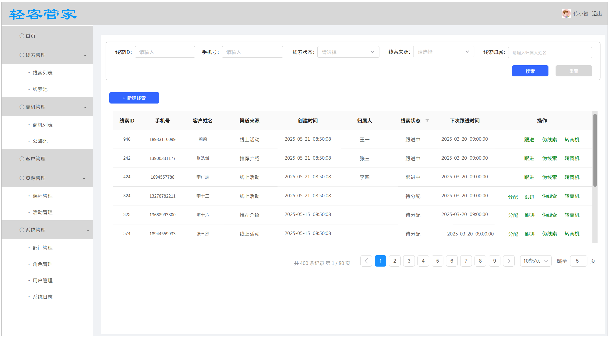

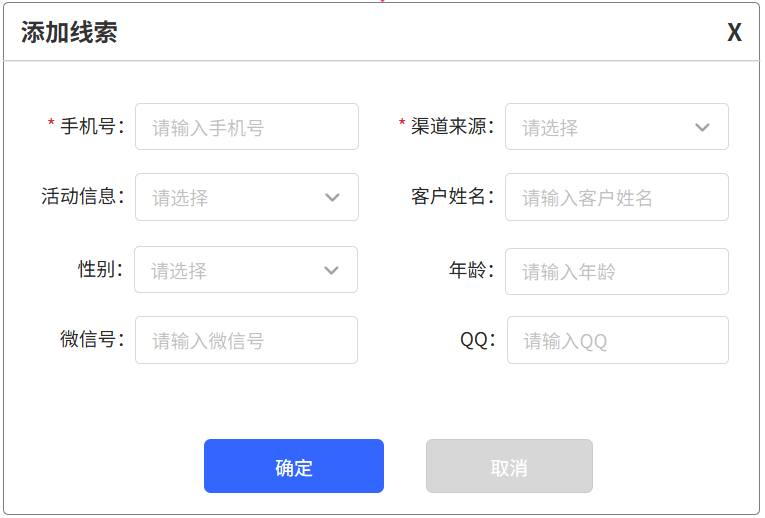

我们点击线索列表中的 "添加线索" 按钮，就可以录入线索。

### 4.2.接口说明

具体线索管理的，接口：[附录-接口文档](https://lining-lo.github.io/lining-lo-notes/轻客管家/附录-接口文档.html)

### 4.3.功能实现

1.ClueController

存放在 `com.qk.controller`，增加如下 `ClueController`。

```java
@Slf4j
@RestController
@RequestMapping("/clues")
public class ClueController {
    @Autowired
    private ClueService clueService;
    /**
     新增线索
     * @param clue 封装线索信息
     * @return
     */
    @PostMapping
    public Result add(@RequestBody Clue clue){
        //1 接收请求参数
        log.info("新增线索：{}", clue);
        //2 调用service，新增线索
        //clue.setStatus(1);  //不设置，表中该字段由默认值
        clueService.save(clue);
        //3 响应Result
        return Result.success();
    }
}
```

2.ClueService

存放在 `com.qk.service`，增加如下 `ClueService`。

```java
public interface ClueService extends IService<Clue> {

}
```

3.ClueServiceImpl

存放在 `com.qk.service.impl`，增加如下 `ClueServiceImpl`。

```java
@Service
public class ClueServiceImpl extends ServiceImpl<ClueMapper, Clue> implements ClueService {

}
```

4.ClueMapper

存放在 `com.qk.mapper`，增加如下 `ClueMapper`。

```java
@Mapper
public interface ClueMapper extends BaseMapper<Clue> {

}
```

功能开发完毕后，重新启动服务，打开Apifox测试一下。

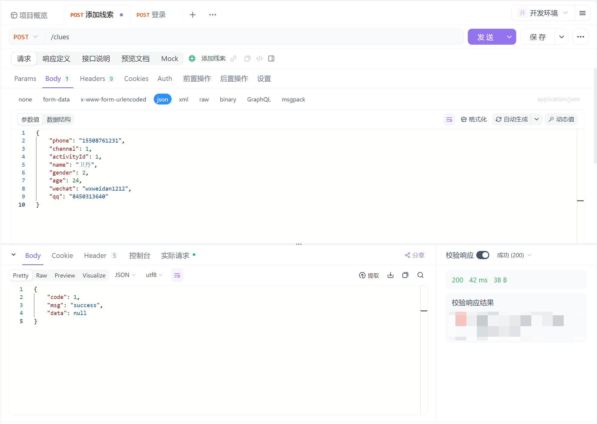

## 5.列表查询

### 5.1.分析

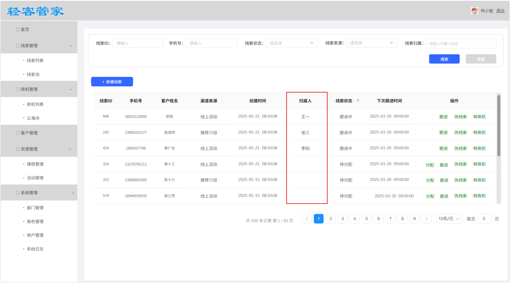

通过页面原型，可以看到，线索列表数据查询时，既要查询线索的基本信息，还需要查询线索的归属人姓名，所以这里呢，就会涉及到多表查询，基础sql如下：

```sql
-- 根据线索ID、手机号、状态、线索来源、线索归属人姓名，来查询线索基本信息 及 线索归属人姓名
select c.*,u.name as assign_name
from clue c left join user u on c.user_id = u.id
where
    c.id=?
    and c.phone like concat('%',?,'%')
    and c.status=?
    and c.channel=?
    and u.name like concat('%',?,'%')
```

### 5.2.接口说明

具体线索管理中列表查询的接口，参照接口文档：[附录-接口文档](https://lining-lo.github.io/lining-lo-notes/轻客管家/附录-接口文档.html)

### 5.3.准备工作

通过接口文档，我们可以看到，在列表查询时，会涉及到很多的请求参数，包括查询参数：clueId、phone、status、channel、assignName，以及分页参数：page、pageSize。

如果查询参数，比较多，建议定义实体类进行封装，便于统一维护和管理。

在 `qk-entity` 模块的 `com.qk.dto` 包中定义实体类。

```java
/**
 * 线索查询参数封装类
 */
@Data
public class ClueQueryDto {
    private Integer clueId; //线索ID
    private String phone;   //手机号
    private Integer status; //线索状态，1:待分配, 2:跟进中, 3:已关闭, 4:伪线索
    private Integer channel;    //线索来源，1:线上活动, 2:推广介绍
    private String assignName;  //线索归属人
    private Integer page = 1;   //分页查询的页码，如果未指定，默认为1
    private Integer pageSize = 10;  //分页查询的每页记录数，如果未指定，默认为10
}
```

### 5.4.功能实现

1.`ClueController` 增加如下方法

```java

/**
 * 根据条件分页查询
 * @param clueQueryDto 封装分页条件
 */
@GetMapping
public Result page(ClueQueryDto clueQueryDto) {
    //1 接收请求参数--->(ClueQueryDto clueQueryDto)
    log.info("查询参数: {}", clueQueryDto);
    //2 调用service层方法，分页查询
    PageResult<Clue> pageResult = clueService.pageQuery(clueQueryDto);
    //3 响应Result
    return Result.success(pageResult);
}
```

2.`ClueService` 增加如下方法:

```java
/**
 * 根据条件分页查询
 * @param clueQueryDto 封装分页条件
 */
PageResult<Clue> pageQuery(ClueQueryDto clueQueryDto);
```

3.`ClueServiceImpl` 增加如下方法:

```java
@Autowired
private ClueMapper clueMapper;
/**
 * 根据条件分页查询
 * @param clueQueryDto 封装分页条件
 */
@Override
public PageResult<Clue> pageQuery(ClueQueryDto clueQueryDto) {
    //1 设置分页参数
    Page<Clue> page = new Page<>(clueQueryDto.getPage(), clueQueryDto.getPageSize());
    //2 调用mapper层方法，分页查询
    Page<Clue> p=clueMapper.list(page, clueQueryDto);
    //3 封装分页结果
    return new PageResult<Clue>(p.getTotal(), p.getRecords());
}
```

4.`ClueMapper` 增加如下方法:

```java
/**
 * 线索列表
 */
Page<Clue> list(Page<Clue> page,  ClueQueryDto clueQueryDto);
```

4.在 `resources` 目录下新增配置文件 `ClueMapper.xml`，具体配置如下：

```xml
<?xml version="1.0" encoding="UTF-8" ?>
<!DOCTYPE mapper PUBLIC "-//mybatis.org//DTD Mapper 3.0//EN" "http://mybatis.org/dtd/mybatis-3-mapper.dtd" >
<mapper namespace="com.itheima.qk.mapper.ClueMapper">

    <!-- 线索列表 线索状态(status)，1:待分配，2:待跟进，3:跟进中，4:伪线索，5:转为商机-->
    <!--分页动态查询线索-线索列表查询
     @param clueQueryDto 封装查询条件和分页参数
    Page<Clue> list(Page<Clue> page, ClueQueryDto clueQueryDto);-->
    <select id="list" resultType="com.itheima.qk.entity.Clue">
        select c.*, u.name as assign_name 
        from clue c left join user u on c.user_id = u.id
        <where>
            <if test="clueQueryDto.clueId != null">
                and c.id = #{clueQueryDto.clueId}
            </if>
            <if test="clueQueryDto.phone != null and clueQueryDto.phone != ''">
                and c.phone LIKE concat('%',#{clueQueryDto.phone},'%')
            </if>
            <if test="clueQueryDto.status != null">
                and c.status = #{clueQueryDto.status}
            </if>
            <if test="clueQueryDto.channel != null">
                and c.channel = #{clueQueryDto.channel}
            </if>
            <if test="clueQueryDto.assignName != null and clueQueryDto.assignName != ''">
                and u.name like concat('%', #{clueQueryDto.assignName}, '%')
            </if>
        </where>
        order by c.update_time desc
    </select>
</mapper>
```

5.在实体类Clue中增加扩展字段 `assignName`，用于封装归属人姓名

```java
/**
 * 线索实体类
 */
@Data
public class Clue {
    private Integer id; // 线索id, 主键
    private String phone; // 手机号
    private Integer channel; // 渠道来源，1:线上活动, 2:推广介绍
    private Integer activityId; // 活动信息，关联活动的id
    private String name; // 客户姓名
    private Integer gender; // 性别，1:男, 2:女
    private Integer age; // 年龄
    private String wechat; // 微信号
    private String qq; // qq号
    private Integer userId; // 归属人id，关联用户id
    private Integer status; // 线索状态，1:待分配, 2:跟进中, 3:伪线索, 4:转为商机
    private Integer subject; // 意向学科，1:ai智能应用开发(java), 2:ai大模型开发(python)，3:ai鸿蒙开发，4:ai大数据，5:ai嵌入式，6:ai测试，7:ai运维
    private Integer level; // 意向等级, 1:近期学习、2:打算学习(考虑中)、3:进行了解、4:打酱油
    private LocalDateTime nextTime; // 下次跟进时间
    
    @TableField(fill = FieldFill.INSERT)
    private LocalDateTime createTime; // 创建时间
    @TableField(fill = FieldFill.INSERT_UPDATE)
    private LocalDateTime updateTime; // 修改时间

    //扩展字段-归属人姓名
    @TableField(exist = false)
    private String assignName;
}
```

> 注意：扩展字段，在数据库表中是不存在这个字段的，所以需要在扩展字段 `assignName` 上加上注解 `@TableField(exist=false)`
>

代码编写完毕后，我们就可以重新启动服务，打开前端页面进行联调测试了。

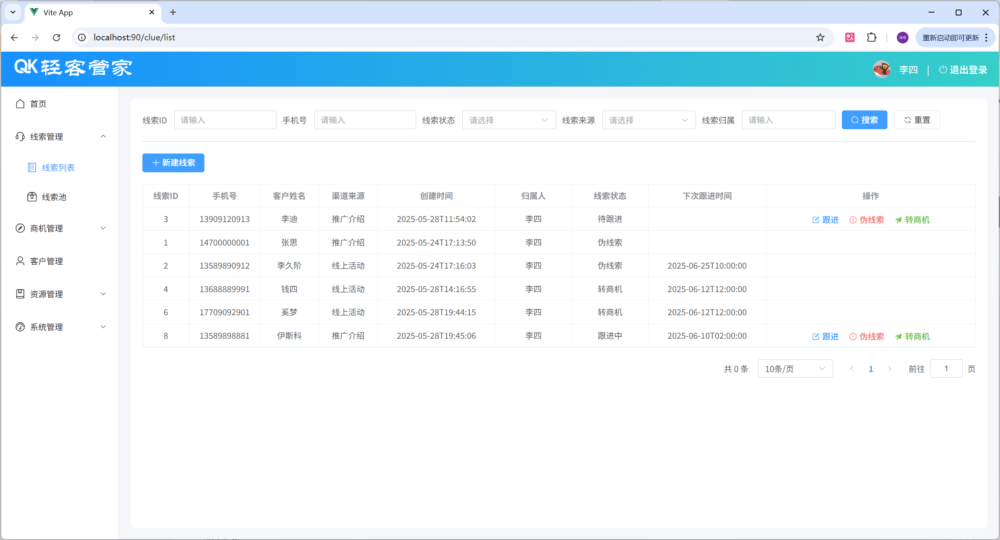

> 提示：
>
> 在MybatisPlus中，如果涉及到复杂sql、多表查询操作，并且需要进行分页的，那么我们可以将具体的分页参数封装到Page对象中，然后将Page对象作为Mapper接口方法形参的第一个参数，此时MybatisPlus会自动对该sql语句进行分页处理。
>
> 官方文档有对应的说明：https://mybatis.plus/guide/interceptor-pagination.html
>

## 6.分配线索

### 6.1.分析

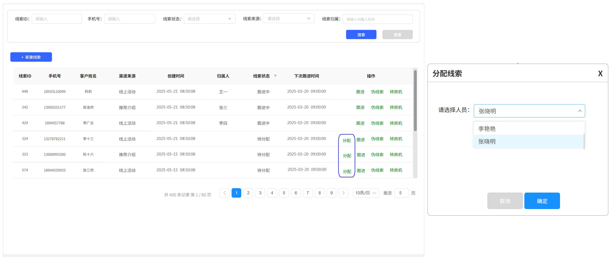

分配线索，是指管理员需要将 “待分配” 状态的线索分配给指定的 线索专员，来跟进这个线索。

```sql
update clue set user_id= ?,status=2 where id=?
```

### 6.2.接口说明

具体线索管理中分配线索的接口，参照接口文档：[附录-接口文档](https://lining-lo.github.io/lining-lo-notes/轻客管家/附录-接口文档.html)

### 6.3.功能实现

具体代码如下: 

1.ClueController

在ClueController中增加如下方法: 

```java
/**
 * 分配线索
 * @param clueId 线索ID
 * @param userId 用户ID
 */
@PutMapping("/assign/{clueId}/{userId}")
public Result assignClue(@PathVariable Integer clueId, @PathVariable Integer userId) {
    log.info("分配线索: 线索ID={}, 用户ID={}", clueId, userId);
    //分配线索本质：修改线索状态为"待跟进"，并设置归属人ID
    //1 封装要修改的线索信息
    Clue clue = new Clue();
    clue.setId(clueId);
    clue.setStatus(2); // 待跟进
    clue.setUserId(userId); // 设置归属人ID
    //2 调用service层方法，更新线索信息
    clueService.updateById(clue);
    //3 响应Result
    return Result.success();
}
```

代码编写完毕后，重新启动服务，我们就可以进行联调测试了 （注意：要使用角色为管理员的账号登录哦，非管理员用户登录在操作栏没有"分配"按钮）。

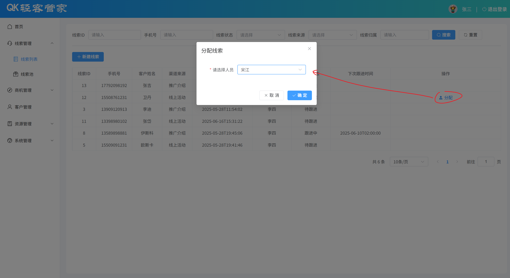

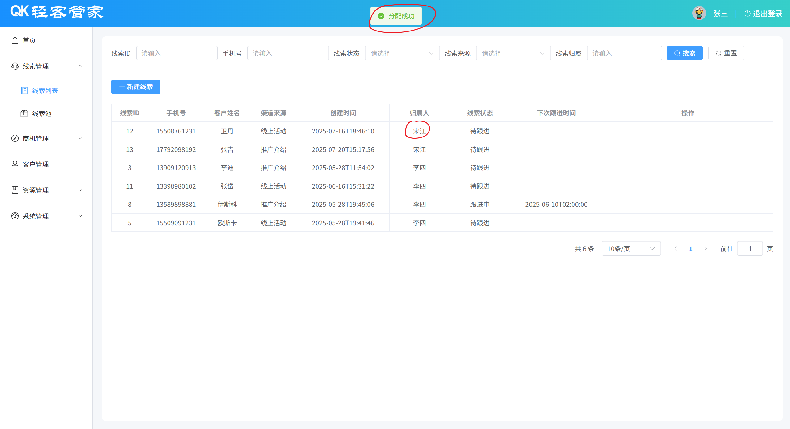

> 注意事项：
>
> 如果之前中没有完成"根据角色查询用户"接口，在分配弹出框中是无法展示人员。
>

# 二、线索跟进

线索跟进是指，管理员将线索分配给指定的线索专员后，线索专员会及时跟进这个线索的情况，并将跟进情况记录在跟进记录表中。 

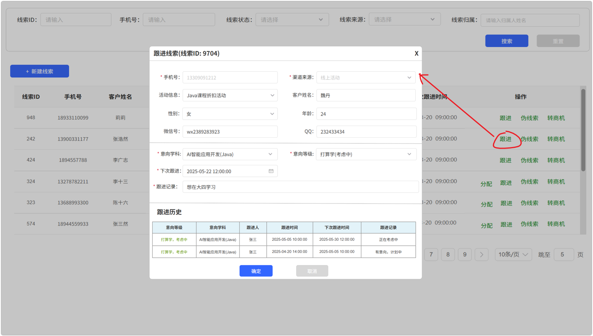

线索跟进时，跟进的信息包括：意向学科、意向等级、下次跟进时间、跟进记录等信息。而一个线索，可以被跟进人多次跟进：

- 如果在线索跟进过程中，发现这个线索，没有意向，可以点击 “伪线索” 将线索标记为伪线索。

- 如果在线索跟进过程中，发现这个线索，有强烈的意向，可以点击 “转商机” 将线索转为商机，有商机专员进一步跟进最终转客户、成交。

那么对于我们接下来，要完成的线索跟进功能来说，其实需要分为两步实现：

- 查询回显：查询线索的基本信息、线索的跟进记录列表，回显在页面中。

- 线索跟进：录入本次跟进信息后，点击确定，跟进此线索。

## 1.查询回显

### 1.1.分析

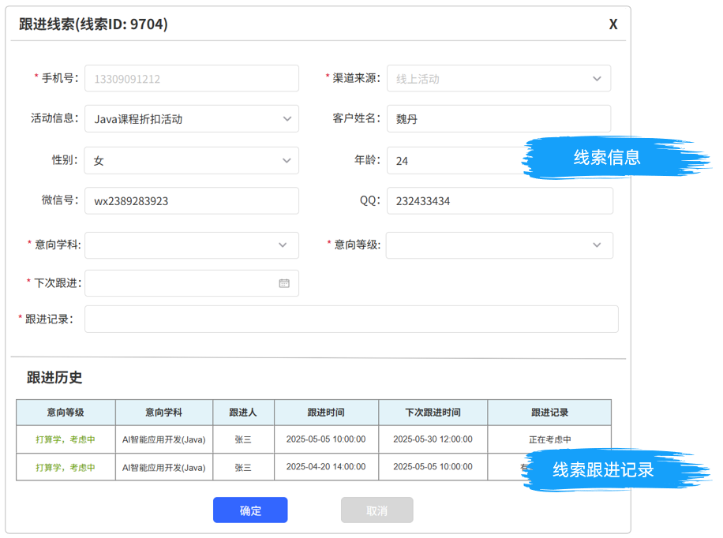

在查询回显的时候，我们既需要查询线索的基本信息，还需要查询线索的跟进记录列表，将其展示在跟进历史的表格中。

### 1.2.接口说明

接口文档，请参考线索管理接口文档中的 根据ID查询线索 ，具体参照：[附录-接口文档](https://lining-lo.github.io/lining-lo-notes/轻客管家/附录-接口文档.html)

通过接口文档，我们可以看到根据ID查询线索详细信息，最终需要给前端响应的数据格式为：

```json
{
        "id": 37,
        "phone": "15508761231",
        "channel": 1,
        "activityId": 1,
        "name": "卫丹",
        "gender": 2,
        "age": 24,
        "wechat": "wxweidan1212",
        "qq": "8450313640",
        "userId": null,
        "status": 1,
        "subject": 1,
        "level": 2,
        "nextTime": "2025-05-22 12:00:00",
        "createTime": "2025-05-20 16:25:58",
        "updateTime": "2025-05-20 17:11:22",
        "trackRecords": [
            {
                "id": 38,
                "clueId": 37,
                "userId": 3,
                "subject": 1,
                "level": 3,
                "record": "了解一下目前java方向的就业前景",
                "nextTime": "2025-05-20 12:00:00",
                "type": 1,
                "falseReason": null,
                "createTime": "2025-05-20 17:10:04",
                "assignName": "张三丰"
            },
            {
                "id": 39,
                "clueId": 37,
                "userId": 3,
                "subject": 1,
                "level": 2,
                "record": "了解一下java目前的学习路线",
                "nextTime": "2025-05-22 12:00:00",
                "type": 1,
                "falseReason": null,
                "createTime": "2025-05-20 17:11:22",
                "assignName": "张三丰"
            }
        ]
    }
```

上面的绿色部分为线索的基本信息，蓝色部分为线索的跟进记录列表。

### 1.3.准备工作

1.定义实体类，封装响应结果。

修改实体类 `Clue`，在其中增加属性 `List<ClueTrackRecord> trackRecords`，用于封装

```java
/**
 * 线索实体类
 */
@Data
public class Clue {
    private Integer id; // 线索id, 主键
    private String phone; // 手机号
    private Integer channel; // 渠道来源，1:线上活动, 2:推广介绍
    private Integer activityId; // 活动信息，关联活动的id
    private String name; // 客户姓名
    private Integer gender; // 性别，1:男, 2:女
    private Integer age; // 年龄
    private String wechat; // 微信号
    private String qq; // qq号
    private Integer userId; // 归属人id，关联用户id
    private Integer status; // 线索状态，1:待分配, 2:跟进中, 3:伪线索, 4:转为商机
    private Integer subject; // 意向学科，1:ai智能应用开发(java), 2:ai大模型开发(python)，3:ai鸿蒙开发，4:ai大数据，5:ai嵌入式，6:ai测试，7:ai运维
    private Integer level; // 意向等级, 1:近期学习、2:打算学习(考虑中)、3:进行了解、4:打酱油
    private LocalDateTime nextTime; // 下次跟进时间
    private LocalDateTime createTime; // 创建时间
    private LocalDateTime updateTime; // 修改时间

    //扩展字段-归属人姓名
    @TableField(exist = false)
    private String assignName;
    
    //扩展字段-线索跟进记录列表
    @TableField(exist = false)
    private List<ClueTrackRecord> trackRecords;
}
```

修改实体类 `ClueTrackRecord`，在其中增加属性 `String assignName`，用于封装跟进记录中的跟进人姓名。

```java
/**
 * 线索跟进记录实体类
 */
@Data
public class ClueTrackRecord {
    private Integer id; // 跟进记录id, 主键
    private Integer clueId; // 线索id，关联线索id
    private Integer userId; // 跟进人id，关联用户id
    private Integer subject; // 意向学科，1:ai智能应用开发(java), 2:ai大模型开发(python)，3:ai鸿蒙开发，4:ai大数据，5:ai嵌入式，6:ai测试，7:ai运维
    private Integer level; // 意向等级, 1:近期学习、2:打算学习(考虑中)、3:进行了解、4:打酱油
    private String record; // 跟进记录
    private LocalDateTime nextTime; // 下次跟进时间
    private Integer type; // 跟进类型, 1:正常跟进、0:伪线索
    private Integer falseReason; // 伪线索原因, 1:空号、2:停机、3:竞品、4:无法联系、5:其他
    private LocalDateTime createTime; // 创建时间

    //扩展字段-跟进人姓名
    @TableField(exist = false)
    private String assignName;
}
```

2.编写sql语句

```sql
SELECT c.*,
       tr.id           tr_id,
       tr.clue_id,
       tr.user_id      tr_user_id,
       tr.subject      tr_subject,
       tr.level        tr_level,
       tr.record,
       tr.next_time    tr_next_time,
       tr.type,
       tr.false_reason,
       tr.create_time  tr_create_time,
       u.name   assign_name
FROM clue c
LEFT JOIN clue_track_record tr ON c.id = tr.clue_id
LEFT JOIN user u ON tr.user_id = u.id
WHERE c.id = 8
ORDER BY tr.create_time DESC
```

### 1.4.功能实现

1.ClueController

在 `ClueController` 中增加如下方法 : 

```java
/**
 * 根据ID查询线索详细信息(包含线索跟进列表)
 * @param id 线索ID
 * @return 线索详细信息
 */
@GetMapping("/{id}")
public Result getById(@PathVariable Integer id) {
    //1 接收请求参数--->(@PathVariable Integer id)
    log.info("根据ID查询线索详细信息, id: {}", id);
    //2 调用service层方法，查询数据
    Clue clue = clueService.getClueById(id);
    //3 响应Result
    return Result.success(clue);
}
```

2.ClueService

在 `ClueService` 中增加如下方法 : 

```java
/**
 * 根据ID查询线索详细信息(包含线索跟进列表)
 * @param id 线索ID
 * @return 线索详细信息
 */
Clue getClueById(Integer id);
```

3.ClueServiceImpl

在 `ClueServiceImpl` 中增加如下方法 : 

```java
/**
 * 根据ID查询线索详细信息(包含线索跟进列表)
 * @param id 线索ID
 * @return 线索详细信息
 */
@Override
public Clue getClueById(Integer id) {
    return clueMapper.getById(id);
}
```

4.ClueMapper

在 `ClueMapper` 中增加如下方法 : 

```java
/**
 * 根据ID查询线索详细信息(包含线索跟进列表)
 * @param id 线索ID
 * @return 线索详细信息
 */
Clue getById(Integer id);
```

5.ClueMapper\.xml

在 `ClueMapper.xml` 中增加如下方法 : 

```xml
    <!--定义ResultMap封装线索详情，autoMapping="true"：字段名和属性名相同或者符合驼峰命名规则就自动映射-->
    <resultMap id="clueResultMap" type="com.itheima.qk.entity.Clue" autoMapping="true">
        <!--id标签：将主键id值映射到(封装)clue对象的id属性身上【必须】-->
        <id column="id" property="id"/>
        <!--result标签：将普通字段值映射到clue对象的其他属性身上【非必须，可以使用autoMapping简化】-->
        <!--<result column="phone" property="phone"/>-->
        <!--给Clue中的private List<ClueTrackRecord> trackRecords属性封装数据-->
        <collection property="trackRecords" ofType="com.itheima.qk.entity.ClueTrackRecord">
            <id column="ctr_id" property="id"/>
            <result column="ctr_clue_id" property="clueId"/>
            <result column="ctr_user_id" property="userId"/>
            <result column="ctr_subject" property="subject"/>
            <result column="ctr_level"   property="level"/>
            <result column="ctr_record" property="record"/>
            <result column="ctr_next_time" property="nextTime"/>
            <result column="ctr_type" property="type"/>
            <result column="ctr_false_reason" property="falseReason"/>
            <result column="tr_create_time" property="createTime"/>
            <result column="tr_assign_name" property="assignName"/>
        </collection>
    </resultMap>

    <!-- 根据ID查询线索详细信息(包含线索跟进列表) Clue getById(Integer id);-->
    <select id="getById" resultMap="clueResultMap">
        SELECT c.*,
               ctr.id           ctr_id,
               ctr.clue_id      ctr_clue_id,
               ctr.user_id      ctr_user_id,
               ctr.subject      ctr_subject,
               ctr.level        ctr_level,
               ctr.record       ctr_record,
               ctr.next_time    ctr_next_time,
               ctr.type         ctr_type,
               ctr.false_reason ctr_false_reason,
               ctr.create_time  tr_create_time,
               u.name           tr_assign_name
        FROM clue c
                 LEFT JOIN clue_track_record ctr ON c.id = ctr.clue_id
                 LEFT JOIN user u ON ctr.user_id = u.id
        WHERE c.id = #{id}
        ORDER BY ctr.create_time DESC
    </select>
```

> 在这种一对多的查询中，我们要想成功的封装的结果，需要手动的基于 `<resultMap>` 来进行封装结果。
>
> Mybatis中封装查询结果，什么时候用 `resultType`，什么时候用 `resultMap` ？
>
> - 如果查询返回的字段名与实体的属性名可以直接对应上，用`resultType` 。
>
> - 如果查询返回的字段名与实体的属性名对应不上，或实体属性比较复杂，可以通过`resultMap`手动封装 。
>

> `resultMap`手动映射封装的规则 ？
>
> - `autoMapping="true"`：字段名和属性名相同或者符合驼峰命名规则就自动映射
>
> - `id`主键属性就使用 `<id property="id" column="id"/>` 标签。
>
> - 其他普通属性，就使用 `<result property="phone" column="phone"/>` 标签。
>
> - 集合属性就使用 `<collection property="trackRecords" ofType="com.qk.entity.ClueTrackRecord">` 标签，其中的 `ofType` 属性表示集合中的单条记录的类型。
>

### 1.5.测试

重新启动服务，基于Apifox进行接口测试。

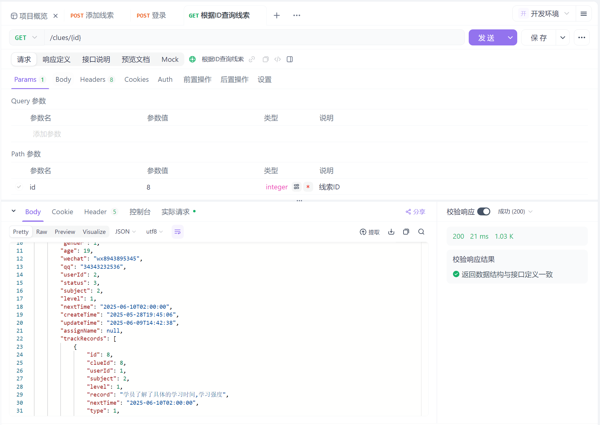

打开浏览器，进行前后端联调测试。

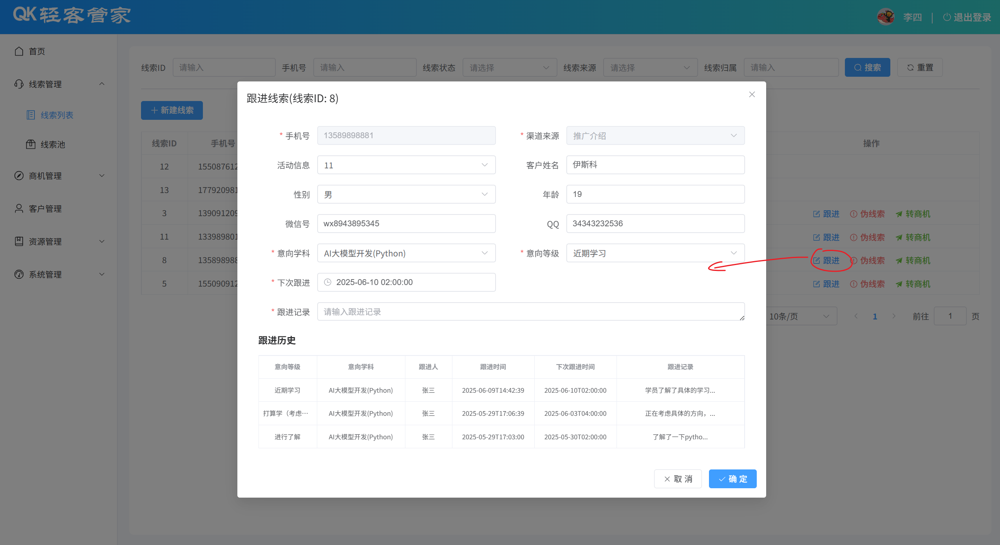

## 2.线索跟进

### 2.1.分析

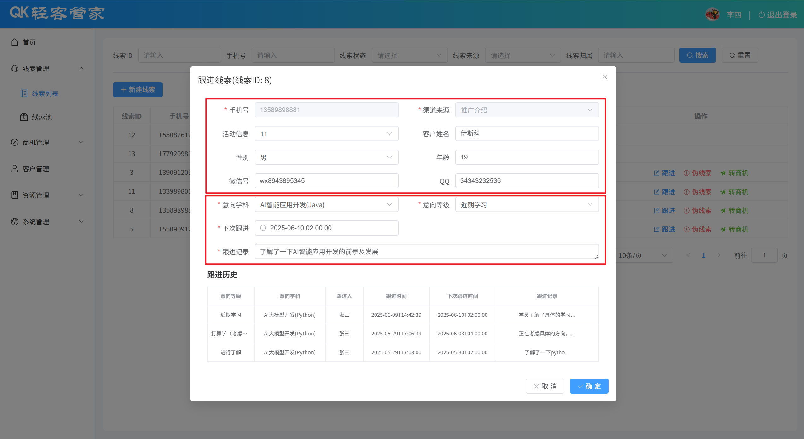

在跟进线索的时候，我们是可以对线索的基本信息进行调整修改的，也可以录入本次线索跟进的信息。所以，当我们点击 "确定" 按钮的时候，会执行两步操作：

1. 根据ID更新线索基本信息

2. 添加线索跟进记录

### 2.2.接口说明

接口文档，请参考线索管理接口文档中的 跟进线索 ，具体参照：[附录-接口文档](https://lining-lo.github.io/lining-lo-notes/轻客管家/附录-接口文档.html)

通过接口文档，我们可以看到请求参数的格式如下： 

```json
{
    "id": 37,
    "phone": "15508761231",
    "channel": 1,
    "activityId": 1,
    "name": "卫丹",
    "gender": 2,
    "age": 24,
    "wechat": "wxweidan1212",
    "qq": "8450313640",
    "userId": 12,
    "status": 2,
    "subject": 1,
    "level": 2,
    "nextTime": "2025-05-22 12:00:00",
    "record": "了解了一下IT行业的就业前景"
}
```

这个请求参数中，既包括线索的基本信息，还包括线索的跟进记录信息。上述的 绿色部分就是线索的基本信息，蓝色部分就是线索的跟进记录信息。

### 2.3.准备工作

这里我们依然可以考虑使用 `Clue` 实体类，来封装上述接口请求的数据，但是有一个属性 `record` 在`Clue`中，并没有对应的属性可以封装，所以我们可以在 `Clue` 中再增加一个扩展属性 `record`，具体如下：

```java
package com.qk.entity;

import com.baomidou.mybatisplus.annotation.TableField;
import lombok.Data;

import java.time.LocalDateTime;
import java.util.List;

/**
 * 线索实体类
 */
@Data
public class Clue {
    private Integer id; // 线索id, 主键
    private String phone; // 手机号
    private Integer channel; // 渠道来源，1:线上活动, 2:推广介绍
    private Integer activityId; // 活动信息，关联活动的id
    private String name; // 客户姓名
    private Integer gender; // 性别，1:男, 2:女
    private Integer age; // 年龄
    private String wechat; // 微信号
    private String qq; // qq号
    private Integer userId; // 归属人id，关联用户id
    private Integer status; // 线索状态，1:待分配, 2:跟进中, 3:伪线索, 4:转为商机
    private Integer subject; // 意向学科，1:ai智能应用开发(java), 2:ai大模型开发(python)，3:ai鸿蒙开发，4:ai大数据，5:ai嵌入式，6:ai测试，7:ai运维
    private Integer level; // 意向等级, 1:近期学习、2:打算学习(考虑中)、3:进行了解、4:打酱油
    private LocalDateTime nextTime; // 下次跟进时间
    private LocalDateTime createTime; // 创建时间
    private LocalDateTime updateTime; // 修改时间

    //扩展字段-归属人姓名
    @TableField(exist = false)
    private String assignName;
    
    //扩展字段-线索跟进记录列表
    @TableField(exist = false)
    private List<ClueTrackRecord> trackRecords;
    
    //扩展字段-跟进记录
    @TableField(exist = false)
    private String record;
}
```

### 2.4.功能实现

1.ClueController

在 `ClueController` 中增加如下方法 : 

```java
/**
 * 跟进线索
 * @param clue 线索信息
 */
@PutMapping
public Result trackClue(@RequestBody Clue clue) {
    //1 接收请求参数--->(@RequestBody Clue clue)
    log.info("跟进线索: {}", clue);
    //2 调用service层方法，跟进线索(保存数据)
    clueService.trackClue(clue);
    //3 响应Result
    return Result.success();
}
```

2.ClueService

在 `ClueService` 中增加如下方法 : 

```java
/**
 * 跟进线索
 *
 * @param clue 线索信息
 */
void trackClue(Clue clue);
```

3.ClueServiceImpl

在 `ClueServiceImpl` 中增加如下方法 : 

```java
@Autowired
private ClueTrackRecordMapper clueTrackRecordMapper;

/**
 * 跟进线索
 * @param clue 线索信息
 */
@Override
public void trackClue(Clue clue) {
    //1 调用ClueMapper更新线索状态为"跟进中"（跟进中状态值为3）
    clue.setStatus(3); // 跟进中
    clue.setUpdateTime(LocalDateTime.now()); // 更新时间
    this.updateById(clue);
    //2 封装跟进记录
    ClueTrackRecord trackRecord = new ClueTrackRecord();
    trackRecord.setClueId(clue.getId());
    trackRecord.setUserId(1); // 当前用户ID - 假设当前用户ID为1 TODO 后面优化调整
    trackRecord.setSubject(clue.getSubject());
    trackRecord.setLevel(clue.getLevel());
    trackRecord.setRecord(clue.getRecord());
    trackRecord.setNextTime(clue.getNextTime());
    trackRecord.setType(1); // 正常跟进
    trackRecord.setCreateTime(LocalDateTime.now());
    //3 调用ClueTrackRecordMapper层方法，保存更加记录
    clueTrackRecordMapper.insert(trackRecord);
}
```

4.ClueTrackRecordMapper

```java
@Mapper
public interface ClueTrackRecordMapper extends BaseMapper<ClueTrackRecord> {

}
```

### 2.5.测试

打开浏览器，进行前后端联调测试。

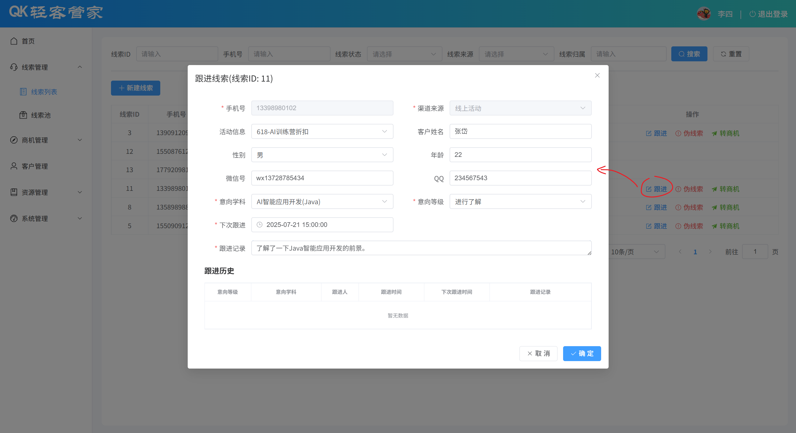

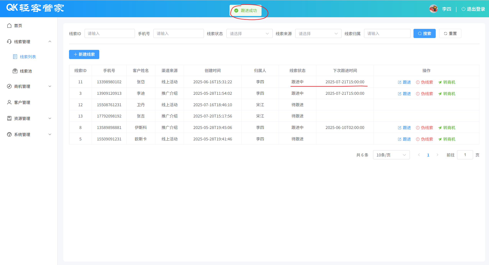

## 3.事务管理

### 3.1.问题分析

目前我们实现的线索跟进功能中，操作了两次数据库。 

- 第一次：是update，根据ID更新线索的基本信息 。

- 第二次：是insert，保存线索的跟进记录信息。

如果说，第一步 根据ID更新线索的基本信息成功了，而第二步，保存线索跟进记录出错了，会发生什么现象呢?

那接下来，我们来做一个测试 。 我们可以在代码中，人为在线索跟进的service层的方法中，构造一个错误：

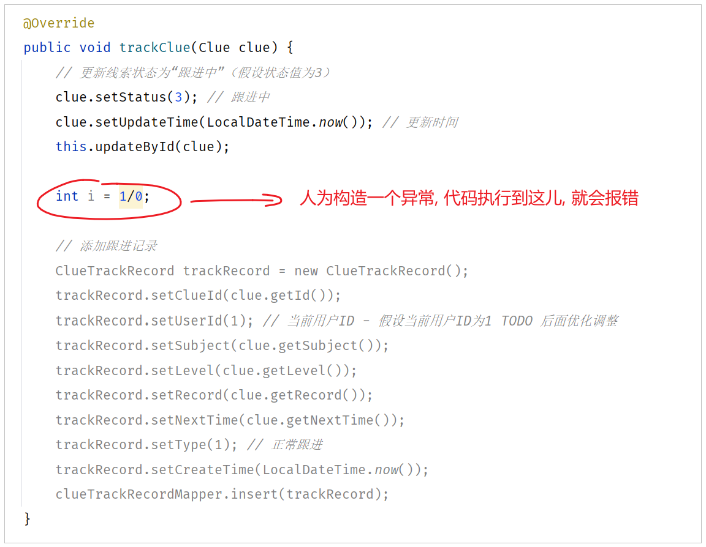

那接下来，我们就重启服务，打开浏览器，来做一个测试：

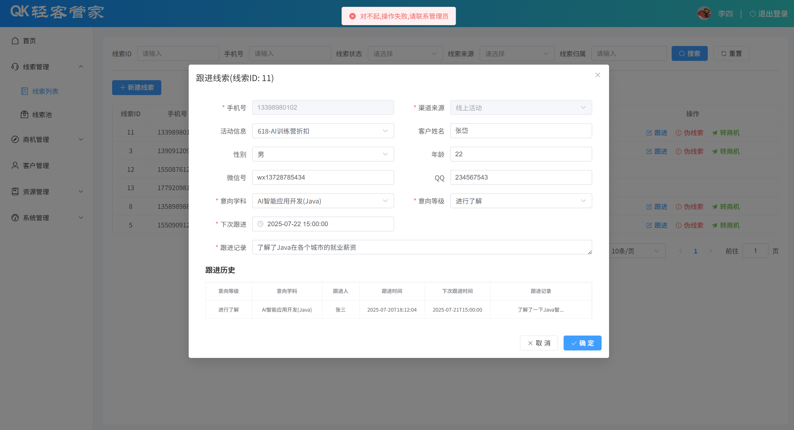

点击 “确定” 之后，提示 “对不起, 操作失败, 请联系管理员”。我们可以打开IDEA控制台看一下，报出的错误信息。 我们看到，更新了线索的基本信息之后，系统出现了异常。

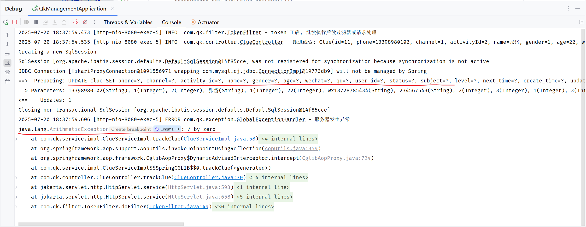

我们再打开数据库，看看表结构中的数据是否正常。

1.`clue` 线索表中id为11的线索数据更新成功了。

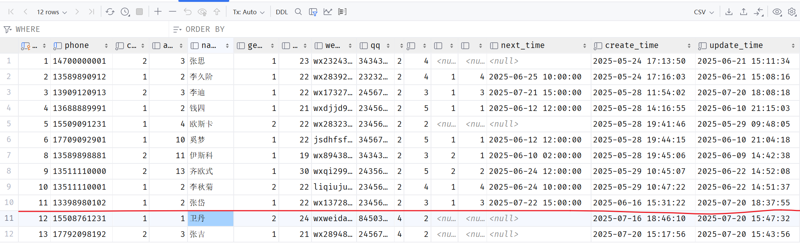

2.`clue_track_record` 线索跟进记录表中，却没有插入新的跟进记录 。

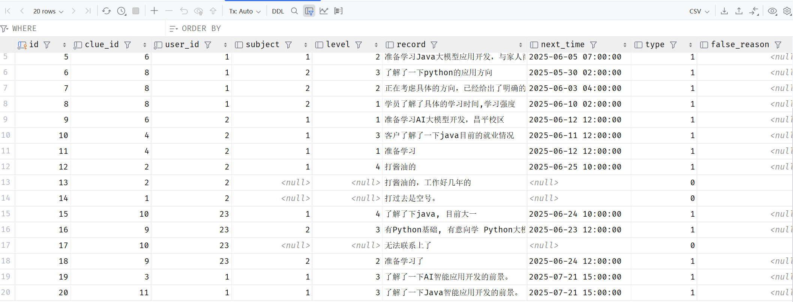

最终，我们看到，程序出现了异常 ，`clue` 线索表中的线索数据更新成功了，`clue_track_record` 表中，却没有插入线索跟进记录。 那是否允许这种情况发生呢？

- 不允许

- 因为这属于一个业务操作，如果线索更新了，线索跟进记录没有保存成功，就会造成数据库数据的不完整、不一致。

那如何解决这个问题呢？ 这需要通过数据库中的事务来解决这个问题。 

### 3.2.介绍

概念： 事务是一组操作的集合，它是一个不可分割的工作单位。事务会把所有的操作作为一个整体一起向系统提交或撤销操作请求，即这些操作 要么同时成功，要么同时失败。

就拿线索跟进的这个业务为例，在这个业务操作中，包含了两个操作，那这两个操作是一个不可分割的工作单位。

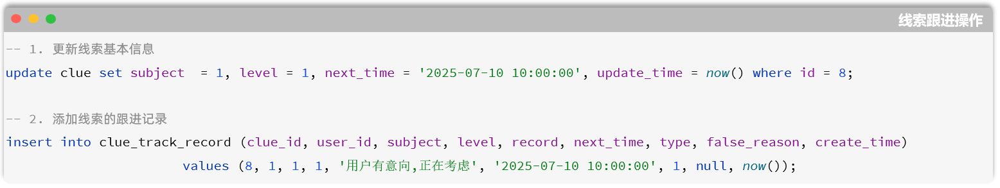

这两个操作，要么同时失败，要么同时成功。

> 默认Mysql的事务是自动提交的，也就是说，当执行一条DML语句，Mysql会立即隐式的提交事务。
>

### 3.3.操作

事务控制主要三步操作：开启事务、提交事务/回滚事务。

- 需要在这组操作执行之前，先开启事务  \( `start transaction; / begin;`\)。

- 所有操作如果全部都执行成功，则提交事务 \( `commit;` \)。

- 如果这组操作中，有任何一个操作执行失败，都应该回滚事务 \( `rollback` \)。

那接下来，我们就可以将线索跟进的业务操作，进行事务管理。 具体的sql如下：

```sql
-- 开启事务
start transaction; / begin;

-- 1. 更新线索基本信息
update clue set subject  = 1, level = 1, next_time = '2025-07-10 10:00:00', update_time = '2025-07-09 10:05:00' where id = 8;

-- 2. 添加线索的跟进记录
insert into clue_track_record (clue_id, user_id, subject, level, record, next_time, type, false_reason, create_time)
      values (8, 1, 1, 1, '用户有意向,正在考虑', '2025-07-10 10:00:00', 1, null, '2025-07-09 10:05:00'); 

-- 提交事务(全部成功) / 回滚事务(有任何一个失败)
commit; / rollback;
```

事务管理的场景，是非常多的，比如：

- 银行转账

- 下单扣减库存

## 4.Spring事务管理

### 5.1.分析

在上述实现的线索跟进的功能中，一旦在更新线索基本信息后出现异常。 我们就会发现，线索信息更新成功，但是线索跟进记录保存失败，造成了数据的不完整不一致。

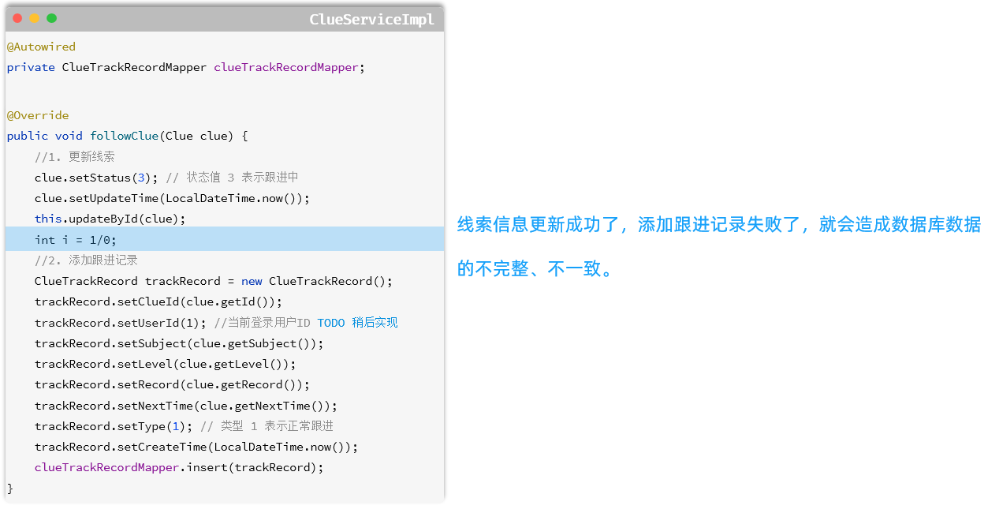

产生原因：

- 先执行更新线索的操作，这步执行完毕，就已经更新了 `clue` 表中的线索数据。

- 执行 1/0 操作，抛出异常

- 抛出异常之前，下面所有的代码都不会执行了，插入线索跟进记录，这个操作也不会执行 。

此时就出现问题了，线索信息更新成功了，线索跟进记录却保存失败了，业务操作前后数据不一致。

而要想保证操作前后，数据的一致性，就需要让线索跟进这个业务中涉及到的两个业务操作，要么全部成功，要么全部失败 。 那我们如何，让这两个操作要么全部成功，要么全部失败呢 ？

那就可以通过事务来实现，因为一个事务中的多个业务操作，要么全部成功，要么全部失败。

此时，我们就需要在线索跟进这个功能中添加事务。

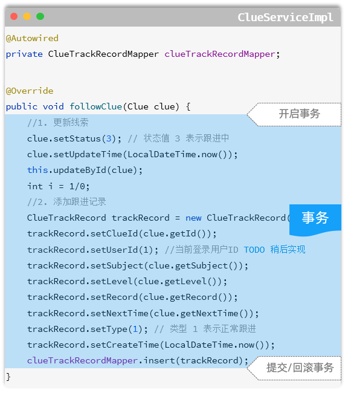

在方法运行之前，开启事务，如果方法成功执行，就提交事务，如果方法执行的过程当中出现异常了，就回滚事务。

> 思考：开发中所有的业务操作，一旦我们要进行控制事务，是不是都是这样的套路？
>
> 答案：是的。
>

所以在spring框架当中就已经把事务控制的代码都已经封装好了，并不需要我们手动实现。我们使用了spring框架，我们只需要通过一个简单的注解@Transactional就搞定了。

### 5.2.Transactional注解

注解：@Transactional

作用：就是在当前这个方法执行开始之前来开启事务，方法执行完毕之后提交事务。如果在这个方法执行的过程当中出现了异常，就会进行事务的回滚操作。

位置：业务层的方法上、类上、接口上

- 方法上：当前方法交给spring进行事务管理

- 类上：当前类中所有的方法都交由spring进行事务管理 

- 接口上：接口下所有的实现类当中所有的方法都交给spring 进行事务管理

接下来，我们就可以在线索跟进业务方法上加上 `@Transactional` 来控制事务 。

```java
/**
 * 跟进线索
 * @param clue 线索信息
 */
@Transactional
@Override
public void trackClue(Clue clue) {
    //1 调用ClueMapper更新线索状态为"跟进中"（跟进中状态值为3）
    clue.setStatus(3); // 跟进中
    clue.setUpdateTime(LocalDateTime.now()); // 更新时间
    baseMapper.updateById(clue);
    //人为制造异常模拟
    int i = 1/0;
    //2 封装跟进记录
    ClueTrackRecord trackRecord = new ClueTrackRecord();
    trackRecord.setClueId(clue.getId());
    trackRecord.setUserId(1); // 当前用户ID - 假设当前用户ID为1 TODO 后面优化调整
    trackRecord.setSubject(clue.getSubject());
    trackRecord.setLevel(clue.getLevel());
    trackRecord.setRecord(clue.getRecord());
    trackRecord.setNextTime(clue.getNextTime());
    trackRecord.setType(1); // 正常跟进
    trackRecord.setCreateTime(LocalDateTime.now());
    //3 调用ClueTrackRecordMapper层方法，保存更加记录
    clueTrackRecordMapper.insert(trackRecord);
}
```

> @Transactional注解
>
> 我们一般会在业务层当中来控制事务，因为在业务层当中，一个业务功能可能会包含多个数据访问的操作。在业务层来控制事务，我们就可以将多个数据访问操作控制在一个事务范围内。
>

说明：可以在`application.yml`配置文件中开启事务管理日志，这样就可以在控制看到和事务相关的日志信息了

```yaml
#spring事务管理日志
logging: 
  level: 
    org.springframework.jdbc.support.JdbcTransactionManager: debug
```

接下来，我们再次添加员工，看看控制台输出的日志信息。

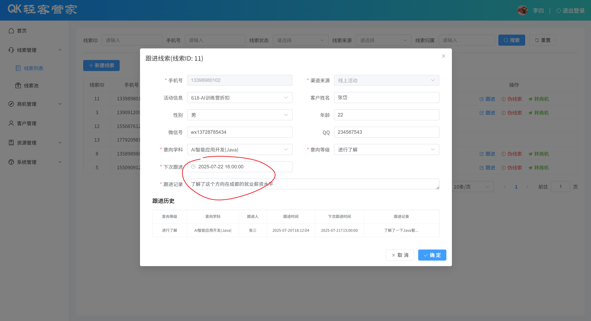


添加Spring事务管理后，由于服务端程序引发了异常，所以事务进行回滚。

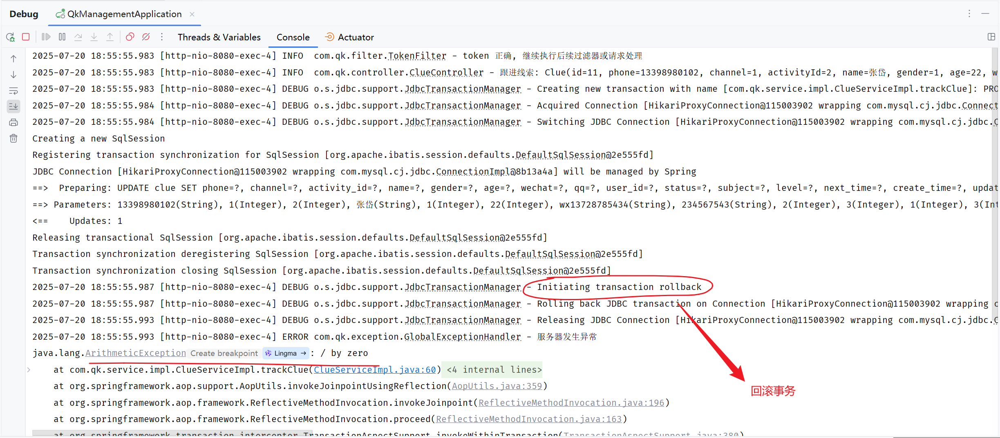

打开数据库，我们会看到 `clue` 表 与 `clue_track_record` 表中的数据都没有任何变化，这样就保证了数据的一致性、完整性。

### 5.3.事务进阶

前面我们通过spring事务管理注解@Transactional已经控制了业务层方法的事务。接下来我们要来详细的介绍一下@Transactional事务管理注解的使用细节。我们这里主要介绍@Transactional注解当中的常见的属性：

异常回滚的属性：`rollbackFor `

我们在之前编写的业务方法上添加了@Transactional注解，来实现事务管理。

```java
@Transactional
@Override
public void trackClue(Clue clue) {
    // 更新线索状态为“跟进中”（假设状态值为3）
    clue.setStatus(3); // 跟进中
    clue.setUpdateTime(LocalDateTime.now()); // 更新时间
    this.updateById(clue);

    int i = 1/0;

    // 添加跟进记录
    ClueTrackRecord trackRecord = new ClueTrackRecord();
    trackRecord.setClueId(clue.getId());
    trackRecord.setUserId(1); // 当前用户ID - 假设当前用户ID为1 TODO 后面优化调整
    trackRecord.setSubject(clue.getSubject());
    trackRecord.setLevel(clue.getLevel());
    trackRecord.setRecord(clue.getRecord());
    trackRecord.setNextTime(clue.getNextTime());
    trackRecord.setType(1); // 正常跟进
    trackRecord.setCreateTime(LocalDateTime.now());
    clueTrackRecordMapper.insert(trackRecord);
}
```

以上业务功能`trackClue`方法在运行时，会引发除0的算术运算异常\(运行时异常\)，出现异常之后，由于我们在方法上加了`@Transactional`注解进行事务管理，所以发生异常会执行rollback回滚操作，从而保证事务操作前后数据是一致的。

下面我们在做一个测试，我们修改业务功能代码，在模拟异常的位置上直接抛出Exception异常（编译时异常）

```java
/**
 * 跟进线索
 * @param clue 线索信息
 */
@Transactional
@Override
public void trackClue(Clue clue) throws FileNotFoundException {
    //1 调用ClueMapper更新线索状态为"跟进中"（跟进中状态值为3）
    clue.setStatus(3); // 跟进中
    clue.setUpdateTime(LocalDateTime.now()); // 更新时间
    baseMapper.updateById(clue);
    //人为制造异常模拟
    //int i = 1/0;
    FileReader fr = new FileReader("d:/a.txt"); //d盘中没有这个文件，会出现编译期异常
    //2 封装跟进记录
    ClueTrackRecord trackRecord = new ClueTrackRecord();
    trackRecord.setClueId(clue.getId());
    trackRecord.setUserId(1); // 当前用户ID - 假设当前用户ID为1 TODO 后面优化调整
    trackRecord.setSubject(clue.getSubject());
    trackRecord.setLevel(clue.getLevel());
    trackRecord.setRecord(clue.getRecord());
    trackRecord.setNextTime(clue.getNextTime());
    trackRecord.setType(1); // 正常跟进
    trackRecord.setCreateTime(LocalDateTime.now());
    //3 调用ClueTrackRecordMapper层方法，保存更加记录
    clueTrackRecordMapper.insert(trackRecord);
}
```

> 说明：
>
> 在service中向上抛出一个FileNotFoundException编译时异常之后，由于是controller调用service，所以在controller中要有异常处理代码，此时我们选择在controller中继续把异常向上抛。
>

重新启动服务后，打开页面测试一下：

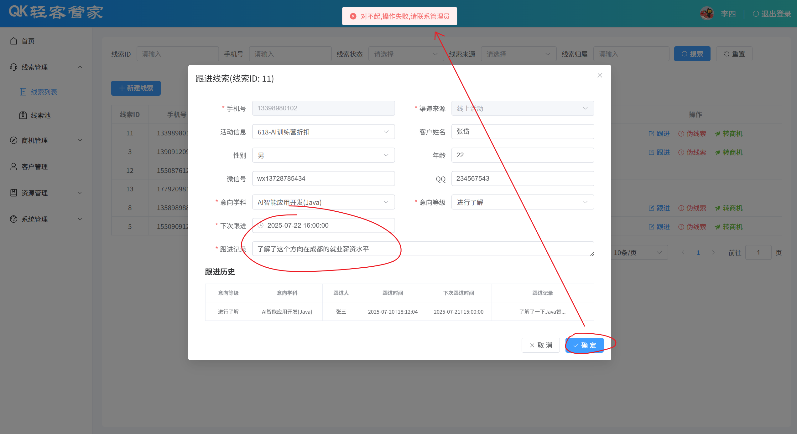

我们看到抛出异常了。然后我们在回到IDEA的控制台来看一下。

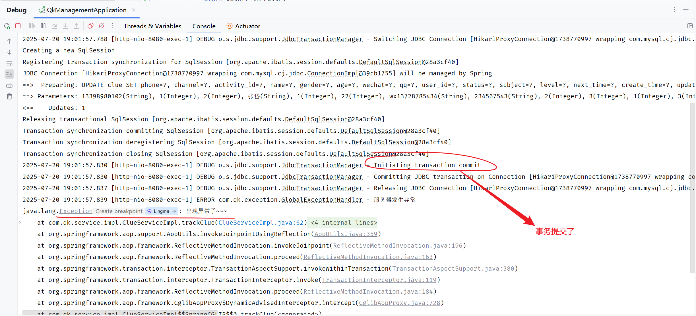

我们看到数据库的事务居然提交了，并没有进行回滚。

通过以上测试可以得出一个结论：默认情况下，只有出现RuntimeException\(运行时异常\)才会回滚事务。

假如我们想让所有的异常都回滚，需要来配置@Transactional注解当中的rollbackFor属性，通过rollbackFor这个属性可以指定出现何种异常类型回滚事务。

```java
/**
 * 跟进线索
 * @param clue 线索信息
 */
@Transactional(rollbackFor = Exception.class) //指定要回滚的异常类型
@Override
public void trackClue(Clue clue) throws FileNotFoundException {
    //1 调用ClueMapper更新线索状态为"跟进中"（跟进中状态值为3）
    clue.setStatus(3); // 跟进中
    clue.setUpdateTime(LocalDateTime.now()); // 更新时间
    baseMapper.updateById(clue);
    //人为制造异常模拟
    //int i = 1/0;
    FileReader fr = new FileReader("d:/a.txt"); //d盘中没有这个文件，会出现编译期异常
    //2 封装跟进记录
    ClueTrackRecord trackRecord = new ClueTrackRecord();
    trackRecord.setClueId(clue.getId());
    trackRecord.setUserId(1); // 当前用户ID - 假设当前用户ID为1 TODO 后面优化调整
    trackRecord.setSubject(clue.getSubject());
    trackRecord.setLevel(clue.getLevel());
    trackRecord.setRecord(clue.getRecord());
    trackRecord.setNextTime(clue.getNextTime());
    trackRecord.setType(1); // 正常跟进
    trackRecord.setCreateTime(LocalDateTime.now());
    //3 调用ClueTrackRecordMapper层方法，保存更加记录
    clueTrackRecordMapper.insert(trackRecord);
}
```

接下来我们重新启动服务，测试线索跟进的操作：

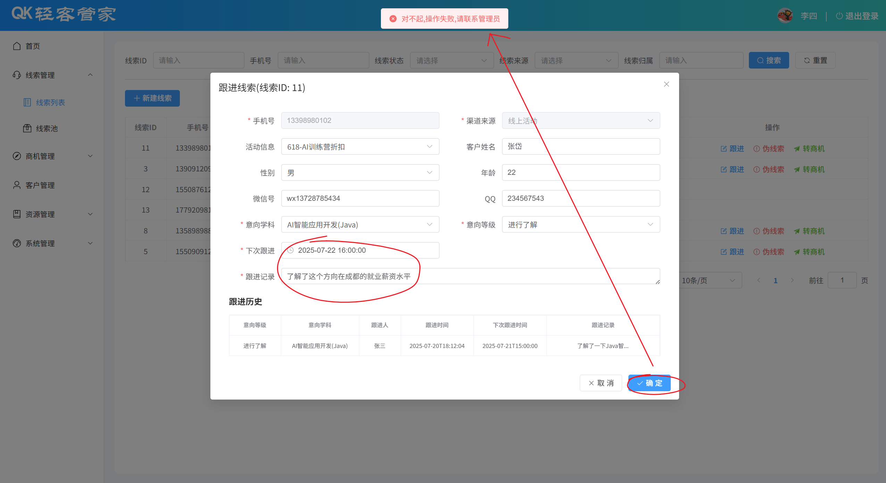

控制台日志，可以看到因为出现了异常又进行了事务回滚。

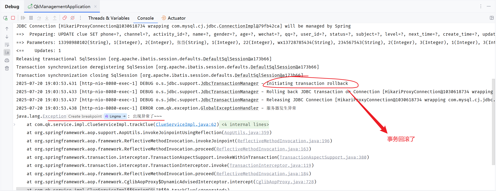

> 结论：
>
> - 在Spring的事务管理中，默认只有运行时异常 RuntimeException才会回滚。
>
> - 如果还需要回滚指定类型的异常，可以通过rollbackFor属性来指定。
>

> 注意：测试完毕后，记得一定一定要把我们手动抛出的异常给删除掉。
>

### 5.4.事务四大特性

面试题：事务有哪些特性？

- 原子性（Atomicity）：事务是不可分割的最小单元，要么全部成功，要么全部失败。

- 一致性（Consistency）：事务完成时，必须使所有的数据都保持一致状态。

- 隔离性（Isolation）：数据库系统提供的隔离机制，保证事务在不受外部并发操作影响的独立环境下运行。

- 持久性（Durability）：事务一旦提交或回滚，它对数据库中的数据的改变就是永久的。

> 事务的四大特性简称为：ACID
>

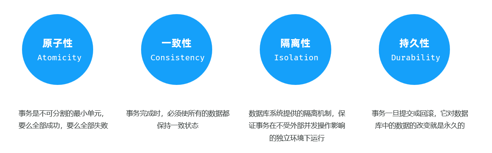

1.原子性（Atomicity） ：原子性是指事务包装的一组sql是一个不可分割的工作单元，事务中的操作要么全部成功，要么全部失败。

2.一致性（Consistency）：一个事务完成之后数据都必须处于一致性状态。

如果事务成功的完成，那么数据库的所有变化将生效。

如果事务执行出现错误，那么数据库的所有变化将会被回滚\(撤销\)，返回到原始状态。

3.隔离性（Isolation）：多个用户并发的访问数据库时，一个用户的事务不能被其他用户的事务干扰，多个并发的事务之间要相互隔离。

一个事务的成功或者失败对于其他的事务是没有影响。

4.持久性（Durability）：一个事务一旦被提交或回滚，它对数据库的改变将是永久性的，哪怕数据库发生异常，重启之后数据亦然存在。

## 5.获取当前登录用户

### 5.1.分析

```java
@Transactional(rollbackFor = Exception.class)
@Override
public void trackClue(Clue clue) throws Exception {
    // 更新线索状态为“跟进中”（假设状态值为3）
    clue.setStatus(3); // 跟进中
    clue.setUpdateTime(LocalDateTime.now()); // 更新时间
    this.updateById(clue);

    // 添加跟进记录
    ClueTrackRecord trackRecord = new ClueTrackRecord();
    trackRecord.setClueId(clue.getId());
    trackRecord.setUserId(1); // 当前用户ID - 假设当前用户ID为1 TODO 后面优化调整
    trackRecord.setSubject(clue.getSubject());
    trackRecord.setLevel(clue.getLevel());
    trackRecord.setRecord(clue.getRecord());
    trackRecord.setNextTime(clue.getNextTime());
    trackRecord.setType(1); // 正常跟进
    trackRecord.setCreateTime(LocalDateTime.now());
    clueTrackRecordMapper.insert(trackRecord);
}
```

刚才我们在完成线索跟进功能的时候，在添加跟进记录时，需要指定本次线索跟进的跟进人是谁 ？ 那这个跟进人，其实就是当前操作人，也就是当前登录用户。 

那么我们如何在ClueServiceImpl的业务方法中获取到当前登录用户呢 ？

> 思考1：用户登录完成后，在哪里存储了当前登录用户的信息（用户ID）？ 
>
>  在JWT令牌中存储了登录用户的信息

> 思考2：在后续的每一次业务请求的过程中，如何获取JWT令牌呢？  
>
> 从请求头中获取，然后解析JWT令牌

而我们在完成登录功能的时候，我们做登录校验（令牌校验）时，在过滤器Filter/拦截器Interceptor中，已经获取到了请求头中的JWT令牌，并且还对令牌进行了解析。那么现在我们想在Service层中，获取到JWT令牌中存储的当前登录用户的信息，我们的思路如下：

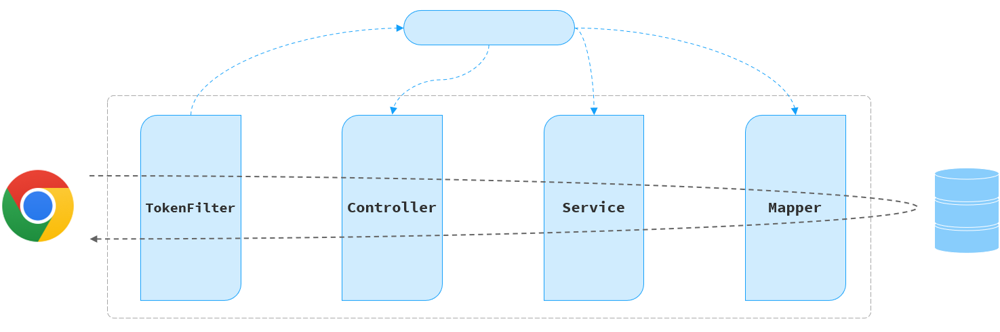

第一步，在过滤器TokenFilter中，我们之前已经完成了令牌的解析，那么我们可以将解析后的结果（当前登录用户的ID）存储到一个容器中。

第二步，在后续的流程中（比如在controller、service等），要想获取到当前登录员工的信息，可以直接从这个容器中获取出来就可以了。

具体往哪里存储呢，通用的方案，就是将其存入ThreadLocal中，那么接下来呢，我们就来介绍一下什么是ThreadLocal，以及具体如何操作ThreadLocal。 

而在讲解ThreadLocal之前，我们需要先介绍一下什么是Thread线程。

### 5.2.Thread线程

**介绍**

线程（Thread） ：是操作系统能够进行运算调度的最小单位。它被包含在进程之中，是进程中的实际运行单位。

进程（Process）：是操作系统中的一个核心概念，指的是正在执行的程序实例，是系统进行资源分配和调度的基本单位。

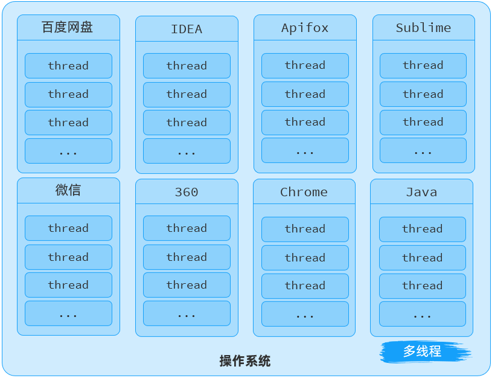

那在我们的操作系统中，会运行很多的应用软件，而这些应用软件在运行的时候，就会在操作系统中启动一个进程，比如我们电脑上安装的百度网盘、IDEA、Apifox、Sublime、微信、QQ、360等等，我们可以打开我们的电脑的资源管理器，就可以看到这些个进程。

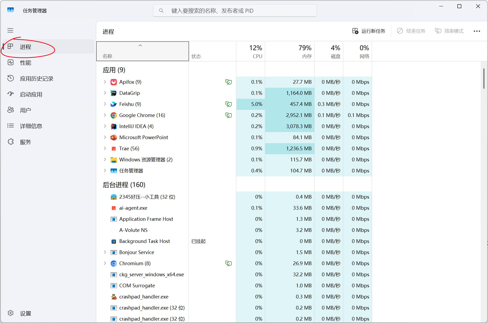

而在一个进程中，会运行很多个线程来处理不同的任务，而这些个线程会公用一个CPU来进行任务处理。

> 为什么要使用多线程呢？
>
> 目的就是为了让程序能同时处理多个任务，提升效率，并充分利用系统资源。
>

那我们java程序运行，需不需要线程呢，答案是肯定的。

那其实，当我们编写一个main方法运行时，程序默认就会自动一个主线程来执行这个程序。如果说，我们需要创建另外一个独立的线程来执行任务，就可以基于java中提供的API来创建线程。

**创建线程**

方式一：继承Thread类

创建一个类，继承Thread，重写run方法 。

```java
package com.qk;

public class MyThread extends Thread{
    @Override
    public void run() {
        System.out.println(this.getName() + " : 执行任务啦....");
    }
}
```

测试：

```java
package com.qk;

public class ThreadDemo {
    public static void main(String[] args) {
        Thread t1 = new MyThread(); //创建线程
        t1.start(); //启动线程
    }
}
```

> 注意事项:  启动线程必须是调用start方法，不是调用run方法。
>
> 如果直接调用run方法就不认为是一条线程启动了，而是把Thread当做一个普通对象，此时run方法中      的执行的代码会成为主线程的一部分。
>

方式二：实现Runnable接口

创建一个类，实现Runnable接口，实现run方法 。

```java
package com.qk;

public class MyRunnable implements Runnable {
    @Override
    public void run() {
        System.out.println(Thread.currentThread().getName() + ": 执行任务 ....");
    }
}
```

测试：

```java
package com.qk;

public class ThreadDemo {
    public static void main(String[] args) {
        //方式一: 继承Thread类
        //Thread t1 = new MyThread();
        //t1.start();

        //方式二: 实现Runnable接口
        Thread t2 = new Thread(new MyRunnable());
        t2.start();
    }
}
```

接下来，我们学习线程的第三种创建方式。已经有两种了为什么还有要第三种呢？ 

这样，我们先分析一下前面两种都存在的一个问题。

如果线程执行完毕后有一些数据需要返回，他们重写的run方法均不能直接返回结果。

怎么解决这个问题呢?

JDK5提供了Callable接口和FutureTask类来创建线程，它最大的优点就是有返回值。

方式三：实现Callable接口

创建一个类，实现Runnable接口，实现run方法 。

```java
package com.qk;

import java.util.concurrent.Callable;

public class MyCallable implements Callable<String> {

    private int num;
    public MyCallable(int num) {
        this.num = num;
    }

    @Override
    public String call() throws Exception {
        System.out.println(Thread.currentThread().getName() + " : 执行任务...");
        int result = 0;
        for (int i = 0; i < num; i++) {
            result += i;
        }
        return "任务执行完毕, 计算 1-" + num + " 的和为: " + result;
    }
}
```

测试：

```java
package com.qk;

import java.util.concurrent.FutureTask;

public class ThreadDemo {
    public static void main(String[] args) throws Exception {
        //方式一: 继承Thread类
        //Thread t1 = new MyThread();
        //t1.start();

        //方式二: 实现Runnable接口
        //Thread t2 = new Thread(new MyRunnable());
        //t2.start();

        //方式三: 实现Callable接口
        FutureTask<String> futureTask = new FutureTask<>(new MyCallable(100));
        Thread t3 = new Thread(futureTask);
        t3.start();
        String result1 = futureTask.get(); //获取任务执行完毕的结果
        System.out.println(result1);
    }
}
```

以上是java中创建线程常见的三种方式：

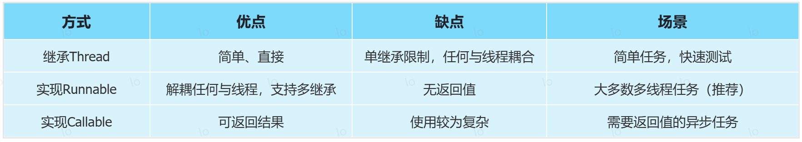

多线程的应用场景:

- 异步执行计算任务;

- 多个程序同时执行;

以上是线程创建的三种方式，但是其实在项目开发中，即使我们要使用多个线程来执行任务，我们一般也不推荐使用上述的三种方式来创建线程，因为创建线程是比较消耗资源的，而上述的方式创建线程，每一次都是创建一个新的线程来执行任务，任务执行完毕，线程也就被销毁了。而频繁的创建线程，销毁线程，是非常耗费系统资源的，所以项目开发中一般不会使用这三种方式创建线程，而是会使用线程池技术。

### 5.3.线程池

**介绍**

其实，线程池就是一个可以复用线程的技术。

而使用线程池，就可以解决上面的问题。

如下图所示，线程池内部会有一个容器，存储几个核心线程，假设有3个核心线程，在执行任务的时候，就可以使用这3个核心线程可以处理任务，可以做到线程的复用。

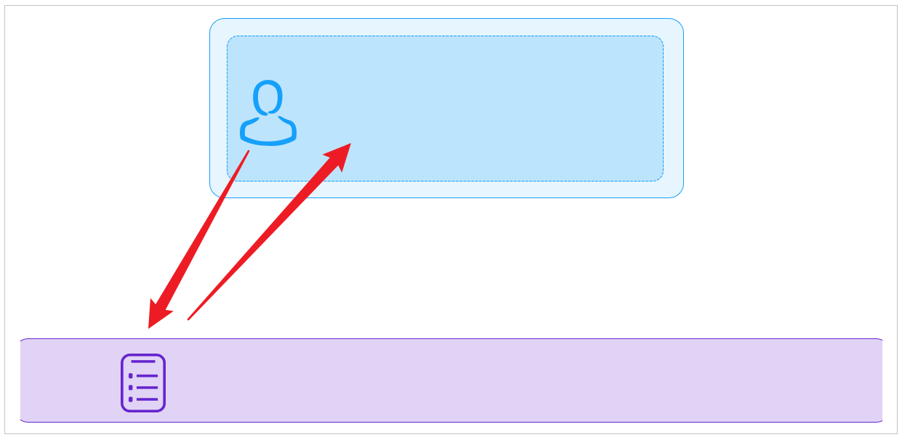

线程池的使用步骤：

1.创建线程池 \(Executors工具类快速创建\)

2.提交任务

3.任务执行完毕，关闭线程池（项目开发中一般不关闭）

示例代码如下：

```java
package com.qk;

import java.util.Random;
import java.util.concurrent.ExecutorService;
import java.util.concurrent.Executors;

public class ThreadPoolDemo {
    public static void main(String[] args) {
        //1. 创建线程池
        ExecutorService executor = Executors.newFixedThreadPool(5);
        
        //2. 提交任务
        for (int i = 0; i < 100; i++) {
            executor.submit(() -> {
                try {
                    Thread.sleep(new Random().nextInt(2000));
                } catch (InterruptedException e) {
                    e.printStackTrace();
                }
                System.out.println(Thread.currentThread().getName() + "   正在执行任务");
            });
        }
        
        //3. 关闭线程池
        executor.shutdown();
    }
}
```

运行测试后，我们可以看到如下结果：

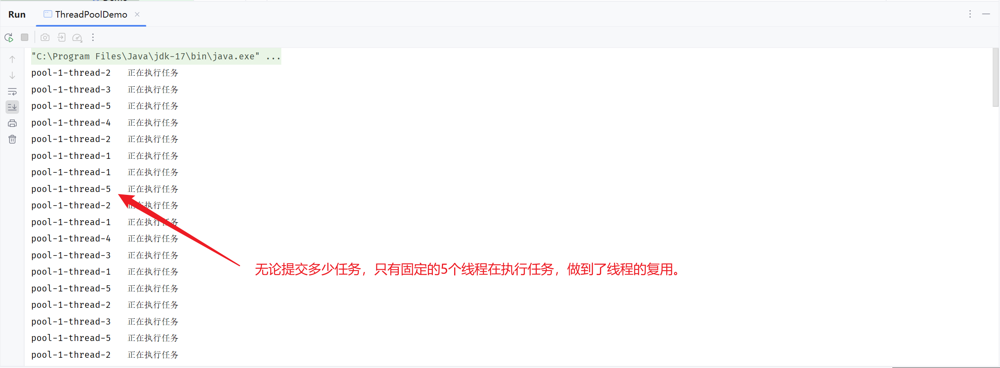

**线程池核心参数**

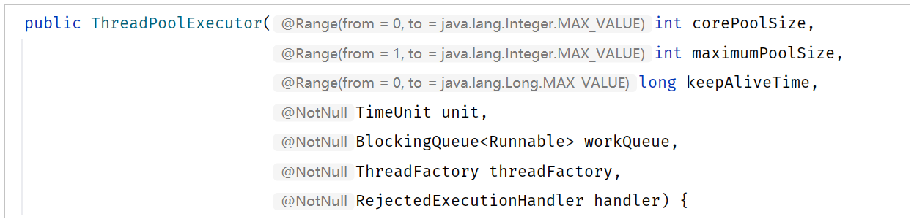

> 在线程池中涉及到7个核心参数，分别是：
>
> 1.`int corePoolSize`：核心线程数，核心线程会常驻线程池
>
> 2.`int maximumPoolSize`：最大线程数，如果同时执行的任务数超过了核心线程数，且队列已满，会创建新的线程来救急，不超这个最大线程数
>
> 3.`long keepAliveTime`：存活时间，超过核心线程数的线程一旦闲下来，会存活一段时间，然后被销毁
>
> 4.`TimeUnit unit`：时间单位
>
> 5.`BlockingQueue<Runnable> workQueue`：工作队列，如果同时执行的任务数超过了核心线程数，会把暂时无法处理的任务放入此队列
>
> 6.`ThreadFactory threadFactory`：线程工厂，可以控制池中线程的命名规则，是否是守护线程等（不太重要的参数）
>
> 7.`RejectedExecutionHandler handler`：拒绝策略，队列放满任务，且所有线程都被占用，再来新任务，就会有问题：
>
> - `AbortPolicy` 报错策略，直接抛异常
>
> - `CallerRunsPolicy` 推脱策略，线程池不执行任务，推脱给任务提交线程
>
> - `DiscardOldestPolicy` 抛弃最老任务策略，把队列中最早的任务抛弃，新任务加入队列等待
>
> - `DiscardPolicy` 抛弃策略，直接把新任务抛弃不执行

自定义线程池：

```java
package com.qk;

import java.util.Random;
import java.util.concurrent.ArrayBlockingQueue;
import java.util.concurrent.Executors;
import java.util.concurrent.ThreadPoolExecutor;
import java.util.concurrent.TimeUnit;

public class ThreadPoolDemo {
    public static void main(String[] args) {
        //1. 创建线程池
        ThreadPoolExecutor executor = new ThreadPoolExecutor(
                5, // 核心线程数
                10, // 最大线程数
                1000,// 线程空闲时间
                TimeUnit.SECONDS, // 线程空闲时间单位
                new ArrayBlockingQueue<>(10), // 线程队列
                Executors.defaultThreadFactory(), // 线程工厂
                new ThreadPoolExecutor.AbortPolicy()); // 拒绝策略 - 报错
        
        //2. 提交任务
        for (int i = 0; i < 100; i++) {
            executor.submit(() -> {
                try {
                    Thread.sleep(new Random().nextInt(2000));
                } catch (InterruptedException e) {
                    e.printStackTrace();
                }
                System.out.println(Thread.currentThread().getName() + "   正在执行任务");
            });
        }
        
        //3. 关闭线程池
        executor.shutdown();
    }

}
```

线程池执行任务的流程如下:

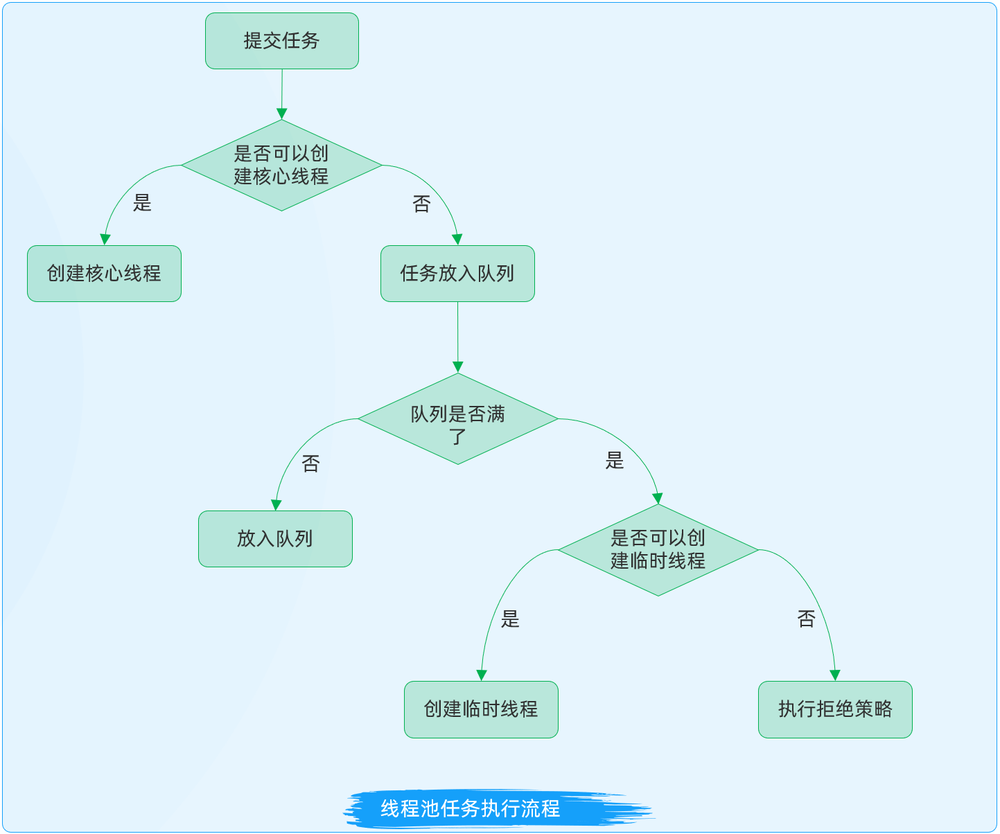

### 5.4.ThreadLocal

ThreadLocal 并不是一个Thread，而是Thread的局部变量。

ThreadLocal为每个线程提供一份单独的存储空间，具有线程隔离的效果，不同的线程之间不会相互干扰。

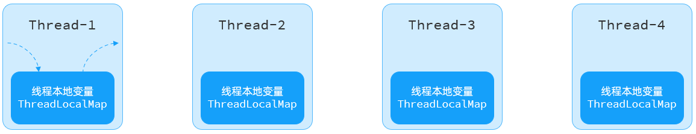

常见方法：

- `public void set(T value) `  设置当前线程的线程局部变量的值

- `public T get() `                    返回当前线程所对应的线程局部变量的值

- `public void remove() `       移除当前线程的线程局部变量

### 5.5.记录当前登录用户

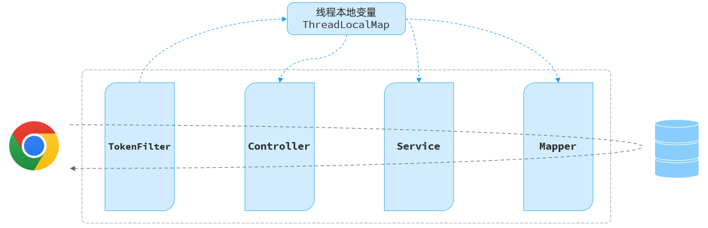

具体操作步骤：

1.定义ThreadLocal操作的工具类，用于操作当前登录用户ID。

在 `qk-common` 模块的 `com.qk.utils` 包中，引入工具类 `CurrentUserHolder`

```java
package com.qk.utils;

/**
 * 操作当前登录用户信息
 */
public class CurrentUserHoler {
    private static ThreadLocal<Integer> CURRENT_USER = new ThreadLocal<>();

    public static void setCurrentUser(Integer userId) {
        CURRENT_USER.set(userId);
    }

    public static Integer getCurrentUser() {
        return CURRENT_USER.get();
    }

    public static void removeCurrentUser() {
        CURRENT_USER.remove();
    }
}
```

2.如果使用的是过滤器，在TokenFilter中，解析出当前登录用户ID，将其存入ThreadLocal（用完之后需将其删除）。

```java
package com.qk.filter;

import com.qk.utils.CurrentUserHoler;
import com.qk.utils.JwtUtils;
import io.jsonwebtoken.Claims;
import jakarta.servlet.*;
import jakarta.servlet.annotation.WebFilter;
import jakarta.servlet.http.HttpServletRequest;
import jakarta.servlet.http.HttpServletResponse;
import lombok.extern.slf4j.Slf4j;
import java.io.IOException;

@Slf4j
@WebFilter(urlPatterns = "/*")
public class TokenFilter implements Filter {

    @Override
    public void doFilter(ServletRequest servletRequest, ServletResponse servletResponse, FilterChain chain) throws IOException, ServletException {

        HttpServletRequest request = (HttpServletRequest) servletRequest;
        HttpServletResponse response = (HttpServletResponse) servletResponse;

        // 放行登录接口
        if ("/login".equals(request.getRequestURI())) {
            log.info("登录操作, 直接放行");
            chain.doFilter(request, response);
            return;
        }

        // 提取请求头中的 token
        String token = request.getHeader("token");
        if (token == null || token.isEmpty()) {
            log.info("请求头中没有 token, 拒绝访问, 401");
            response.setStatus(HttpServletResponse.SC_UNAUTHORIZED);
            return;
        }

        try {
            // 解析 token
            Claims claims = JwtUtils.parseToken(token);
            //获取用户id, 存入ThreadLocal
            Integer userId = claims.get("id", Integer.class);
            CurrentUserHoler.setCurrentUser(userId);
        } catch (Exception e) {
            // 捕获解析 token 异常，返回 401 错误
            log.info("解析 token 出错, 拒绝访问, 401");
            response.setStatus(HttpServletResponse.SC_UNAUTHORIZED);
            return;
        }

        // 继续执行后续过滤器或请求处理
        log.info("token 正确, 继续执行后续过滤器或请求处理");
        chain.doFilter(request, response);

        //用户删除
        CurrentUserHoler.removeCurrentUser();
    }

}
```

如果使用的是拦截器，则在TokenInterceptor中，解析出当前登录用户ID，将其存入ThreadLocal（用完之后需将其删除）。

```java
@Slf4j
@Component
public class TokenInterceptor implements HandlerInterceptor {
    @Override
    public boolean preHandle(HttpServletRequest request, HttpServletResponse response, Object handler) throws Exception {
        //1. 获取请求头中的令牌（token）。
        String jwt = request.getHeader("token");
        //2. 判断令牌是否存在，如果不存在，返回错误结果（未登录）。
        if(!StringUtils.hasText(jwt)){ //jwt为空
            log.info("获取到jwt令牌为空, 返回错误结果");
            response.setStatus(HttpStatus.SC_UNAUTHORIZED);
            return false;
        }
        //3. 解析token，如果解析失败，返回错误结果（未登录）。
        try {
            Claims claims = JwtUtils.parseToken(jwt);
            //4. 校验成功放行。
            log.info("令牌合法, 放行");
            //获取用户id, 存入ThreadLocal
            Integer userId = claims.get("id", Integer.class);
            CurrentUserHoler.setCurrentUser(userId);
            return true;
        } catch (Exception e) {
            e.printStackTrace();
            //5 校验失败，返回错误结果（未登录）。
            log.info("解析令牌失败, 返回错误结果");
            response.setStatus(HttpStatus.SC_UNAUTHORIZED);
            return false;
        }
    }

    //在controller层方法执行之后无论是否出现异常时都执行
    @Override
    public void afterCompletion(HttpServletRequest request, HttpServletResponse response, Object handler, Exception ex) throws Exception {
        //从ThreadLocal中移除用户id
        CurrentUserHoler.removeCurrentUser();
    }
}
```

3.在Service程序中，从ThreadLocal中获取当前登录用户的ID。

```java
/**
 * 跟进线索
 * @param clue 线索信息
 */
@Transactional(rollbackFor = Exception.class) //指定要回滚的异常类型
@Override
public void trackClue(Clue clue) throws FileNotFoundException {
    //1 调用ClueMapper更新线索状态为"跟进中"（跟进中状态值为3）
    clue.setStatus(3); // 跟进中
    clue.setUpdateTime(LocalDateTime.now()); // 更新时间
    baseMapper.updateById(clue);
    //人为制造异常模拟
    //int i = 1/0;
    //FileReader fr = new FileReader("d:/a.txt"); //d盘中没有这个文件，会出现编译期异常
    //2 封装跟进记录
    ClueTrackRecord trackRecord = new ClueTrackRecord();
    trackRecord.setClueId(clue.getId());
    trackRecord.setUserId(CurrentUserHoler.getCurrentUser()); //当前登录用户ID
    trackRecord.setSubject(clue.getSubject());
    trackRecord.setLevel(clue.getLevel());
    trackRecord.setRecord(clue.getRecord());
    trackRecord.setNextTime(clue.getNextTime());
    trackRecord.setType(1); // 正常跟进
    trackRecord.setCreateTime(LocalDateTime.now());
    //3 调用ClueTrackRecordMapper层方法，保存更加记录
    clueTrackRecordMapper.insert(trackRecord);
}
```

代码优化完毕之后，我们重新启动服务测试。就可以看到，可以获取到不同的登录用户信息了。

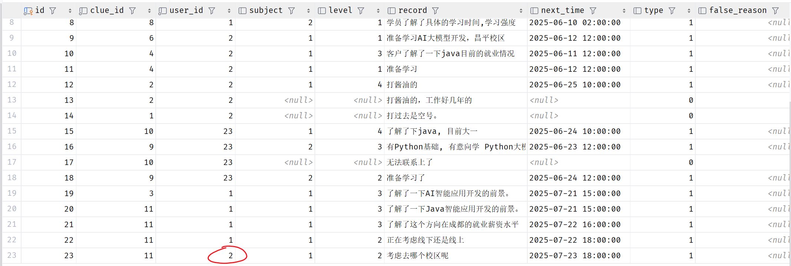

# 三、转商机

## 1.分析

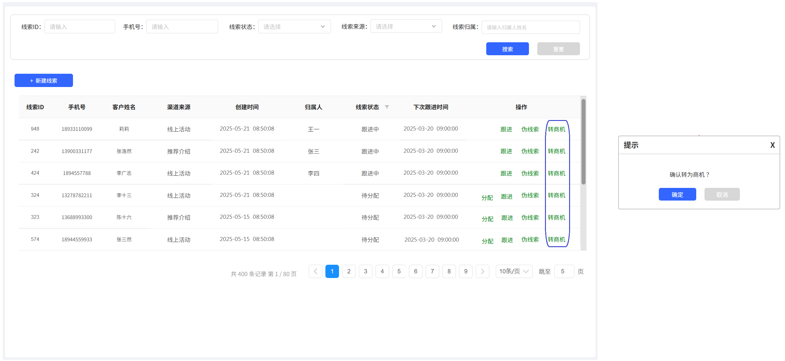

在线索跟进的过程中，如果跟进人发现线索有意向，是公司的潜在客户，就可以点击 “转商机” 按钮，将其转为商机 。 

## 2.准备工作

1.准备商机相关表结构

```sql
-- 商机表
create table business (
  id int unsigned not null primary key auto_increment comment '线索id, 主键',
  name varchar(20) comment '客户姓名',
  phone char(11) not null unique comment '手机号',
  gender tinyint unsigned comment '性别，1:男, 2:女',
  age tinyint unsigned comment '年龄',
  wechat varchar(30) comment '微信号',
  qq varchar(15) comment 'qq号',
  subject tinyint unsigned comment '意向学科，1:ai智能应用开发(java), 2:ai大模型开发(python)，3:ai鸿蒙开发，4:ai大数据，5:ai嵌入式，6:ai测试，7:ai运维',
  course_id int unsigned comment '意向课程, 课程id',
  degree tinyint unsigned comment '学历, 1:高中、2:中专、3:大专、4:本科、5:硕士、6:博士、7:其他',
    job_status tinyint unsigned comment '在职情况, 1: 在职, 0: 离职',
  channel tinyint unsigned not null comment '渠道来源，1:线上活动, 2:推广介绍',
  remark varchar(50) comment '备注',
  status tinyint unsigned not null default '1' comment '商机状态，1:待分配, 2:待跟进, 3:跟进中, 4:回收, 5:转客户',
  user_id int unsigned comment '归属人id，关联用户id',
  clue_id int unsigned comment '归属线索id',
  next_time datetime comment '下次跟进时间',
  create_time datetime not null comment '创建时间',
  update_time datetime not null comment '修改时间'
) comment '商机表';

-- 商机跟进记录表
create table business_track_record (
  id int unsigned primary key auto_increment comment '跟进记录id, 主键',
  business_id int unsigned not null comment '商机id，关联商机id',
  user_id int unsigned not null comment '跟进人id，关联用户id',
  track_status tinyint unsigned not null comment '跟进状态, 1:接通, 2:拒绝, 3:无人接听',
  key_items varchar(50) comment '沟通重点',
  next_time datetime comment '下次跟进时间',
  record varchar(50) comment '沟通纪要',
  create_time datetime not null comment '创建时间'
) comment '商机跟进记录表';
```

2.准备商机相关的实体类

在 `qk-entity` 模块的 `com.qk.entity` 包中，添加如下两个实体类。

`Business` 商机实体类: 

```java
package com.qk.entity;

import com.baomidou.mybatisplus.annotation.TableField;
import com.baomidou.mybatisplus.annotation.TableName;
import lombok.Data;
import java.time.LocalDateTime;
import java.util.List;

/**
 * 商机实体类
 */
@Data
public class Business {
    private Integer id; // 商机id, 主键
    private String name; // 客户姓名
    private String phone; // 手机号
    private Integer gender; // 性别，1:男, 2:女
    private Integer age; // 年龄
    private String wechat; // 微信号
    private String qq; // qq号
    private Integer subject; // 意向学科，1:AI智能应用开发(java), 2:AI大模型开发(python)，3:AI鸿蒙开发，4:AI大数据，5:AI嵌入式，6:AI测试，7:AI运维
    private Integer courseId; // 意向课程, 课程id
    private Integer degree; // 学历, 1:高中、2:中专、3:大专、4:本科、5:硕士、6:博士、7:其他
    private Integer jobStatus; // 在职情况, 1: 在职, 0: 离职
    private Integer channel; // 渠道来源，1:线上活动, 2:推广介绍
    private String remark; // 备注
    private Integer status; // 商机状态，1:待分配, 2:待跟进, 3:跟进中, 4:回收, 5:转客户
    private Integer userId; // 归属人id，关联用户id
    private Integer clueId; // 归属线索id
    private LocalDateTime nextTime; // 下次跟进时间
    private LocalDateTime createTime; // 创建时间
    private LocalDateTime updateTime; // 修改时间
}
```

`BusinessTrackRecord` 商机跟进记录实体类: 

```java
package com.qk.entity;

import com.baomidou.mybatisplus.annotation.TableField;
import com.baomidou.mybatisplus.annotation.TableName;
import lombok.Data;
import java.time.LocalDateTime;

/**
 * 商机跟进记录实体类
 */
@Data
public class BusinessTrackRecord {
    private Integer id; // 跟进记录id, 主键
    private Integer businessId; // 商机id，关联商机id
    private Integer userId; // 跟进人id，关联用户id
    private Integer trackStatus; // 跟进状态, 1:接通, 2:拒绝, 3:无人接听
    private String keyItems; // 沟通重点
    private LocalDateTime nextTime; // 下次跟进时间
    private String record; // 沟通纪要
    private LocalDateTime createTime; // 创建时间

    //扩展 - 跟进人姓名
    @TableField(exist = false)
    private String assignName;
}
```

3.准备对应的Mapper接口

```java
package com.qk.mapper;

import com.baomidou.mybatisplus.core.mapper.BaseMapper;
import com.qk.entity.Business;
import org.apache.ibatis.annotations.Mapper;

/**
 * 商机管理Mapper
 */
 @Mapper
public interface BusinessMapper extends BaseMapper<Business> {
}
```

```java
package com.qk.mapper;

import com.baomidou.mybatisplus.core.mapper.BaseMapper;
import com.qk.entity.BusinessTrackRecord;
import org.apache.ibatis.annotations.Mapper;

/**
 * 商机跟进记录管理Mapper
 */
 @Mapper
public interface BusinessTrackRecordMapper extends BaseMapper<BusinessTrackRecord> {
}
```

## 3.功能实现

1.ClueController

在 ClueController 中增加如下方法：

```java
/**
 * 将线索转为商机
 * @param id 线索ID
 * @return 操作结果
 */
@PutMapping("/toBusiness/{id}")
public Result convertToBusiness(@PathVariable Integer id) {
    //1 接收请求参数--->(@PathVariable Integer id)
    log.info("将线索转为商机, id: {}", id);
    //2 调用service层方法，将线索转为商机
    clueService.convertToBusiness(id);
    //3 响应Result
    return Result.success();
}
```

2.ClueService

在 ClueService 中增加如下方法：

```java
/**
 * 将线索转为商机
 * @param id 线索ID
 */
void convertToBusiness(Integer id);
```

3.ClueServiceImpl

在 ClueServiceImpl 中增加如下方法：

```java
@Autowired
private BusinessMapper businessMapper;

/**
 * 将线索转为商机
 * @param id 线索ID
 */
@Transactional(rollbackFor = Exception.class)
@Override
public void convertToBusiness(Integer id) {
    // 1. 根据id线索信息
    Clue clue = clueMapper.selectById(id);
    //2 修改线索状态
    clue.setStatus(5); //转为商机
    clue.setUpdateTime(LocalDateTime.now());
    this.updateById(clue);
    // 3. 创建商机信息
    Business business = new Business();
    BeanUtils.copyProperties(clue, business); //将clue对象中的属性值拷贝给business对象
    business.setId(null); //  设置商机ID为空, 表示为新增商机, 主键自动增长，否则存的是线索id
    business.setUserId(null); //  设置商机归属人为空
    business.setNextTime(null); //  设置下次联系时间为空
    business.setStatus(1);  // 设置商机状态为"待分配"
    business.setClueId(clue.getId()); //  设置商机对应的线索ID
    business.setCreateTime(LocalDateTime.now());
    business.setUpdateTime(LocalDateTime.now());
    // 5. 插入商机记录
    businessMapper.insert(business);
}
```

代码编写完毕后，重启服务，测试：

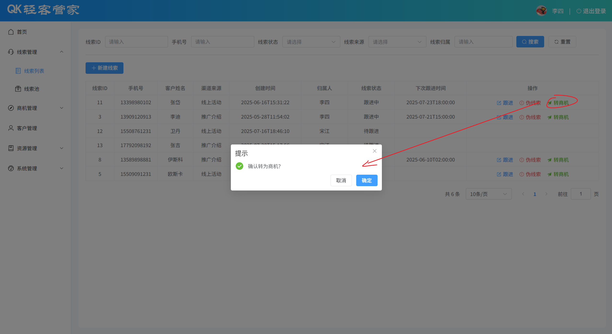

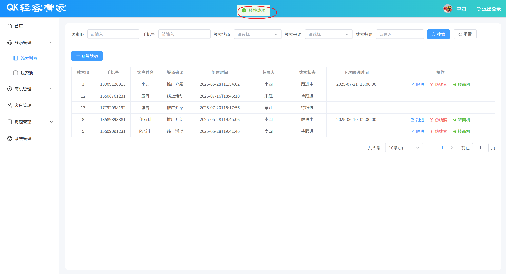


