# 一、部门管理

## 1.部门列表查询

**基本信息**

请求路径：`/depts`

请求方式：`GET`

接口描述：该接口用于部门列表数据查询


**请求参数**

参数格式：`queryString`

参数说明：

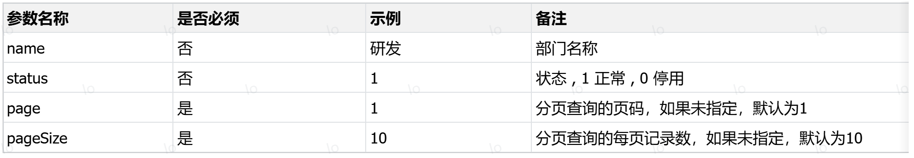

请求数据样例：

`/depts?page=1&pageSize=10`

`/depts?name=研发&page=1&pageSize=10`

`/depts?name=研发&status=1&page=1&pageSize=10`


**响应数据**

参数格式：`application/json`

参数说明：

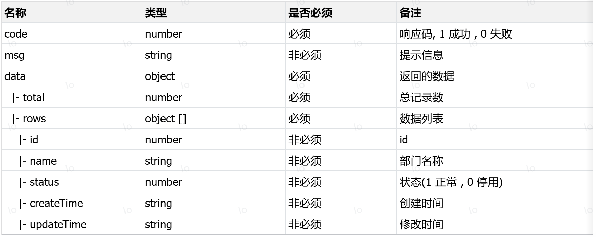

响应数据样例：

```json
{
    "code": 1,
    "msg": "success",
    "data": {
        "total": 3,
        "rows": [
            {
                "id": 1,
                "name": "市场一部",
                "status": 1,
                "createTime": "2025-03-23T16:48:58",
                "updateTime": "2025-04-24T20:36:04"
            },
            {
                "id": 2,
                "name": "市场二部",
                "status": 1,
                "createTime": "2025-03-23T16:16:26",
                "updateTime": "2025-04-20T14:18:05"
            },
            {
                "id": 3,
                "name": "稽核",
                "status": 0,
                "createTime": "2025-03-23T17:49:10",
                "updateTime": "2025-04-18T16:32:40"
            }
        ]
    }
}
```

## 2.删除部门

**基本信息**

请求路径：`/depts/{id}`

请求方式：`DELETE`

接口描述：该接口用于根据ID删除部门数据


**请求参数**

参数格式：路径参数

参数说明：

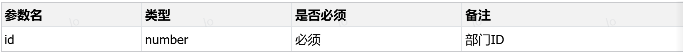

请求参数样例：

`/depts/1`

`/depts/2`


**响应数据**

参数格式：`application/json`

参数说明：

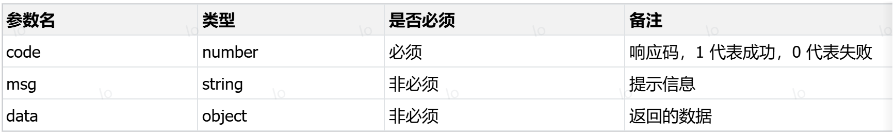

响应数据样例：

```json
{
    "code":1,
    "msg":"success",
    "data":null
}
```

## 3.添加部门

**基本信息**

请求路径：`/depts`

请求方式：`POST`

接口描述：该接口用于添加部门数据


**请求参数**

格式：`application/json`

参数说明：

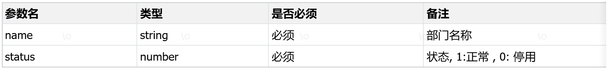

请求参数样例：

```json
{
    "name":"服务中心",
    "status":1
}
```


**响应数据**

参数格式：`application/json`

参数说明：

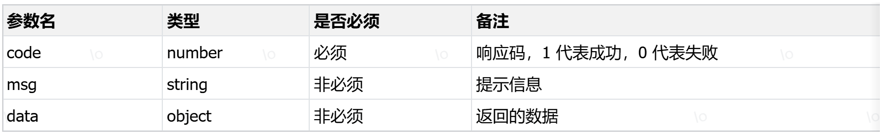

响应数据样例：

```json
{
    "code":1,
    "msg":"success",
    "data":null
}
```

## 4.根据ID查询

**基本信息**

请求路径：`/depts/{id}`

请求方式：`GET`

接口描述：该接口用于根据ID查询部门数据


**请求参数**

参数格式：路径参数

参数说明：

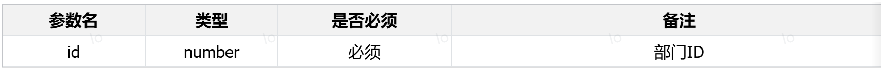

请求参数样例：

`/depts/1`

`/depts/3`


**响应数据**

参数格式：`application/json`

参数说明：

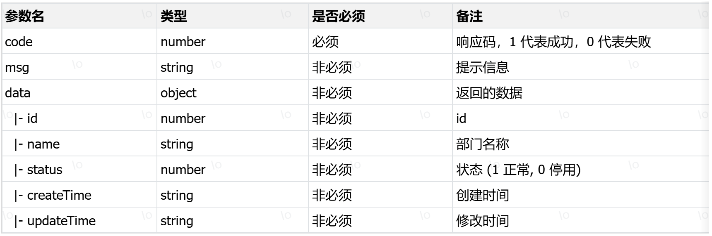

响应数据样例：

```json
{
  "code": 1,
  "msg": "success",
  "data": {
    "id": 15,
    "name": "服务中心",
    "status": 1,
    "createTime": "2025-09-01T23:06:29",
    "updateTime": "2025-09-01T23:06:29"
  }
}
```

## 5.修改部门

**基本信息**

请求路径：`/depts`

请求方式：`PUT`

接口描述：该接口用于修改部门数据


**请求参数**

格式：`application/json`

参数说明：

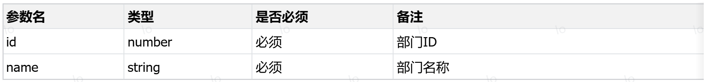

请求参数样例：

```json
{
     "id": 15,
     "name": "服务中心",
     "status": 1
}
```


**响应数据**

参数格式：`application/json`

参数说明：

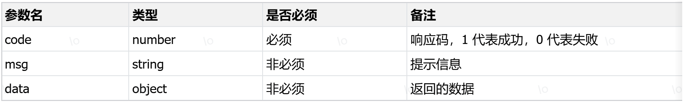

响应数据样例：

```json
{
    "code":1,
    "msg":"success",
    "data":null
}
```

## 6.查询所有部门

**基本信息**

请求路径：`/depts/list`

请求方式：`GET`

接口描述：该接口用于查询所有正常状态的部门数据


**请求参数**

无


**响应数据**

参数格式：`application/json`

参数说明：

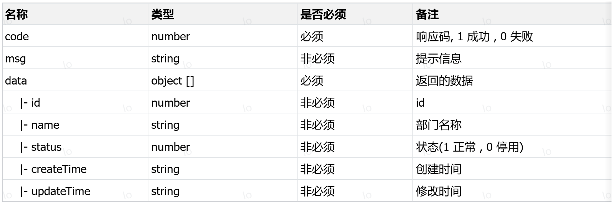

响应数据样例：

```json
{
    "code": 1,
    "msg": "success",
    "data": [
        {
            "id": 1,
            "name": "市场一部",
            "status": 1,
            "createTime": "2025-03-23T16:48:58",
            "updateTime": "2025-04-24T20:36:04"
        },
        {
            "id": 2,
            "name": "市场二部",
            "status": 1,
            "createTime": "2025-03-23T16:16:26",
            "updateTime": "2025-04-20T14:18:05"
        },
        {
            "id": 3,
            "name": "稽核",
            "status": 0,
            "createTime": "2025-03-23T17:49:10",
            "updateTime": "2025-04-18T16:32:40"
        }
    ]
}
```

# 二、用户管理

## 1.用户列表查询

**基本信息**

请求路径：`/users`

请求方式：`GET`

接口描述：该接口用于用户列表数据查询


**请求参数**

参数格式：`queryString`

参数说明：

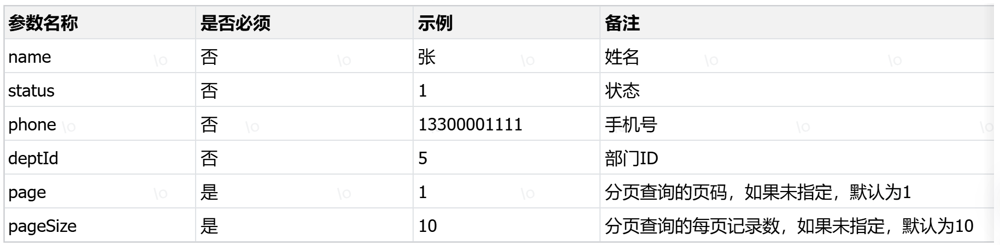


请求数据样例：

`/users?page=1&pageSize=5`

`/users?name=张&page=1&pageSize=5`

`/users?name=张&status=1&page=1&pageSize=5`

`/users?name=张&status=1&phone=13309091111&page=1&pageSize=5`

`/users?name=张&status=1&phone=13309091111&deptId=5&page=1&pageSize=5`


**响应数据**

参数格式：`application/json`

参数说明：

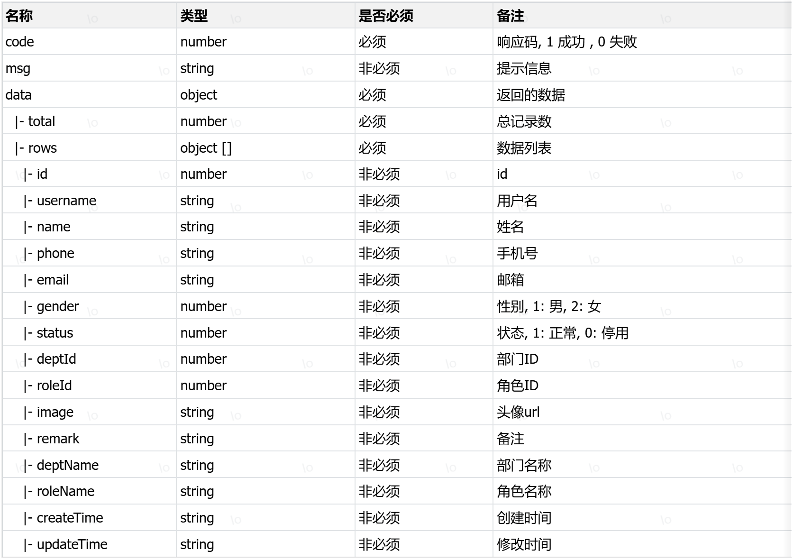

响应数据样例：

```json
{
    "code": 1,
    "msg": "success",
    "data": {
        "total": 2,
        "rows": [
            {
                "id": 3,
                "username": "zhangsanfeng",
                "name": "张三丰",
                "phone": "13309091122",
                "email": "zhangsanfeng@163.com",
                "gender": 1,
                "status": 1,
                "deptId": 1,
                "roleId": 1,
                "image": "https://web2025-test.oss-cn-beijing.aliyuncs.com/2025/03/cf2488ac-b40b-4eaf-b3ea-ef348f3ef079.png",
                "remark": "资深开发工程师",
                "createTime": "2025-03-23 20:09:07",
                "updateTime": "2025-04-18 20:26:00",
                "deptName": "市场二部",
                "roleName": "管理员"
            },
            {
                "id": 2,
                "username": "zhangwuji",
                "name": "张无忌",
                "phone": "13009091111",
                "email": "zhangwuji@163.com",
                "gender": 1,
                "status": 1,
                "deptId": 1,
                "roleId": 3,
                "image": "https://java-ai.oss-cn-beijing.aliyuncs.com/2024/11/9075fc6d-3ae4-49a0-a0d8-15ecbb1461b2.png",
                "remark": "测试使用的账号.",
                "createTime": "2025-03-23 19:56:11",
                "updateTime": "2025-04-18 20:24:45",
                "deptName": "市场二部",
                "roleName": "普通用户"
            }
        ]
    }
}
```

## 2.删除用户

**基本信息**

请求路径：`/users/{ids}`

请求方式：`DELETE`

接口描述：该接口用于根据ID删除用户数据


**请求参数**

参数格式：路径参数

参数说明：

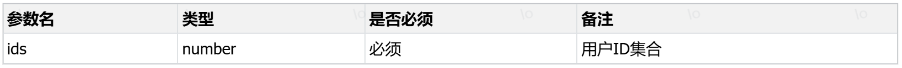

请求参数样例：

`/users/1`

`/users/10,20`

`/users/2,3,4`


**响应数据**

参数格式：`application/json`

参数说明：

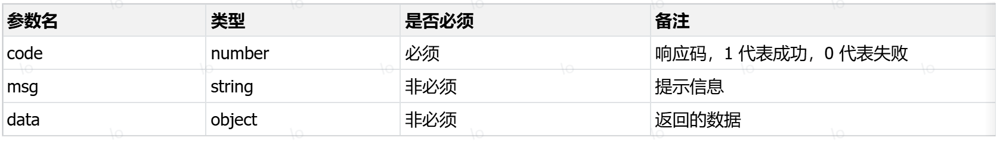

响应数据样例：

```json
{
    "code":1,
    "msg":"success",
    "data":null
}
```

## 3.添加用户

**基本信息**

请求路径：`/users`

请求方式：`POST`

接口描述：该接口用于添加用户数据


**请求参数**

格式：`application/json`

参数说明：

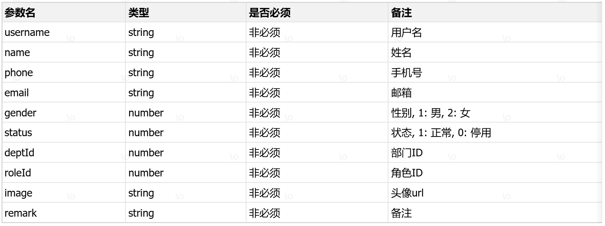

请求参数样例：

```json
{
    "username": "wangyan",
    "name": "王艳",
    "phone": "13637449119",
    "email": "wangyan@vip.qq.com",
    "gender": 2,
    "status": 1,
    "deptId": 1,
    "roleId": 1,
    "image": "1.jpg",
    "remark": "无"
}
```


**响应数据**

参数格式：`application/json`

参数说明：

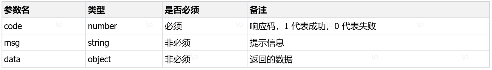

响应数据样例：

```json
{
    "code":1,
    "msg":"success",
    "data":null
}
```

## 4.根据ID查询

**基本信息**

请求路径：`/users/{id}`

请求方式：`GET`

接口描述：该接口用于根据ID查询用户数据


**请求参数**

参数格式：路径参数

参数说明：

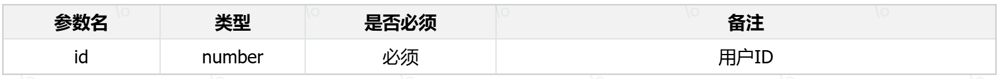

请求参数样例：

`/users/1`

`/users/3`


**响应数据**

参数格式：`application/json`

参数说明：

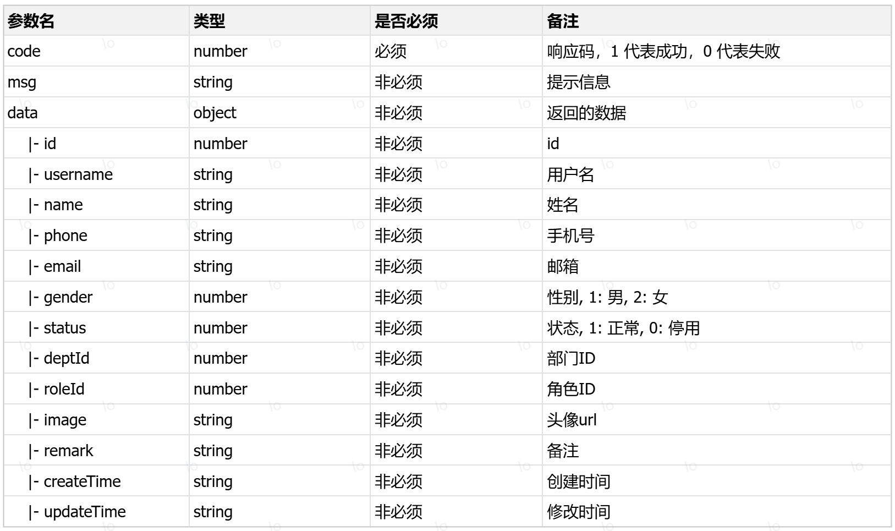

响应数据样例：

```json
{
    "code": 1,
    "msg": "success",
    "data": {
        "id": 2,
        "username": "zhangwuji",
        "password": "123456",
        "name": "张无忌",
        "phone": "13009091111",
        "email": "zhangwuji@163.com",
        "gender": 1,
        "status": 1,
        "deptId": 1,
        "roleId": 3,
        "image": "https://java-ai.oss-cn-beijing.aliyuncs.com/2024/11/9075fc6d-3ae4-49a0-a0d8-15ecbb1461b2.png",
        "remark": "测试使用的账号.",
        "createTime": "2025-03-23T19:56:11",
        "updateTime": "2025-04-18T20:24:45"
    }
}
```

## 5.修改用户

**基本信息**

请求路径：`/users`

请求方式：`PUT`

接口描述：该接口用于修改用户数据


**请求参数**

格式：`application/json`

参数说明：

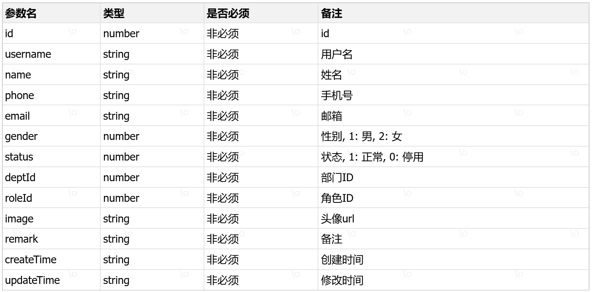

请求参数样例：

```json
{
    "id": 2,
    "username": "zhangwuji",
    "password": "123456",
    "name": "张无忌",
    "phone": "13009091111",
    "email": "zhangwuji@163.com",
    "gender": 1,
    "status": 1,
    "deptId": 1,
    "roleId": 3,
    "image": "https://java-ai.oss-cn-beijing.aliyuncs.com/2024/11/9075fc6d-3ae4-49a0-a0d8-15ecbb1461b2.png",
    "remark": "测试使用的账号.",
    "createTime": "2025-03-23T19:56:11",
    "updateTime": "2025-04-18T20:24:45"
}
```


**响应数据**

参数格式：`application/json`

参数说明：

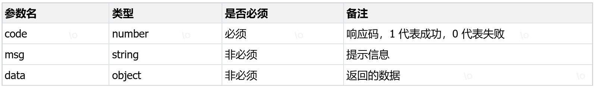

响应数据样例：

```json
{
    "code":1,
    "msg":"success",
    "data":null
}
```

## 6.查询所有用户

**基本信息**

请求路径：`/users/list`

请求方式：`GET`

接口描述：该接口用于查询所有用户数据


**请求参数**

无


**响应数据**

参数格式：`application/json`

参数说明：

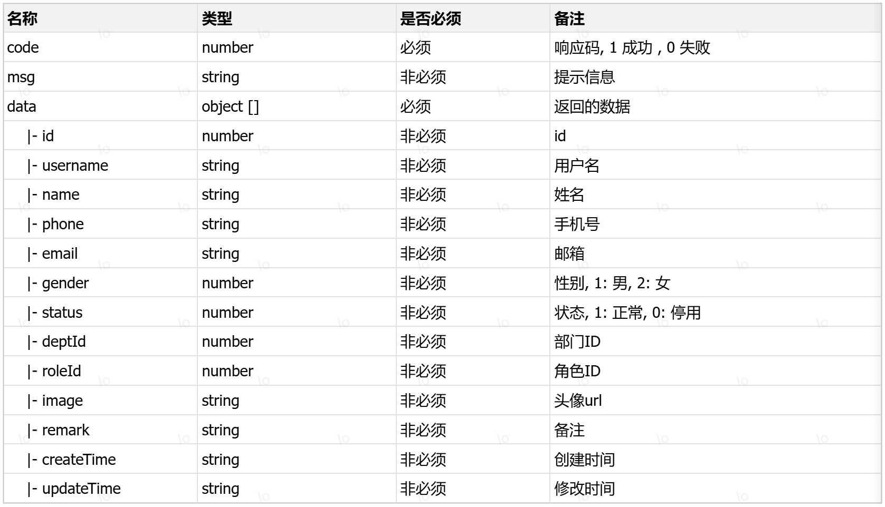

响应数据样例：

```json
{
    "code": 1,
    "msg": "success",
    "data": [
        {
            "id": 1,
            "username": "yanshisan",
            "password": "123456",
            "name": "燕十三",
            "phone": "13800138016",
            "email": "yanshisan@example.com",
            "gender": 1,
            "status": 1,
            "deptId": 1,
            "roleId": 3,
            "image": "https://java-ai.oss-cn-beijing.aliyuncs.com/2024/11/9075fc6d-3ae4-49a0-a0d8-15ecbb1461b2.png",
            "remark": "普通员工",
            "createTime": "2025-03-23T16:57:24",
            "updateTime": "2025-04-18T20:24:52",
            "deptName": null,
            "roleName": null
        },
        {
            "id": 2,
            "username": "zhangwuji",
            "password": "123456",
            "name": "张无忌",
            "phone": "13009091111",
            "email": "zhangwuji@163.com",
            "gender": 1,
            "status": 1,
            "deptId": 1,
            "roleId": 3,
            "image": "https://java-ai.oss-cn-beijing.aliyuncs.com/2024/11/9075fc6d-3ae4-49a0-a0d8-15ecbb1461b2.png",
            "remark": "测试使用的账号.",
            "createTime": "2025-03-23T19:56:11",
            "updateTime": "2025-05-10T14:51:06",
            "deptName": null,
            "roleName": null
        }
    ]
}
```

## 7.根据角色查询用户

**基本信息**

请求路径：`/users/role/{roleLabel}`

请求方式：`GET`

接口描述：该接口用于根据角色标识查询用户列表


**请求参数**

参数格式：路径参数

参数说明：

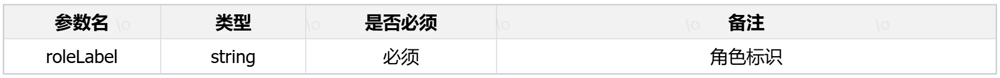

请求参数样例：

`/users/role/clue_operator`

`/users/role/admin`


**响应数据**

参数格式：`application/json`

参数说明：


响应数据样例：

```json
{
    "code": 1,
    "msg": "success",
    "data": [
        {
            "id": 10,
            "username": "lishier",
            "password": "123456",
            "name": "李十二",
            "phone": "13800138010",
            "email": "pm1@example.com",
            "gender": 1,
            "status": 1,
            "deptId": 10,
            "roleId": 18,
            "image": "https://java-ai.oss-cn-beijing.aliyuncs.com/2024/11/9075fc6d-3ae4-49a0-a0d8-15ecbb1461b2.png",
            "remark": "产品经理",
            "createTime": "2025-03-23T16:42:35",
            "updateTime": "2025-04-18T20:53:01",
            "deptName": null,
            "roleName": null
        },
        {
            "id": 11,
            "username": "zhaoshisan",
            "password": "123456",
            "name": "赵十三",
            "phone": "13800138011",
            "email": "marketing1@example.com",
            "gender": 0,
            "status": 1,
            "deptId": 11,
            "roleId": 18,
            "image": "https://java-ai.oss-cn-beijing.aliyuncs.com/2024/11/9075fc6d-3ae4-49a0-a0d8-15ecbb1461b2.png",
            "remark": "市场人员",
            "createTime": "2025-03-23T16:42:35",
            "updateTime": "2025-04-18T20:53:06",
            "deptName": null,
            "roleName": null
        }
    ]
}
```

## 8.根据部门查询用户

**基本信息**

请求路径：`/users/dept/{deptId}`

请求方式：`GET`

接口描述：该接口用于根据部门查询用户列表


**请求参数**

参数格式：路径参数

参数说明：

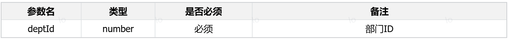

请求参数样例：

`/users/dept/1`

`/users/dept/2`


**响应数据**

参数格式：`application/json`

参数说明：

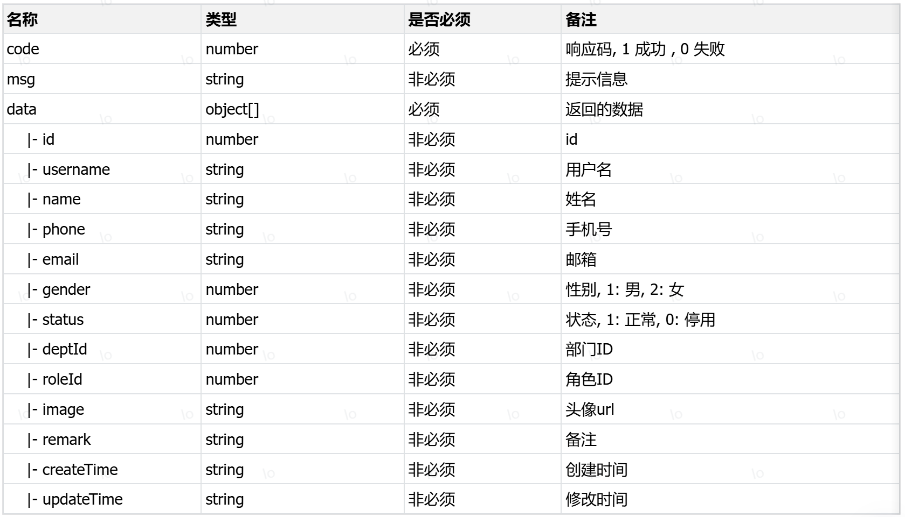

响应数据样例：

```json
{
    "code": 1,
    "msg": "success",
    "data": [
        {
            "id": 10,
            "username": "lishier",
            "password": "123456",
            "name": "李十二",
            "phone": "13800138010",
            "email": "pm1@example.com",
            "gender": 1,
            "status": 1,
            "deptId": 10,
            "roleId": 18,
            "image": "https://java-ai.oss-cn-beijing.aliyuncs.com/2024/11/9075fc6d-3ae4-49a0-a0d8-15ecbb1461b2.png",
            "remark": "产品经理",
            "createTime": "2025-03-23T16:42:35",
            "updateTime": "2025-04-18T20:53:01",
            "deptName": null,
            "roleName": null
        },
        {
            "id": 11,
            "username": "zhaoshisan",
            "password": "123456",
            "name": "赵十三",
            "phone": "13800138011",
            "email": "marketing1@example.com",
            "gender": 0,
            "status": 1,
            "deptId": 11,
            "roleId": 18,
            "image": "https://java-ai.oss-cn-beijing.aliyuncs.com/2024/11/9075fc6d-3ae4-49a0-a0d8-15ecbb1461b2.png",
            "remark": "市场人员",
            "createTime": "2025-03-23T16:42:35",
            "updateTime": "2025-04-18T20:53:06",
            "deptName": null,
            "roleName": null
        }
    ]
}
```

# 三、角色管理

## 1.角色列表查询

**基本信息**

请求路径：`/roles`

请求方式：`GET`

接口描述：该接口用于角色列表数据查询


**请求参数**

参数格式：`queryString`

参数说明：


请求数据样例：

`/roles?page=1&pageSize=10`

`/roles?name=销售&page=1&pageSize=10`


**响应数据**

参数格式：`application/json`

参数说明：


响应数据样例：

```json
{
    "code": 1,
    "msg": "success",
    "data": {
        "total": 2,
        "rows": [
            {
                "id": 3,
                "name": "普通用户",
                "label": "user_normal",
                "remark": "普通用户",
                "createTime": "2025-03-23 16:42:35",
                "updateTime": "2025-04-18 19:48:00"
            },
            {
                "id": 19,
                "name": "商机专员",
                "label": "business_operator",
                "remark": "用于跟进商机信息",
                "createTime": "2025-04-18 19:46:43",
                "updateTime": "2025-04-18 19:46:43"
            }
        ]
    }
}
```

## 2.删除角色

**基本信息**

请求路径：`/roles/{id}`

请求方式：`DELETE`

接口描述：该接口用于根据ID删除角色数据


**请求参数**

参数格式：路径参数

参数说明：


请求参数样例：

`/roles/1`

`/roles/2`


**响应数据**

参数格式：`application/json`

参数说明：


响应数据样例：

```json
{
    "code":1,
    "msg":"success",
    "data":null
}
```

## 3.添加角色

**基本信息**

请求路径：`/roles`

请求方式：`POST`

接口描述：该接口用于添加角色数据


**请求参数**

格式：`application/json`

参数说明：


请求参数样例：

```json
{
    "name": "线索专员",
    "label": "clue_operator",
    "remark": "负责跟进线索"
}
```


**响应数据**

参数格式：`application/json`

参数说明：


响应数据样例：

```json
{
    "code":1,
    "msg":"success",
    "data":null
}
```

## 4.根据ID查询

**基本信息**

请求路径：`/roles/{id}`

请求方式：`GET`

接口描述：该接口用于根据ID查询角色数据


**请求参数**

参数格式：路径参数

参数说明：


请求参数样例：

`/roles/1`

`/roles/3`


**响应数据**

参数格式：`application/json`

参数说明：


响应数据样例：

```json
{
    "code": 1,
    "msg": "success",
    "data": {
        "id": 1,
        "name": "管理员",
        "label": "admin",
        "remark": "系统管理员",
        "createTime": "2025-03-23T16:42:35",
        "updateTime": "2025-03-23T16:42:35"
    }
}
```

## 5.修改角色

**基本信息**

请求路径：`/roles`

请求方式：`PUT`

接口描述：该接口用于修改角色数据


**请求参数**

格式：`application/json`

参数说明：


请求参数样例：

```json
{
    "id": 1,
    "name": "管理员",
    "label": "admin",
    "remark": "系统管理员",
    "createTime": "2025-03-23T16:42:35",
    "updateTime": "2025-03-23T16:42:35"
}
```


**响应数据**

参数格式：`application/json`

参数说明：


响应数据样例：

```json
{
    "code":1,
    "msg":"success",
    "data":null
}
```

## 6.查询所有角色

**基本信息**

请求路径：`/roles/list`

请求方式：`GET`

接口描述：该接口用于查询所有角色数据


**请求参数**

无


**响应数据**

参数格式：`application/json`

参数说明：


响应数据样例：

```json
{
    "code": 1,
    "msg": "success",
    "data": [
        {
            "id": 3,
            "name": "普通用户",
            "label": "user_normal",
            "remark": "普通用户",
            "createTime": "2025-03-23T16:42:35",
            "updateTime": "2025-04-18T19:48:00"
        },
        {
            "id": 19,
            "name": "商机专员",
            "label": "business_operator",
            "remark": "用于跟进商机信息",
            "createTime": "2025-04-18T19:46:43",
            "updateTime": "2025-04-18T19:46:43"
        }
    ]
}
```

# 四、活动管理

## 1.活动列表查询

**基本信息**

请求路径：`/activities`

请求方式：`GET`

接口描述：该接口用于活动列表数据查询


**请求参数**

参数格式：`queryString`

参数说明：


请求数据样例：

`/activities?page=1&pageSize=5`

`/activities?channel=1&page=1&pageSize=5`

`/activities?channel=1&type=1&page=1&pageSize=5`

`/activities?channel=1&type=1&status=1&page=1&pageSize=5`


**响应数据**

参数格式：`application/json`

参数说明：


响应数据样例：

```json
{
    "code": 1,
    "msg": "success",
    "data": {
        "total": 17,
        "rows": [
            {
                "id": 1,
                "channel": 1,
                "name": "Java课程折扣活动",
                "startTime": "2024-10-01 00:00:00",
                "endTime": "2024-10-31 23:59:59",
                "description": "Java课程限时8折优惠",
                "type": 1,
                "discount": 8.0,
                "voucher": null,
                "createTime": "2025-03-24 11:16:34",
                "updateTime": "2025-03-24 11:16:34"
            },
            {
                "id": 2,
                "channel": 1,
                "name": "前端课程代金券活动",
                "startTime": "2024-11-01 00:00:00",
                "endTime": "2024-11-30 23:59:59",
                "description": "购买前端课程立减500元",
                "type": 2,
                "discount": null,
                "voucher": 500,
                "createTime": "2025-03-24 11:16:34",
                "updateTime": "2025-03-24 11:16:34"
            }
        ]
    }
}
```

## 2.删除活动

**基本信息**

请求路径：`/activities/{id}`

请求方式：`DELETE`

接口描述：该接口用于根据ID删除活动数据


**请求参数**

参数格式：路径参数

参数说明：


请求参数样例：

`/activities/1`

`/activities/2`


**响应数据**

参数格式：`application/json`

参数说明：


响应数据样例：

```json
{
    "code":1,
    "msg":"success",
    "data":null
}
```


## 3.添加活动

**基本信息**

请求路径：`/activities`

请求方式：`POST`

接口描述：该接口用于添加活动数据


**请求参数**

格式：`application/json`

参数说明：


请求参数样例：

```json
{
    "channel": 1,
    "name": "618 python课程折扣活动",
    "startTime": "2025-06-01 00:00:00",
    "endTime": "2025-06-30 23:59:59",
    "description": "python课程限时8折优惠",
    "type": 1,
    "discount": 8.0,
    "voucher": null
}
```


**响应数据**

参数格式：`application/json`

参数说明：


响应数据样例：

```json
{
    "code":1,
    "msg":"success",
    "data":null
}
```

## 4.根据ID查询

**基本信息**

请求路径：`/activities/{id}`

请求方式：`GET`

接口描述：该接口用于根据ID查询活动数据


**请求参数**

参数格式：路径参数

参数说明：


请求参数样例：

`/activities/1`

`/activities/3`


**响应数据**

参数格式：`application/json`

参数说明：


响应数据样例：

```json
{
    "code": 1,
    "msg": "success",
    "data": {
        "id": 1,
        "channel": 1,
        "name": "Java课程折扣活动",
        "startTime": "2024-10-01 00:00:00",
        "endTime": "2024-10-31 23:59:59",
        "description": "Java课程限时8折优惠",
        "type": 1,
        "discount": 8.0,
        "voucher": null,
        "createTime": "2025-03-24 11:16:34",
        "updateTime": "2025-03-24 11:16:34"
    }
}
```

## 5.修改活动

**基本信息**

请求路径：`/activities`

请求方式：`PUT`

接口描述：该接口用于修改活动数据


**请求参数**

格式：`application/json`

参数说明：


请求参数样例：

```json
{
    "id": 1,
    "channel": 1,
    "name": "Java课程折扣活动",
    "startTime": "2024-10-01 00:00:00",
    "endTime": "2024-10-31 23:59:59",
    "description": "Java课程限时8折优惠",
    "type": 1,
    "discount": 8.0,
    "voucher": null,
    "createTime": "2025-03-24 11:16:34",
    "updateTime": "2025-03-24 11:16:34"
}
```


**响应数据**

参数格式：`application/json`

参数说明：


响应数据样例：

```json
{
    "code":1,
    "msg":"success",
    "data":null
}
```

## 6.查询指定类型的活动

**基本信息**

请求路径：`/activities/type/{type}`

请求方式：`GET`

接口描述：该接口用于查询指定类型的所有活动数据


**请求参数**

参数格式：路径参数

参数说明：


请求参数样例：

`/activities/type/1`

`/activities/type/2`


**响应数据**

参数格式：`application/json`

参数说明：


响应数据样例：

```json
{
    "code": 1,
    "msg": "success",
    "data": [
        {
            "id": 1,
            "channel": 1,
            "name": "Java课程折扣活动",
            "startTime": "2024-10-01 00:00:00",
            "endTime": "2024-10-31 23:59:59",
            "description": "Java课程限时8折优惠",
            "type": 1,
            "discount": 8.0,
            "voucher": null,
            "createTime": "2025-03-24 11:16:34",
            "updateTime": "2025-03-24 11:16:34"
        },
        {
            "id": 2,
            "channel": 1,
            "name": "前端课程代金券活动",
            "startTime": "2024-11-01 00:00:00",
            "endTime": "2024-11-30 23:59:59",
            "description": "购买前端课程立减500元",
            "type": 2,
            "discount": null,
            "voucher": 500,
            "createTime": "2025-03-24 11:16:34",
            "updateTime": "2025-03-24 11:16:34"
        }
    ]
}
```

# 五、课程管理

## 1.课程列表查询

**基本信息**

请求路径：`/courses`

请求方式：`GET`

接口描述：该接口用于课程列表数据查询


**请求参数**

参数格式：`queryString`

参数说明：


请求数据样例：

`/courses?page=1&pageSize=10`

`/courses?name=Java&page=1&pageSize=10`

`/courses?name=Java&subject=1&page=1&pageSize=10`

`/courses?name=Java&subject=1&target=1&page=1&pageSize=10`


**响应数据**

参数格式：`application/json`

参数说明：


响应数据样例：

```json
{
    "code": 1,
    "msg": "success",
    "data": {
        "total": 2,
        "rows": [
            {
                "id": 1,
                "subject": 1,
                "name": "Java基础入门",
                "price": 599,
                "target": 1,
                "description": "适合零基础学员，掌握Java基础语法",
                "createTime": "2025-03-24 11:16:34",
                "updateTime": "2025-03-24 11:16:34"
            },
            {
                "id": 2,
                "subject": 1,
                "name": "Java高级编程",
                "price": 1999,
                "target": 2,
                "description": "深入Java高级特性，适合中级程序员",
                "createTime": "2025-03-24 11:16:34",
                "updateTime": "2025-03-24 11:16:34"
            }
        ]
    }
}
```

## 2.删除课程

**基本信息**

请求路径：`/courses/{id}`

请求方式：`DELETE`

接口描述：该接口用于根据ID删除课程数据


**请求参数**

参数格式：路径参数

参数说明：


请求参数样例：

`/courses/1`

`/courses/2`


**响应数据**

参数格式：`application/json`

参数说明：


响应数据样例：

```json
{
    "code":1,
    "msg":"success",
    "data":null
}
```

## 3.添加课程

**基本信息**

请求路径：`/courses`

请求方式：`POST`

接口描述：该接口用于添加课程数据


**请求参数**

格式：`application/json`

参数说明：


请求参数样例：

```json
{
    "subject": 1,
    "name": "SpringAI入门",
    "price": 199,
    "target": 2,
    "description": "SpringAI入门"
}
```


**响应数据**

参数格式：`application/json`

参数说明：


响应数据样例：

```json
{
    "code":1,
    "msg":"success",
    "data":null
}
```

## 4.根据ID查询

**基本信息**

请求路径：`/courses/{id}`

请求方式：`GET`

接口描述：该接口用于根据ID查询课程数据


**请求参数**

参数格式：路径参数

参数说明：


请求参数样例：

`/courses/1`

`/courses/3`


**响应数据**

参数格式：`application/json`

参数说明：


响应数据样例：

```json
{
    "code": 1,
    "msg": "success",
    "data": {
        "id": 20,
        "subject": 1,
        "name": "SpringAI入门",
        "price": 199,
        "target": 2,
        "description": "SpringAI入门",
        "createTime": "2025-05-09 16:11:24",
        "updateTime": "2025-05-09 16:11:24"
    }
}
```

## 5.修改课程

**基本信息**

请求路径：`/courses`

请求方式：`PUT`

接口描述：该接口用于修改课程数据


**请求参数**

格式：`application/json`

参数说明：


请求参数样例：

```json
{
    "id": 20,
    "subject": 1,
    "name": "SpringAI入门到精通",
    "price": 299,
    "target": 2,
    "description": "SpringAI入门到精通",
    "createTime": "2025-05-09 16:11:24",
    "updateTime": "2025-05-09 16:11:24"
}
```


**响应数据**

参数格式：`application/json`

参数说明：


响应数据样例：

```json
{
    "code":1,
    "msg":"success",
    "data":null
}
```

## 6.查询所有课程

**基本信息**

请求路径：`/courses/list`

请求方式：`GET`

接口描述：该接口用于查询所有课程数据


**请求参数**

无


**响应数据**

参数格式：`application/json`

参数说明：


响应数据样例：

```json
{
    "code": 1,
    "msg": "success",
    "data": [
        {
            "id": 1,
            "subject": 1,
            "name": "Java基础入门",
            "price": 599,
            "target": 1,
            "description": "适合零基础学员，掌握Java基础语法",
            "createTime": "2025-03-24 11:16:34",
            "updateTime": "2025-03-24 11:16:34"
        },
        {
            "id": 2,
            "subject": 1,
            "name": "Java高级编程",
            "price": 1999,
            "target": 2,
            "description": "深入Java高级特性，适合中级程序员",
            "createTime": "2025-03-24 11:16:34",
            "updateTime": "2025-03-24 11:16:34"
        }
    ]
}
```

## 7.根据学科查询课程

**基本信息**

请求路径：`/courses/subject/{subject}`

请求方式：`GET`

接口描述：该接口用于根据学科查询对应学科的所有课程数据


**请求参数**

参数格式：路径参数

参数说明：


请求参数样例：

`/courses/subject/1`

`/courses/subject/2`


**响应数据**

参数格式：`application/json`

参数说明：


响应数据样例：

```json
{
    "code": 1,
    "msg": "success",
    "data": [
        {
            "id": 1,
            "subject": 1,
            "name": "Java基础入门",
            "price": 599,
            "target": 1,
            "description": "适合零基础学员，掌握Java基础语法",
            "createTime": "2025-03-24 11:16:34",
            "updateTime": "2025-03-24 11:16:34"
        },
        {
            "id": 2,
            "subject": 1,
            "name": "Java高级编程",
            "price": 1999,
            "target": 2,
            "description": "深入Java高级特性，适合中级程序员",
            "createTime": "2025-03-24 11:16:34",
            "updateTime": "2025-03-24 11:16:34"
        },
        {
            "id": 20,
            "subject": 1,
            "name": "SpringAI入门",
            "price": 199,
            "target": 2,
            "description": "SpringAI入门",
            "createTime": "2025-05-09 16:11:24",
            "updateTime": "2025-05-09 16:11:24"
        }
    ]
}
```
